# SwifPro BI ERP — Module Workflow & Architecture Specification

> Developer-facing specification for the SwifPro BI multi-tenant ERP (Django 5, server-rendered, Bootstrap 5).
> Every module below is grounded in the actual codebase (`core/` app): real model names, URL paths and service
> functions. Intended as input for product specs, database design and application architecture.
>
> **Platform shape:** multi-company (`CompanyGroup → Tenant`), multi-site (`Site → Location → Bin`), per-tenant
> double-entry General Ledger, role-based access (8 roles) with per-permission and per-location overrides, and an
> append-only audit trail. Built for UK SMEs (UK chart of accounts, VAT/MTD, GBP defaults).

## Module index

1. [Company Setup](#1-company-setup)
2. [User Roles and Permissions](#2-user-roles-and-permissions)
3. [Customer Management](#3-customer-management)
4. [Supplier Management](#4-supplier-management)
5. [Product / SKU Management](#5-product--sku-management)
6. [Inventory and Stock Control](#6-inventory-and-stock-control)
7. [Purchasing](#7-purchasing)
8. [Sales](#8-sales)
9. [Finance and Accounting](#9-finance-and-accounting)
10. [VAT and UK Tax Compliance](#10-vat-and-uk-tax-compliance)
11. [Expenses](#11-expenses)
12. [Reports and Dashboards](#12-reports-and-dashboards)
13. [Documents / PDFs](#13-documents--pdfs)
14. [Notifications and Alerts](#14-notifications-and-alerts)
15. [Audit Logs](#15-audit-logs)
16. [Import / Export](#16-import--export)
17. [Integrations](#17-integrations)
18. [AI Assistant / Copilot](#18-ai-assistant--copilot)
19. [End-to-end ERP flow](#19-end-to-end-erp-flow)

---

## 1. Company Setup

### Purpose
Establishes the legal, financial and locale identity of each company (Tenant) on the SwifPro BI platform, and optionally groups several companies under a parent CompanyGroup for consolidated reporting. Creating a Tenant auto-seeds a UK chart of accounts and standard VAT codes, and a guided onboarding checklist walks a new Admin through completing setup. Tenant-level settings (approval thresholds, payment terms, financial year, dunning) drive behaviour across every other module.

### Roles involved
- **Admin (Owner/Admin)** — the only role with access. All Company Setup pages and onboarding actions are gated by `@role_required([ROLE_ADMIN], [ROLE_ADMIN])`. Any logged-in user may create a brand-new organisation (`new_organisation`), becoming its Admin.

### Workflow
1. A logged-in user creates a new organisation via `/onboarding/new-organisation/` (`NewOrganisationForm`: name, business type, currency, country).
2. On save, the creator is made the Owner/Admin (`OrgMembership` with role `ADMIN`), a `UserProfile` is set, and the session switches to the new org.
3. The `post_save` signal `bootstrap_tenant_defaults` seeds 5 default `TaxCode` rows and 26 default `GLAccount` rows for the tenant.
4. The Admin lands on `/onboarding/` showing a 7-step guided checklist with completion status and a percent-complete bar.
5. The Admin opens `/settings/tenant/` and completes the company profile (identity, registration & tax, addresses, contact, branding, locale, defaults, credit control) via `TenantSettingsForm`.
6. The Admin optionally configures VAT codes (`/tax-codes/`), first location, team, products, customers and suppliers — each a checklist step.
7. The Admin optionally creates/joins a `CompanyGroup` at `/settings/group/` for multi-company consolidation.
8. When ready, the Admin posts `/onboarding/finish/`, which sets `onboarding_complete = True`.

### Input data
- Identity: name, legal_name, trading_name, business_type (LTD / Sole trader / Partnership / Charity / Franchise).
- Registration & tax: company_number, utr_number, vat_registered, vat_number.
- Business address + billing address (billing_same_as_business toggle).
- Contact: email, phone, website.
- Branding: logo (ImageField), invoice_footer.
- Defaults & locale: currency_code (GBP/USD/EUR), country, timezone, financial_year_start_month (default April), default_tax_code, default_payment_terms_days (default 30).
- Approval thresholds: po_approval_threshold, expense_approval_threshold.
- Credit control: dunning_enabled, dunning_interval_days.
- Group: group name (create) or existing group_id (join).

### Output generated
- A `Tenant` record (the company).
- An `OrgMembership` (creator → ADMIN) and a `UserProfile`.
- 5 seeded `TaxCode` records (STD 20%, RED 5%, ZERO, EXEMPT, OS).
- 26 seeded `GLAccount` records (full UK CoA: Inventory, Bank, AR, AP, GRNI, VAT Output/Input, Sales, COGS, expense accounts, etc.).
- Status flag: `onboarding_complete`.
- Optional `CompanyGroup` record and group membership (`tenant.group`).
- Audit log entries: `ORG_CREATED`, `VAT_SETTINGS_CHANGED`, `GROUP_CHANGED`, `SETTINGS_CHANGED`.
- No GL postings are produced by this module itself (it only seeds the account structure).

### Related modules
- **Finance / VAT** — seeds tax codes and the chart of accounts; default_tax_code and vat_registered feed invoicing and VAT returns.
- **Procurement** — po_approval_threshold gates PO approval.
- **Expenses** — expense_approval_threshold gates expense posting.
- **Inventory** — stock_adjustment_approval_threshold gates stock-adjustment posting (field exists on Tenant but is NOT exposed on TenantSettingsForm; set elsewhere/admin only).
- **Sales / AR** — default_payment_terms_days, invoice_footer, logo, dunning settings drive invoices and reminders.
- **Reports** — CompanyGroup enables Consolidated and Inter-company reporting.
- **Users & Roles** — onboarding's "Invite your team" step links to membership management.

### Validations & rules
- Admin-only access on every page (`role_required([ROLE_ADMIN], [ROLE_ADMIN])`).
- `TenantSettingsForm` required fields: name, legal_name, business_type, email, address_line1, address_city, address_postcode.
- Field validators: `validate_vat_number`, `validate_company_number`, `validate_utr`, `validate_phone`.
- VAT changes are specifically audited (`VAT_SETTINGS_CHANGED`); the view snapshots VAT state before binding because the ModelForm mutates its instance during `is_valid()`.
- Default tax codes / GL accounts use `get_or_create`, so re-saving a Tenant never duplicates them; seeding only runs on `created`.
- Approval thresholds of 0 mean "no approval required" (PO, expense, stock adjustment).
- `dunning_interval_days` and `expense_approval_threshold` fall back to current/default values when left blank.
- Multi-tenancy: all related entities (TaxCode, GLAccount, etc.) are scoped by `tenant`; CompanyGroup join is restricted to groups containing a company the Admin already belongs to.
- No soft-delete or immutability is implemented for Tenant in this module.

### Database entities
- `Tenant` (the company)
- `CompanyGroup` (parent / multi-company)
- `OrgMembership` (user ↔ tenant role)
- `UserProfile` (fallback primary tenant)
- `TaxCode` (seeded)
- `GLAccount` (seeded)
- `InterCompanyTransaction` (group-related, populated by other modules)

### API / page requirements
- `/onboarding/` → `onboarding` (guided checklist)
- `/onboarding/finish/` → `onboarding_finish` (sets onboarding_complete)
- `/onboarding/new-organisation/` → `new_organisation` (create company)
- `/settings/tenant/` → `settings_tenant` (`TenantSettingsForm`)
- `/settings/group/` → `settings_group` (create/join/leave group)
- `/settings/role-landing/` → `settings_role_landing` (per-role default landing route)
- `/select-org/` → `select_org` (switch active company)
- Supporting onboarding-step targets: `/tax-codes/`, `/locations/new/`, `/team/invite/`, `/products/`, `/customers/`, `/suppliers/`

### Flow diagram
```mermaid
flowchart TD
    A[Logged-in user] --> B[/onboarding/new-organisation/]
    B --> C[NewOrganisationForm: name, type, currency, country]
    C --> D[Create Tenant]
    D --> E[post_save signal: bootstrap_tenant_defaults]
    E --> F[Seed 5 TaxCodes]
    E --> G[Seed 26 GLAccounts]
    D --> H[OrgMembership role=ADMIN + UserProfile]
    H --> I[Switch session to new org]
    I --> J[/onboarding/ checklist]
    J --> K[/settings/tenant/ TenantSettingsForm]
    K --> L{VAT changed?}
    L -->|yes| M[Audit VAT_SETTINGS_CHANGED]
    L -->|no| N[Save profile]
    J --> O[/settings/group/ create/join group]
    O --> P[CompanyGroup link -> consolidated reports]
    J --> Q[/onboarding/finish/]
    Q --> R[onboarding_complete = True]
```

---

## 2. User Roles and Permissions

### Purpose
Controls who can access the SwifPro BI app and what each person may do within a given company (tenant). Access is governed per-organisation: a single login can belong to multiple companies with a different role in each, and an Admin can fine-tune individual users with per-permission overrides and per-location restrictions. All sensitive changes are recorded in an append-only audit trail.

### Roles involved
- **Admin** (Owner/Admin): full access; the only role that can manage users, roles, permissions, location access, access requests and the audit log.
- **Accountant, Manager, Sales, Warehouse, Purchasing, Finance, Read-only**: subjects of role/permission assignment. They receive a baseline permission set from the role matrix; none of them can administer users.

Note: a person's effective access is always evaluated against the **active organisation's** membership role, not a union across all their orgs (see `core/auth.effective_groups`).

### Workflow
1. A prospective user submits the public **Request access** form (`/request-access/`), creating an `AccessRequest` with status `PENDING`. Alternatively an Admin skips this and invites someone directly.
2. Admin reviews pending requests at `/access-requests/` and either **rejects** (status `REJECTED`, applicant emailed) or **approves** with a chosen role.
3. On approval (or direct invite at `/team/invite/`), a Django `User` is created with a unique username and a random temporary password; a `UserProfile` (fallback tenant) and an `OrgMembership` (role in the active tenant) are created, and credentials are emailed.
4. The `OrgMembership` post-save signal syncs the user into the matching Django auth groups via `ROLE_TO_GROUPS`, so per-view RBAC (`role_required`) takes effect immediately.
5. Admin manages the team at `/users/`: change role, deactivate/reactivate, or remove a member.
6. On a role change, the signal re-syncs groups; existing `UserPermissionOverride` rows are either reset to the new role default or pruned (kept) depending on the tenant's `keep_permissions_on_role_change` policy.
7. Admin can fine-tune one member at `/users/<id>/permissions/`, adding GRANT/REVOKE overrides on top of the role baseline.
8. Admin restricts users to specific warehouses/locations via the matrix at `/locations/access/` (`UserLocationAccess`).
9. Admin reviews/exports the security trail at `/audit/`.
10. At request time, `get_effective_permissions` resolves role baseline + overrides; `role_required` / `permission_required` decorators gate each view.

### Input data
- Access request: name, email, optional employee ID, team, message.
- Invite: name, email, role (from `ROLE_CHOICES`).
- Role assignment: the 8-value role code per membership.
- Per-user permission deltas: permission code + effect (GRANT/REVOKE).
- Location grants: which `Location` rows a user may access.
- Tenant access policy toggle: `keep_permissions_on_role_change`.

### Output generated
- New `User` + `OrgMembership` (+ `UserProfile`) accounts; emailed temporary credentials.
- Django auth-group membership synced from the role.
- `UserPermissionOverride` and `UserLocationAccess` records.
- `AccessRequest` status transitions: `PENDING → APPROVED | REJECTED`.
- `AuditLog` entries: `ROLE_CHANGED`, `PERMISSION_CHANGED`, `USER_INVITED`, `USER_DEACTIVATED`/`USER_REACTIVATED`, `USER_REMOVED`, `ACCESS_REQUEST_APPROVED`/`ACCESS_REQUEST_REJECTED`, `LOCATION_ACCESS_CHANGED`, `SETTINGS_CHANGED`.
- Roles × permissions matrix view (read-only display of `ROLE_PERMISSIONS`).
- No GL postings (this module produces none).

### Related modules
- **All operational modules** (Sales, Procurement, Inventory, Finance, Reports): each view is gated by `role_required`/`permission_required` derived from this module.
- **Inventory / Locations**: `UserLocationAccess` filters which locations a user sees via `accessible_locations`.
- **Onboarding**: the "Invite your team" step links here.
- **Audit Log module**: consumes the `AuditLog` rows this module writes.
- **Multi-company / Company Group**: roles are per-tenant; the active-tenant resolver (`core/access`) decides which membership governs the request.

### Validations & rules
- **Tenant scoping**: every membership/override/location grant is keyed to a `Tenant`; `OrgMembership` is `unique_together (user, tenant)`.
- **Last-admin protection**: you cannot change the role of, deactivate, or remove the last active Owner/Admin (`_active_admin_count`).
- **Self-protection**: you cannot deactivate or remove yourself.
- **Admin overrides are inert**: Admins always have the full permission set; `UserPermissionOverride` does not apply to them (and their member-permissions page is read-only).
- **Override resolution**: effective = role baseline + GRANTs − REVOKEs, intersected with the known catalog (`effective_permissions`).
- **Role-change policy**: overrides reset to role default unless `keep_permissions_on_role_change` is on, in which case now-redundant overrides are pruned.
- **Location default-open**: a user with zero `UserLocationAccess` rows (or an Admin) is unrestricted; adding rows narrows access.
- **Audit immutability**: `AuditLog.save()` raises if an existing record is updated — append-only.
- **Access-request idempotency**: only `PENDING` requests can be approved/rejected.
- **Superuser bypass**: Django superusers pass all `role_required`/`permission_required` checks and get all permissions.
- Role values validated against `ROLE_CHOICES` on invite, approval, and role change.

### Database entities
- `OrgMembership` — role per user per tenant (`is_default` for preferred org).
- `UserPermissionOverride` — per-user GRANT/REVOKE delta, scoped to a tenant.
- `UserLocationAccess` — per-user allowed locations.
- `AccessRequest` — self-service access requests with review fields.
- `AuditLog` — append-only security/audit trail.
- `UserProfile` — fallback primary tenant for a user.
- `Tenant` — holds the `keep_permissions_on_role_change` policy and `role_landing`.
- Django `auth.User` / `auth.Group` — the underlying account and RBAC groups synced from roles.
- Supporting code (not models): `core/roles.py`, `core/permissions.py`, `core/auth.py`, `core/access.py`, `core/signals.py`.

### API / page requirements
- `GET /users/` → `members_list` (Admin).
- `POST /users/<membership_id>/role/` → `member_change_role`.
- `POST /users/<membership_id>/active/` → `member_toggle_active`.
- `POST /users/<membership_id>/remove/` → `member_remove`.
- `GET|POST /users/<membership_id>/permissions/` → `member_permissions`.
- `GET|POST /team/invite/` → `invite_user`.
- `GET|POST /team/permissions/` → `roles_permissions` (matrix + access-policy toggle).
- `GET|POST /request-access/` → `request_access` (public).
- `GET /access-requests/` → `access_request_list`.
- `POST /access-requests/<req_id>/action/` → `access_request_action` (approve/reject).
- `GET|POST /locations/access/` → `location_access`.
- `GET /audit/` → `audit_log_list`; `GET /audit/export.csv` → `audit_log_export`.

Note: there is **no separate persisted `Invite`/token model** — invites create the account immediately and email a temporary password; there is no email-link acceptance flow.

### Flow diagram
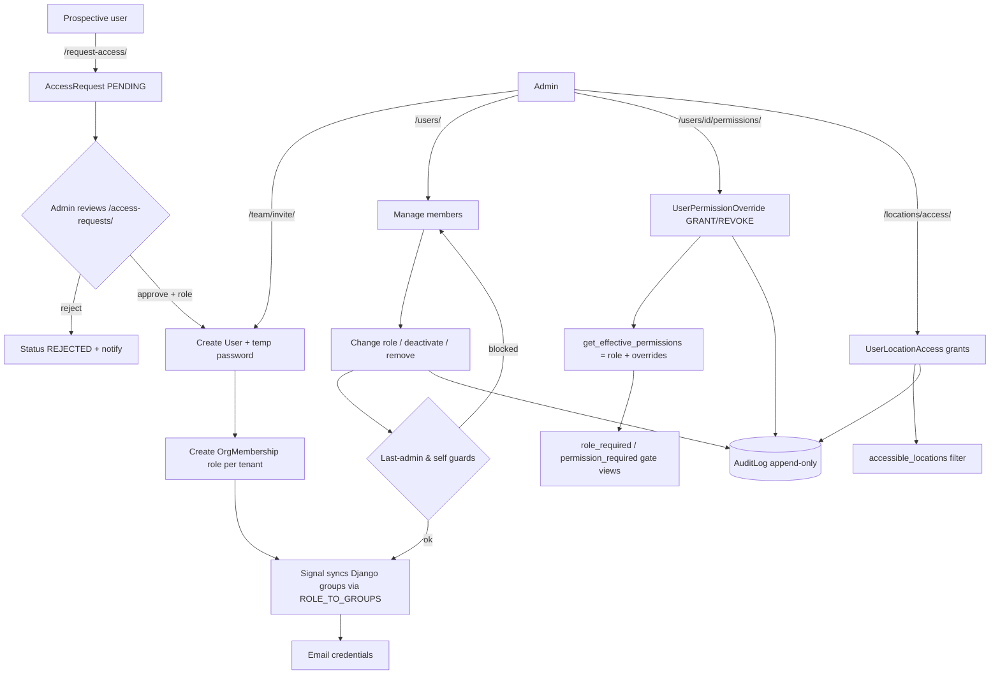

---

## 3. Customer Management

### Purpose
Maintains the master record of every customer (sold-to party) for a tenant, including contact details, tax/company identifiers, billing and shipping addresses, payment terms, credit limit and account status. It is the central reference for all sales documents (quotes, orders, invoices, credit notes, receipts) and drives credit control and customer statements.

### Roles involved
- **Admin** — full read/write.
- **Sales** — full read/write (create, edit, statements).
- **Finance** — full read/write (used here as the mapped group for the Accountant membership role; ACCOUNTANT/FINANCE membership roles both resolve to the Finance group).
- **Read-only** — may view the customer list, customer profile, and statements (read), but cannot create or edit.

(All customer views use `@role_required([ROLE_SALES, ROLE_FINANCE, ROLE_ADMIN, ...], write_groups=[ROLE_SALES, ROLE_FINANCE, ROLE_ADMIN])`; Read-only is granted view access only on `customer_list`, `customer_detail`, `customer_statement`, and `customer_statement_pdf`.)

### Workflow
1. User opens `/customers/` (`customer_list`) and can filter by free-text query (name, email, phone, VAT number, company number, contact person), customer type, status, or tag.
2. User clicks "New" → `/customers/new/` (`customer_create`) and fills the `CustomerForm`.
3. On save, `_find_customer_duplicates` checks for existing records matching email, phone, VAT number, company number, or name; if matches are found, the form re-renders with a duplicate warning and requires `confirm_duplicate=1` to proceed.
4. Record is saved against the current tenant; a DB `IntegrityError` on the `(tenant, name)` unique constraint surfaces as a "customer with this name already exists" error.
5. User is redirected to `/customers/<id>/` (`customer_detail`) — the profile showing details, outstanding balance, available credit, and a merged activity timeline (quotes, sales orders, invoices, payments, credit notes).
6. Edits go through `/customers/<id>/edit/` (`customer_edit`), which re-runs duplicate detection (excluding the current record).
7. Credit control is enforced downstream: when issuing AR invoices or confirming customer orders, `customer.credit_status(amount)` is called to block sales for ON_HOLD customers or those over their credit limit.
8. Statements: user opens `/customers/<id>/statement/` (`customer_statement`), defaults to the last 12 months (`statements.default_period`), and can download a PDF or email it to the customer.

### Input data
- Name (required; unique per tenant).
- Customer type (Individual, Company, Trade customer, Wholesale customer).
- Status (Active, Inactive, On hold).
- Contact person, email, phone.
- VAT number, company number.
- Billing address, shipping address.
- Payment terms (days) — blank falls back to the company default.
- Credit limit (0 = no limit).
- Tags (comma-separated, e.g. "VIP, Reseller").
- Notes.

### Output generated
- Persisted `Customer` record (scoped to tenant).
- Customer profile page with derived figures: `outstanding_balance`, `available_credit`, `is_over_limit`.
- Customer statement (HTML, PDF via `documents/statement_pdf.html`, or emailed PDF) — a dated ledger of invoices, receipts, refunds and credit notes with opening/closing running balance.
- Audit event `STATEMENT_SENT` when a statement is emailed.
- Credit-control verdicts `(ok, reason)` consumed by AR invoice and customer-order flows.
- No GL postings are produced directly by this module (postings arise from the invoices/payments it references).

### Related modules
- **Sales — Quotes, Customer (Sales) Orders, AR Invoices, Recurring Invoices** — all reference `Customer`; credit checks gate invoice issue and order confirmation.
- **Payments / Receipts & Refunds** — `Payment` records feed `outstanding_balance` and statements.
- **Credit Notes** — sales-kind credit notes reduce balance and appear on statements.
- **Reports — Aged Debtors (Receivables)** at `/reports/aged-receivables/` (`reports_service.aged_receivables`) ages each customer's open invoices.
- **CSV Import** — `/customers/import/` (`import_customers`) for bulk loading.

### Validations & rules
- **Tenant scoping** — every query filters by `tenant`; all detail/edit views use `get_object_or_404(Customer, id=..., tenant=tenant)`.
- **Unique name per tenant** — enforced by `unique_together = ("tenant", "name")`.
- **Duplicate detection** — soft warning on matching email/phone/VAT/company number/name; overridable with `confirm_duplicate=1` (advisory, not a hard block except the unique-name constraint).
- **Credit limit** — `credit_limit = 0` means no limit; `available_credit = credit_limit - outstanding_balance` (None when no limit). `credit_status(additional)` blocks a sale when projected outstanding would exceed the limit.
- **On-hold block** — status `ON_HOLD` causes `credit_status` to return `False` regardless of credit limit, blocking new sales until released.
- **Payment terms fallback** — null `payment_terms_days` defers to the company/tenant default.
- **Outstanding balance** — computed only over `CustomerInvoice.ISSUED_STATES` invoices with positive outstanding amount.
- **Soft-delete** — not implemented for customers; there is no customer delete URL/view. Customers are retired by setting status to Inactive.

### Database entities
- `Customer` (with `Type`, `Status` text choices; properties `tag_list`, `outstanding_balance`, `available_credit`, `is_over_limit`; method `credit_status`).
- `CustomerInvoice` / `CustomerInvoiceLine` (drive balance and statement debits).
- `Payment` (RECEIPT and REFUND directions — statement credits/debits).
- `CreditNote` / `CreditNoteLine` (kind SALES — statement credits).
- `CustomerOrder`, `SalesQuote` (timeline and related sales documents).
- `Tenant` (scoping owner).

### API / page requirements
- `GET /customers/` — `customer_list` (filters: `q`, `type`, `status`, `tag`).
- `GET|POST /customers/new/` — `customer_create`.
- `GET /customers/<id>/` — `customer_detail` (profile + timeline).
- `GET|POST /customers/<id>/edit/` — `customer_edit`.
- `GET /customers/<id>/statement/` — `customer_statement`.
- `GET /customers/<id>/statement/pdf/` — `customer_statement_pdf`.
- `POST /customers/<id>/statement/email/` — `customer_statement_email`.
- `GET|POST /customers/import/` — `import_customers` (CSV).
- `GET /reports/aged-receivables/` — `report_aged_receivables` (related reporting).

### Flow diagram
```mermaid
flowchart TD
    A[/customers/ list] -->|filter q/type/status/tag| A
    A --> B[New customer /customers/new/]
    A --> C[Open profile /customers/&lt;id&gt;/]
    B --> D[CustomerForm valid?]
    D -->|no| B
    D -->|yes| E[_find_customer_duplicates]
    E -->|matches & not confirmed| F[Show duplicate warning]
    F -->|confirm_duplicate=1| G[save tenant-scoped]
    E -->|no matches| G
    G -->|IntegrityError on unique name| B
    G --> C
    C --> H[Edit /customers/&lt;id&gt;/edit/]
    H --> E
    C --> I[Compute outstanding_balance / available_credit]
    C --> J[Statement /customers/&lt;id&gt;/statement/]
    J --> K[PDF / Email statement]
    I --> L{credit_status used by Sales}
    L -->|ON_HOLD or over limit| M[Block AR invoice / order]
    L -->|ok| N[Allow sale]
```

Key files: `d:\swifpro_bi\core\models.py` (Customer at line 1444), `d:\swifpro_bi\core\views.py` (customer views at lines 3726-5068), `d:\swifpro_bi\core\forms.py` (CustomerForm at line 517), `d:\swifpro_bi\core\services\statements.py`, `d:\swifpro_bi\core\urls.py` (lines 208-215), `d:\swifpro_bi\core\roles.py`.

---

## 4. Supplier Management

### Purpose
Maintains the tenant's supplier master data (contact, VAT/company numbers, currency, payment terms, bank details, status and categories) and presents a 360-degree supplier profile aggregating purchase orders, bills, payments, expenses and credit notes. It also captures supplier+product unit-cost history (used to prefill PO prices) and feeds a supplier performance scorecard covering spend, on-time delivery and price variance.

### Roles involved
- **Admin** — full access (create/edit/delete, view, scorecard).
- **Purchasing** (Procurement group) — create/edit/delete and view suppliers; the primary user.
- **Manager** — list/scorecard access via nav (Operations role spans Procurement).
- **Finance / Accountant** — read suppliers and view the scorecard (Finance group); needed for payables and payments.
- **Read-only** — can view `supplier_detail` and the scorecard.

Note: `supplier_create`/`supplier_edit`/`supplier_delete` are restricted to Admin + Procurement only (`role_required([ROLE_ADMIN, ROLE_PROCUREMENT], ...)`).

### Workflow
1. Purchasing/Admin opens `/suppliers/` (`supplier_list`) and searches/filters by name, email, phone, VAT/company number, contact, status or category.
2. Creates a supplier via `/suppliers/new/` (`SupplierForm`). On save, `_find_supplier_duplicates` checks for existing matches on email/phone/VAT/company number/name; if found, the user must confirm (`confirm_duplicate=1`) before saving.
3. Supplier is saved against the current tenant and redirects to `supplier_detail`.
4. The supplier is selected on Purchase Orders; when a PO is submitted, `record_po_prices` writes a `SupplierPriceHistory` record (source=PO) per line.
5. At PO entry, `/po/supplier/<id>/prices/` (`supplier_prices_json` → `last_prices_for_supplier`) returns the latest unit cost per product to prefill line prices.
6. Goods receipts and supplier bills are raised against the supplier; when a bill is posted to the GL (`post_supplier_invoice`), `record_bill_prices` writes `SupplierPriceHistory` records (source=BILL).
7. `/suppliers/<id>/` (`supplier_detail`) renders the full profile: POs, bills, payments, expenses, purchase credit notes, outstanding payables, products supplied, price history and a merged activity timeline.
8. Performance is reviewed at `/reports/supplier-scorecard/` (`report_supplier_scorecard` → `purchasing.supplier_scorecard`) for a chosen period.
9. Suppliers may be edited, set to Inactive/On hold, or hard-deleted (with an audit log entry).

### Input data
- Supplier identity: name (unique per tenant), contact_person, email, phone.
- Compliance: vat_number, company_number.
- Commercial: currency_code (default GBP), payment_terms_days (blank = company default), categories (comma-separated), status.
- Bank details: bank_name, bank_account_name, bank_sort_code, bank_account_number.
- address, notes.
- CSV bulk import via `/suppliers/import/` (`import_suppliers`).

### Output generated
- Supplier records (`Supplier`) with status ACTIVE / INACTIVE / ON_HOLD.
- `SupplierPriceHistory` rows (source PO / BILL / MANUAL) — idempotent per (supplier, product, source, reference).
- Supplier 360 profile page (POs, bills, payments, expenses, credit notes, timeline).
- Computed `outstanding_payables` (sum of posted-bill outstanding) and `purchases_total` (posted bills).
- Supplier scorecard data: spend, bill count, GRN/receipt count, on-time-delivery %, price variance.
- Audit log entry on deletion (`RECORD_DELETED`).
- No standalone PDF/statement is generated for suppliers — not implemented (statements exist for customers only).

### Related modules
- **Purchase Orders** — POs reference the supplier; submission captures PO prices; price-prefill JSON.
- **Purchase Requisitions / Backorders** — feed POs to suppliers.
- **Supplier Invoices (AP bills)** — bills posted against suppliers; drive spend and price variance.
- **Payments** — supplier payments shown on the profile and timeline.
- **Expenses** — expenses linked to a supplier appear on the profile.
- **Credit Notes** — purchase credit notes (`Kind.PURCHASE`); return-to-supplier credits via `create_return_credit_note`.
- **Shipments / Goods Receipts** — GRNs drive the OTD metric in the scorecard.
- **Inventory / Products** — products name a `preferred_supplier`; price history feeds standard cost context.
- **General Ledger** — bill posting (`post_supplier_invoice`) triggers price capture.

### Validations & rules
- **Tenant scoping** — every query filters by the current tenant (`_get_default_tenant`); `unique_together = (tenant, name)`.
- **Duplicate detection** — soft warning on email/phone/VAT/company number/name; requires explicit confirmation, not a hard block.
- **Name uniqueness** — DB `IntegrityError` surfaced as a form error.
- **Price-history capture** — no-op when supplier/product/cost missing or unit_cost ≤ 0; idempotent via `update_or_create` on (tenant, supplier, product, source, reference).
- **Deletion is a hard delete** (`obj.delete()`), not a soft-delete; only Admin/Procurement; audit-logged. No guard preventing deletion of suppliers with linked POs/bills (relies on FK cascade behaviour).
- **Status** drives availability but is not enforced as a posting block in this module.
- No approval thresholds or credit limits exist for suppliers (those apply to POs/customers, not suppliers).

### Database entities
- `Supplier` (with `Supplier.Status`: ACTIVE/INACTIVE/ON_HOLD; properties `category_list`, `outstanding_payables`).
- `SupplierPriceHistory` (with `Source`: PO/BILL/MANUAL).
- Referenced read-only on the profile/scorecard: `PurchaseOrder`, `PurchaseOrderLine`, `SupplierInvoice`, `SupplierInvoiceLine`, `GoodsReceipt`, `Payment`, `Expense`, `CreditNote`, `Product`.

### API / page requirements
- `GET /suppliers/` — `supplier_list` (search + status/category filters).
- `GET/POST /suppliers/new/` — `supplier_create`.
- `GET /suppliers/<int:supplier_id>/` — `supplier_detail` (360 profile).
- `GET/POST /suppliers/<int:supplier_id>/edit/` — `supplier_edit`.
- `GET/POST /suppliers/<int:supplier_id>/delete/` — `supplier_delete`.
- `GET /suppliers/import/` — `import_suppliers` (CSV); `GET /import/<kind>/template.csv` — `import_template`.
- `GET /po/supplier/<int:supplier_id>/prices/` — `supplier_prices_json` (latest cost per product, JSON).
- `GET /reports/supplier-scorecard/` — `report_supplier_scorecard`.

### Flow diagram
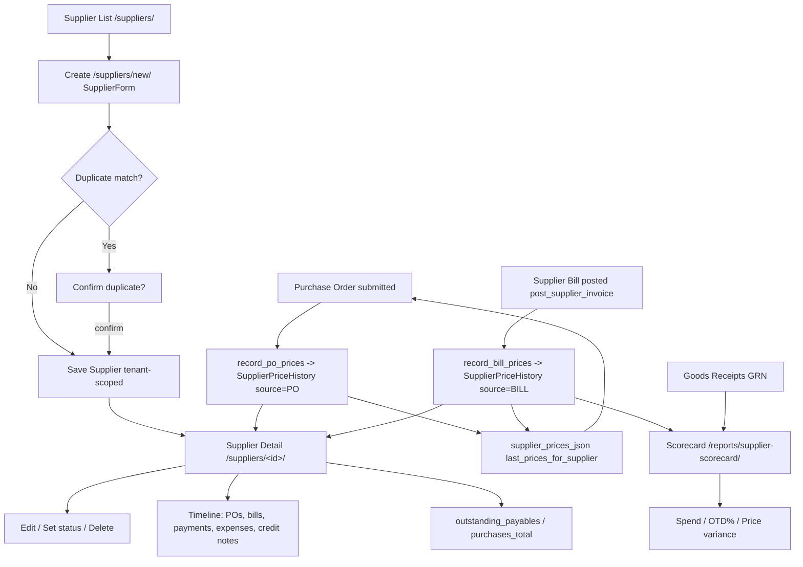

---

## 5. Product / SKU Management

### Purpose
Central master-data module for every sellable, purchasable and stockable item in the tenant. It defines SKUs with type, category, pricing, tax code, costing method and batch/serial-tracking flags, plus supporting masters: barcodes, units of measure with conversions, and bills of materials (kits). Every other operational module (inventory, purchasing, sales, GL valuation) references `Product` records created here.

### Roles involved
- Admin — full create/edit/delete on products, categories, BOMs, UOMs, CSV import.
- Manager — read access to products/categories/BOMs (via Procurement group mapping in `roles.py`).
- Purchasing — create/edit products, categories, BOMs, UOMs; run product CSV import (the views use `ROLE_PROCUREMENT`, which Purchasing maps to).
- Warehouse — read products, product categories, product detail.
- Sales — read product list/detail and BOM list/detail (no create/edit).
- Read-only — read product list, detail and categories only.

Note: views use the underlying Django-group roles (`ROLE_ADMIN`, `ROLE_PROCUREMENT`, `ROLE_WAREHOUSE`, `ROLE_SALES`, `ROLE_FINANCE`, `ROLE_READONLY`). Membership roles Manager/Accountant inherit access through the `ROLE_TO_GROUPS` mapping.

### Workflow
1. (Optional) Define supporting masters first: UOMs at `/uoms/`, conversions at `/uom-conversions/`, and product categories at `/product-categories/`.
2. Create a product at `/products/new/` (`product_create`) — enter SKU, name, type, category, pricing, tax code, cost method, reorder level, preferred supplier and tracking flags via `ProductForm`.
3. On save the form optionally captures one barcode (creates a `ProductBarcode`) and optional opening stock, which triggers a one-off `apply_movement` RECEIVE into the chosen location (seeding cost).
4. View the product profile at `/products/<id>/` (`product_detail`): stock by location, recent movements, barcodes, sales history, purchase history, supplier price history and margin.
5. Edit at `/products/<id>/edit/` (`product_edit`); a change to `standard_cost` writes a `PRODUCT_COST_CHANGED` audit entry.
6. For kit/bundle SKUs, create a BOM at `/boms/new/`, then add component lines on the BOM detail page (`bom_detail` with `BOMLineFormSet`).
7. When a kit is sold/picked, `explode_product()` resolves the first active BOM and deducts component stock instead of the kit itself.
8. Bulk load via `/products/import/` (CSV upsert by SKU); a template is downloadable at `/import/products/template.csv`.
9. Delete a product at `/products/<id>/delete/` (hard delete, audited) — or set `is_active=False` to retire it without removing history.

### Input data
- SKU (unique per tenant, case-insensitive), name, product type, category, brand, description, image.
- Variant fields: `parent` style SKU, `variant_name`, `option1`/`option2`/`option3`, `pack_size`.
- UOM: `base_uom` (FK) and legacy `uom` text (default "each").
- Pricing: `sales_price`, `tax_code` (FK `TaxCode`).
- Costing: `cost_method` (FIFO / AVERAGE / STANDARD), `standard_cost`, `reorder_level`, `preferred_supplier`.
- Tracking flags: `track_lots`, `track_expiry`, `track_serial`.
- Optional single barcode; optional opening stock + opening location.
- BOM: parent product, BOM name, active flag; lines of component product + qty + UOM.
- CSV columns for import: sku, name, product_type, category, brand, description, uom, cost_method, standard_cost, sales_price, is_active, barcode.

### Output generated
- `Product` records (and `ProductBarcode`, `BillOfMaterials`/`BillOfMaterialsLine`, `ProductCategory`, `UnitOfMeasure`, `UOMConversion`).
- Opening-stock `InventoryMovement` (type RECEIVE, ref_type "OPENING") when opening stock is supplied.
- `average_cost` maintained on inbound movements (moving average); derived `cost_price`, `margin`, `margin_pct`, `on_hand_total` properties.
- Audit entries: `PRODUCT_COST_CHANGED` on standard-cost change; `RECORD_DELETED` on product/category/BOM delete.
- No GL postings originate directly from this module — product master only feeds valuation/COGS in inventory and sales modules.

### Related modules
- Inventory — `InventoryBalance`/`InventoryMovement` keyed by product; opening stock, on-hand, reorder level, lot/serial tracking.
- Purchasing — `preferred_supplier`, `SupplierPriceHistory`, PO lines reference products.
- Sales — quotes/orders/invoices reference products; `explode_product` deducts kit components at fulfilment.
- Finance / Tax — `tax_code` FK to `TaxCode` drives VAT; costing feeds stock valuation and COGS.
- Reports — stock valuation, inventory analytics and profitability use product cost/price.

### Validations & rules
- SKU unique per tenant (DB `unique_together` + case-insensitive `clean_sku`).
- Barcode unique per tenant (DB `unique_together` + `clean_barcode`).
- All queries tenant-scoped via `_get_default_tenant`; every model carries a `tenant` FK.
- Category: `unique_together (tenant, name, parent)`; supports one level of nesting (parent).
- Category delete is safe — product `category` FK is `SET_NULL` and subcategory `parent` is `SET_NULL` (no cascade loss of products).
- Product delete is a hard delete (audited); `parent` variant FK is `PROTECT` and BOM `component` FK is `PROTECT`, so referenced products cannot be deleted. Soft retire via `is_active=False` is the intended alternative.
- BOM: `unique_together (tenant, product, name)`; line `unique_together (bom, component)`; `explode_product` uses the first active BOM by `created_at`.
- Opening stock only accepted when both quantity (>0) and location are provided; created once.
- No approval thresholds, credit limits or maker/checker workflow exist for product master (master data is created/edited directly by authorised roles).

### Database entities
- `Product`
- `ProductCategory`
- `ProductBarcode`
- `BillOfMaterials`
- `BillOfMaterialsLine`
- `UnitOfMeasure`
- `UOMConversion`
- (referenced) `TaxCode`, `Supplier`, `Location`, `InventoryMovement`, `InventoryBalance`, `SupplierPriceHistory`

### API / page requirements
- `/products/` — `product_list` (search by sku/name/brand/barcode; filter type/category/status).
- `/products/new/` — `product_create`.
- `/products/<int:product_id>/` — `product_detail`.
- `/products/<int:product_id>/edit/` — `product_edit`.
- `/products/<int:product_id>/delete/` — `product_delete`.
- `/products/import/` — `import_products`; `/import/products/template.csv` — `import_template`.
- `/product-categories/` — `product_category_list` (list + inline create).
- `/product-categories/<int:category_id>/delete/` — `product_category_delete`.
- `/boms/` — `bom_list`; `/boms/new/` — `bom_create`; `/boms/<int:bom_id>/` — `bom_detail`; `/boms/<int:bom_id>/delete/` — `bom_delete`.
- `/uoms/`, `/uoms/new/`, `/uoms/<id>/edit/`, `/uoms/<id>/delete/` — UOM master.
- `/uom-conversions/` (+ new/edit/delete) — UOM conversion rules.
- All are server-rendered Django views (templates under `templates/products/`, `templates/boms/`, `templates/uoms/`); no JSON REST API for product master.

### Flow diagram
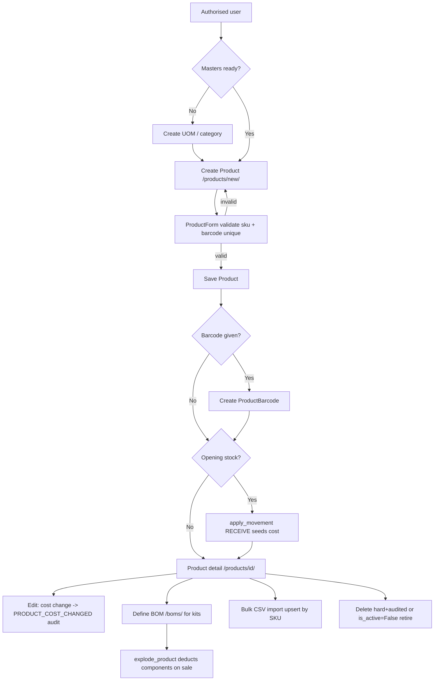

If something is not implemented: there is no variant-generator UI (variants are individual SKUs linked via `parent`), no multi-level BOM explosion (single active BOM, one level), and no JSON/REST API or approval workflow for product master.

---

## 6. Inventory and Stock Control

### Purpose
Tracks on-hand and reserved stock per product and location across a Site → Location → Bin hierarchy, maintaining a full costed movement ledger and inventory valuation (moving average, FIFO, or standard cost). It supports manual adjustments with GL postings, location-to-location transfers, cycle counts, and low-stock reordering, keeping the stock ledger in step with the inventory control account.

### Roles involved
- **Admin** — full access to all inventory pages, plus the only role that manages Location Access scoping (`/locations/access/`).
- **Manager** — operational visibility across inventory, adjustments, transfers, cycle counts, sites/locations/bins.
- **Warehouse** — day-to-day stock: adjustments, transfers, cycle counts, low-stock reorder.
- **Purchasing** — views inventory, adjustments, movements, low stock; approves adjustments and raises reorders. (In code the group is `ROLE_PROCUREMENT`.)
- **Read-only** — view-only access to inventory list, movements and low stock.

Note: Accountant/Finance do not appear in the inventory views' `role_required` lists; they consume the resulting GL postings and the Stock Valuation report instead.

### Workflow
1. Stock enters via inbound movements (PO/GRN receipt, customer return) routed through `services.inventory.apply_movement`, which updates `InventoryBalance.on_hand` and valuation.
2. A user raises a **Stock Adjustment** at `/inventory/adjustments/new/` (correction, damage, write-off/loss, or return-to-supplier). `estimated_value` is computed as `abs(qty_delta) * product.cost_price`.
3. If the tenant's `stock_adjustment_approval_threshold > 0` and `estimated_value >= threshold`, the adjustment is saved `PENDING` and waits for approval; otherwise it posts immediately.
4. Posting (`_post_stock_adjustment`) writes one `InventoryMovement` via `apply_movement`, then books the GL impact via `gl.post_stock_adjustment` (or, for return-to-supplier with a supplier, raises a purchase credit note via `purchasing.create_return_credit_note`).
5. An approver (Admin/Purchasing) approves at `/inventory/adjustments/<id>/approve/` (posts) or rejects at `.../reject/`.
6. **Transfers**: a user builds an `InventoryTransfer` with lines at `/transfers/new/`, then posts it; `_post_transfer` applies a `TRANSFER_OUT` (negative) at the source and a `TRANSFER_IN` (positive) at the destination per line, lot-aware.
7. **Cycle counts**: created at `/cycle-counts/new/`, move DRAFT → SUBMITTED → APPROVED → POSTED. On post, each line's `variance_qty` is written as an `ADJUSTMENT` movement.
8. **Low stock**: `/inventory/low-stock/` lists products where `on_hand_total < reorder_level`; selected lines POST to `/inventory/low-stock/reorder/`, which creates `PurchaseRequisition`(s) grouped by `preferred_supplier`.

### Input data
- Product, location (and optional bin) for each movement/adjustment.
- Signed `qty_delta` (+found / −loss), reason, optional notes, optional supplier (for return-to-supplier).
- Optional lot/serial/expiry tracking (lot_code, serial_number, expiry_date).
- Unit cost on inbound movements (drives valuation); cost method comes from the Product.
- Transfer header (from/to location) and line quantities; cycle-count counted quantities.
- Reorder selections and quantities on the low-stock page.

### Output generated
- `InventoryMovement` ledger rows, each with `unit_cost` and signed `value`.
- Updated `InventoryBalance` (`on_hand`, `reserved`) and optional `InventoryLotBalance`.
- `InventoryCostLayer` rows for FIFO products on inbound; consumed oldest-first on outbound.
- Updated `Product.average_cost` (moving average / standard).
- GL `JournalEntry` (ref_type `STOCK_ADJ`): loss → DR Inventory Adjustments / CR Inventory; gain → reverse. Idempotent per adjustment id.
- `PurchaseRequisition` + lines from low-stock reorder; `CreditNote` for return-to-supplier.
- Statuses: StockAdjustment PENDING/POSTED/REJECTED; Transfer DRAFT/POSTED/CANCELLED; CycleCount DRAFT/SUBMITTED/APPROVED/POSTED.
- Audit log entries (STOCK_ADJ_REQUESTED, STOCK_ADJUSTED, STOCK_ADJ_APPROVED/REJECTED, requisition_create).

### Related modules
- **Procurement** — receipts (RECEIVE movements) raise stock; low-stock reorder creates Purchase Requisitions; return-to-supplier raises credit notes.
- **Sales / Fulfilment** — sales fulfilment (SALE movements) and reservations (`reserve_stock` / `release_reservations`) draw on stock.
- **General Ledger / Finance** — adjustments and receipts post journals via `services.gl`.
- **Reports** — Stock Valuation and Inventory Analytics read movement value and balances.
- **Products / BOMs** — cost method, reorder level, preferred supplier come from Product.

### Validations & rules
- **Approval threshold**: adjustments at/above `tenant.stock_adjustment_approval_threshold` go PENDING; below post immediately; zero/blank threshold means no approval gate.
- **Tenant scoping**: every model/query is filtered by `tenant`.
- **Location access scoping**: `accessible_location_ids` / `UserLocationAccess` narrows the inventory list and form location dropdowns; a user with no rows (or Admin) sees all locations.
- **Valuation**: inbound with `unit_cost` updates moving average; FIFO also creates a cost layer; STANDARD always carries `standard_cost` (purchase variance handled in GL). Outbound is valued at average / consumed FIFO layers / standard.
- **Negative stock**: allowed — FIFO shortfall is valued at fallback (current average) cost.
- **Idempotency**: `gl.post_stock_adjustment` returns the existing entry for the same `STOCK_ADJ` ref, preventing double-posting.
- **GL gating**: zero-value adjustments post no journal.
- **Status guards**: transfers skip if already POSTED; cycle counts only post when APPROVED; approve/reject only act on PENDING adjustments.
- **Uniqueness**: balance unique per (tenant, product, location); transfer number unique per tenant.
- No soft-delete on movements; the ledger is append-only (corrections are new movements).

### Database entities
- `InventoryBalance`, `InventoryLotBalance`, `InventoryReservation`
- `InventoryMovement`, `InventoryCostLayer`
- `StockAdjustment`
- `InventoryTransfer`, `InventoryTransferLine`
- `CycleCount`, `CycleCountLine`
- `Site`, `Location`, `Bin`, `UserLocationAccess`
- `Product` (cost_method, average_cost, standard_cost, reorder_level, preferred_supplier)
- Downstream: `JournalEntry` / `JournalLine`, `PurchaseRequisition` / `PurchaseRequisitionLine`, `CreditNote`

### API / page requirements
- `/inventory/` — `inventory_list`
- `/inventory/adjustments/` — `adjustment_list`; `/inventory/adjustments/new/` — `adjustment_create`
- `/inventory/adjustments/<adj_id>/approve/` — `adjustment_approve`; `.../reject/` — `adjustment_reject`
- `/inventory/movements/` — `stock_movements`
- `/inventory/low-stock/` — `low_stock`; `/inventory/low-stock/reorder/` — `low_stock_reorder`
- `/transfers/`, `/transfers/new/`, `/transfers/<id>/`, `/transfers/<id>/post/` — transfer views
- `/cycle-counts/`, `/cycle-counts/new/`, `/cycle-counts/<id>/`, `.../submit/`, `.../approve/`, `.../post/`
- `/sites/` (+ new/edit/delete), `/locations/` (+ new/edit/delete), `/bins/` (+ new/edit/delete)
- `/locations/access/` — `location_access` (Admin only)

These are server-rendered Django pages (template responses), not a JSON REST API.

### Flow diagram
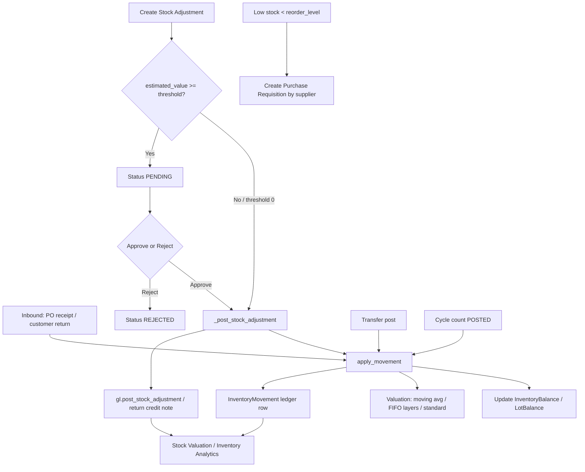

---

## 7. Purchasing

### Purpose
Manages the full procure-to-pay cycle for a UK SME: internal Purchase Requisitions, Purchase Orders to suppliers, inbound Shipments, Goods Receipts (GRN) into inventory, and three-way-matched Supplier Invoices (bills) that post to the General Ledger. It captures supplier price history for cost intelligence, supports approval thresholds, PO amendments/versioning, backorder tracking, and PO PDF/email to suppliers.

### Roles involved
- **Admin** — full access to all purchasing actions.
- **Purchasing** (group `Procurement`) — create/submit/send/amend/cancel POs, create requisitions, convert approved requisitions, create shipments.
- **Warehouse** — create requisitions, view POs/shipments, receive goods (GRN).
- **Manager** — read access across requisitions, POs, backorders, shipments (via the `Procurement`/`Warehouse` group mapping).
- **Accountant** / **Finance** — supplier invoices (bills) and posting (`/invoices/` is restricted to Admin/Accountant/Finance); Finance also approves/rejects requisitions.
- **Read-only** — view-only on POs, requisitions, shipments.

Note: requisition **approve/reject** views are gated to `[ROLE_ADMIN, ROLE_FINANCE]`, not Procurement.

### Workflow
1. A requester creates a **Purchase Requisition** (`requisition_create`) in Draft or directly Submitted (form `action`).
2. Admin/Finance **approves** (`requisition_approve`) or rejects/cancels it.
3. An approved requisition is **converted** (`requisition_convert`) into a Draft **PurchaseOrder** — supplier resolved from `preferred_supplier`, else a product's preferred supplier, else first supplier; lines copied with estimated/standard cost and STD tax code.
4. Purchasing **submits** the PO (`po_submit`): currency set from supplier/tenant, supplier prices recorded (`record_po_prices`), and a planned Shipment + ShipmentLines auto-created. If total > tenant `po_approval_threshold` the PO goes to **Approval Pending**, otherwise **Submitted**.
5. If required, Admin/Procurement **approves** (`po_approve`) → **Approved** (also ensures a shipment exists).
6. PO is **sent** to the supplier by email with PDF attached (`po_send`) → **Sent**.
7. Goods arrive; warehouse posts a **Goods Receipt / GRN** (`receive_po`) against a shipment — qty validated against open qty, inventory movements applied, optional landed cost apportioned, GL receipt posted (`post_inventory_receipt`).
8. PO status becomes **Partially Received** or **Fully Received** based on remaining open qty; outstanding lines appear in **Backorders**.
9. Finance/Accountant records and posts a **Supplier Invoice** (`invoice_post` → `post_supplier_invoice`): posts AP GL entry, marks the PO **Billed**, and captures actual billed prices (`record_bill_prices`).
10. Payment of the supplier invoice is handled by the Finance/Payments module (`supplier_payment_create`).

### Input data
- Requisition: department, preferred supplier, needed-by date, justification, line products/quantities/estimated unit cost.
- PO header: supplier, delivery address, currency, expected date, notes; lines: product, ordered qty, unit cost, VAT `tax_code`.
- Shipment: carrier, tracking number, ETA, destination Location; shipment line expected qty.
- GRN: received qty per line, optional lot code / serial / expiry, optional single landed-cost charge, attachment.
- Supplier Invoice: invoice number, invoice date, currency, lines (qty, unit cost, tax code, linked po_line/receipt_line), attachment.

### Output generated
- **Documents:** PO PDF (`po_pdf`, `documents/po_pdf.html`), PO email with PDF attachment (`po_email.html`).
- **Statuses:** PO — Draft / Submitted / Approval Pending / Approved / Sent / In Transit / Partially Received / Fully Received / Billed / Closed / Cancelled. (In Transit and Closed exist as choices but are not set by the receive/submit flows reviewed.)
- **GL postings:** GRN receipt — DR Inventory / CR GRNI / CR Accruals (landed) / ± Purchase Price Variance. Supplier invoice — DR GRNI + DR VAT Input / CR Accounts Payable.
- **Records:** GoodsReceipt + GoodsReceiptLines, InventoryMovement (RECEIVE), SupplierPriceHistory (PO and BILL sources), PurchaseOrderAmendment (versioning).

### Related modules
- **Inventory** — GRN applies costed stock movements and updates balances.
- **Finance / GL** — receipt and AP-invoice journal entries (`post_inventory_receipt`, `post_supplier_invoice`).
- **Payments** — supplier payments settle posted bills (DR AP / CR Bank).
- **VAT / Tax** — `TaxCode` drives input VAT on PO/invoice lines.
- **Suppliers & Products** master data; **Supplier Scorecard** report (`supplier_scorecard`) consumes bills + GRNs.

### Validations & rules
- **Approval threshold:** PO requires approval only when tenant `po_approval_threshold` is set and PO total exceeds it (set at submit time).
- **Receiving guards:** cannot receive a PO that is `approval_required`/Approval Pending; cannot receive more than a shipment line's open qty; "nothing received" rolls back the whole atomic transaction.
- **Status guards:** only Draft POs can be submitted; cancelled/closed POs cannot be sent or amended; only Approved requisitions convert, and a requisition converts only once (`converted_po`).
- **Amendments:** non-draft PO amendment creates a new version (`-vN`), supersedes the old one, sets `is_current=False` on the original, and requires a reason.
- **Price history idempotency:** `SupplierPriceHistory` unique per (tenant, supplier, product, source, reference); non-positive costs are ignored.
- **Tenant scoping:** every view filters by `_get_default_tenant(request)`; `po_number`/`req_number`/`grn_number`/`invoice_number` unique per tenant.
- Not implemented as an explicit gate: a formal three-way match block (PO/GRN/invoice quantities are linked via FKs and `SupplierInvoice.Status` has MATCHED/APPROVED, but posting via `invoice_post` does not enforce a match check).

### Database entities
- `PurchaseRequisition`, `PurchaseRequisitionLine`
- `PurchaseOrder`, `PurchaseOrderLine`, `PurchaseOrderAmendment`
- `Shipment`, `ShipmentLine`, `Container`
- `GoodsReceipt`, `GoodsReceiptLine`, `LandedCostCharge`
- `SupplierInvoice`, `SupplierInvoiceLine`
- `SupplierPriceHistory`, `Supplier`
- (GL) `JournalEntry`, `JournalLine`; (inventory) `InventoryMovement`, `InventoryBalance`

### API / page requirements
- Requisitions: `/requisitions/`, `/requisitions/new/`, `/requisitions/<id>/`, `.../submit/`, `.../approve/`, `.../reject/`, `.../cancel/`, `.../convert/`
- Purchase Orders: `/po/`, `/po/new/`, `/po/<id>/`, `.../submit/`, `.../approve/`, `.../send/`, `.../amend/`, `.../cancel/`, `.../print/`, `.../pdf/`, `.../receive/`
- `/po/backorders/` (outstanding open lines)
- `/po/supplier/<supplier_id>/prices/` → `supplier_prices_json` (last-cost prefill)
- Shipments: `/po/<po_id>/shipments/new/`, `/shipments/`, `/shipments/<id>/`, `/shipment/<id>/` (update)
- Supplier invoices (bills): `/invoices/`, `/invoices/new/`, `/invoices/<id>/`, `/invoices/<id>/post/`
- Report: `/reports/supplier-scorecard/`

### Flow diagram
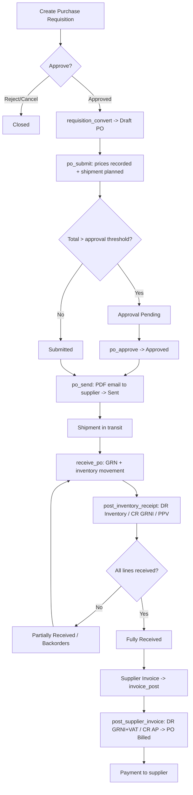

---

## 8. Sales

### Purpose
The Sales module manages the full order-to-cash lifecycle for selling goods and services to customers: quoting, order capture, invoicing, recurring billing, channel/e-commerce orders, credit notes, and returns. It drives stock reservations and deductions, posts revenue/VAT/COGS to the general ledger on invoice issue, and enforces customer credit limits and on-hold blocks. It connects sales activity directly to inventory and finance so a single tenant's AR ledger, VAT return, and stock valuation stay in sync.

### Roles involved
- **Sales** — create/edit quotes, orders, invoices, recurring templates, channel orders, and returns (`SALES_DOC_ROLES = [Sales, Finance, Admin]`).
- **Finance** / **Accountant** — issue, send, cancel, and refund customer invoices; manage credit notes.
- **Admin** — full access to all sales documents and configuration.
- **Manager** — navigation access (sidebar) to quotes, orders, invoices, returns, and channel orders.
- **Warehouse** — returns (RMA) processing/receiving via nav; channel order posting deducts stock.
- **Read-only** — list/detail views only (`SALES_DOC_READ` adds Read-only to read paths).

### Workflow
1. **Quote** — Sales creates a `SalesQuote` (DRAFT) with line items; optionally emails it (`quote_send`), moving it to SENT.
2. **Quote acceptance** — status moved via `quote_status` (ACCEPTED/DECLINED/EXPIRED/CANCELLED).
3. **Convert quote** — `quote_to_order` creates a CONFIRMED `CustomerOrder` (copying lines, linked via `CustomerOrder.quote`); or `quote_to_invoice` creates a draft `CustomerInvoice` (linked via `source_quote`). The quote is set to CONVERTED.
4. **Order confirm** — `corder_status` "confirm" runs `credit_status`, then reserves stock via `_reserve_customer_order` → `reserve_stock` (ref_type `CUSTOMER_ORDER`).
5. **Convert order to invoice** — `corder_to_invoice` builds a draft `CustomerInvoice` (linked via `source_order`), sets the order to INVOICED, and releases reservations (`_release_customer_order`).
6. **Issue invoice** — `ar_invoice_issue` checks `credit_status`, then `post_customer_invoice` posts the GL entry, sets status ISSUED, and runs `_post_invoice_cogs` to deduct stock and book COGS.
7. **Send invoice** — `ar_invoice_send` issues (if draft) then emails the PDF and marks SENT.
8. **Payment/credit** — payments allocate against the invoice; `outstanding` derives Partially paid / Paid / Overdue display states.
9. **Cancel/refund** — `ar_invoice_cancel` reverses the GL entry (if posted and unpaid); `ar_invoice_refund` and `CreditNote` handle post-payment credits.
10. **Recurring** — `RecurringInvoice` templates generate invoices on schedule via `generate_for_template` / `generate_due` (auto-issued if `auto_issue`).
11. **Channel orders** — `SalesOrder` (Shopify/e-commerce) posts via `sales_order_post` → `_post_sales_order` (releases reservations, deducts stock, allows negative with shortage warnings).
12. **Returns** — `ReturnAuthorization` (RMA) processed via `return_process` (approve → receive) restocks goods via `_receive_rma`.

### Input data
- Customer, currency, quote/order/invoice dates, valid-until / due-date.
- Line items: product (or description-only service line), qty, unit price, discount %, tax code.
- Notes and terms (defaulted from `tenant.invoice_footer`); default tax code and payment terms from tenant.
- Recurring: frequency, interval, start/next-run/end dates, max occurrences, auto-issue flag.
- Channel order: channel, order number, ship-from location, lot/serial/expiry per line.
- RMA: channel, original order number, receive location, lines with reason and lot/serial/expiry.

### Output generated
- Documents: quote PDF, sales-order PDF, invoice PDF, credit note PDF (`quote_pdf`, `corder_pdf`, `ar_invoice_pdf`, `credit_note_pdf`).
- GL postings on invoice issue (`post_customer_invoice`): DR Accounts Receivable (total), CR Sales Revenue (subtotal), CR VAT Output (tax). Plus COGS entry (`post_cogs`) and SALE inventory movements via `_post_invoice_cogs`.
- Status transitions across quote/order/invoice lifecycles; invoice cancellation reversal JE (`AR_INVOICE_CANCEL`).
- Stock reservations on order confirm; stock deductions on invoice issue and channel-order post; restock movements (RETURN) on RMA receive.
- Customer outstanding balance / aged-debtor data; VAT-return inputs (output VAT).

### Related modules
- **Inventory** — reservations (`reserve_stock`/`release_reservations`), SALE/RETURN movements (`apply_movement`), kit explosion (`explode_product`).
- **Finance / GL** — journal entries, COGS, VAT Output, AR control account; credit notes; payments/receipts allocation.
- **Customers** — credit limit and on-hold status (`credit_status`), statements.
- **VAT (MTD)** — issued invoices feed output-VAT boxes via tax codes.
- **Reports** — sales reports (history, by product/customer/channel), profitability, aged receivables.
- **Channels** — `SalesOrder` from Shopify/e-commerce connectors.

### Validations & rules
- **Credit control**: `credit_status(total)` blocks issuing an invoice when over limit or customer ON_HOLD. On order confirm, ON_HOLD is a hard block but over-limit only warns (no receivable until invoiced).
- **Idempotent posting**: `post_customer_invoice` and `_post_invoice_cogs` guard against double-posting via JE ref (`AR_INVOICE` / `COGS` + invoice number).
- **Cancel guards**: an invoice with payments cannot be cancelled (must use credit note/refund); GL reversal only when previously issued.
- **Conversion immutability**: CONVERTED quotes and INVOICED orders cannot be deleted (linked to downstream docs).
- **Soft delete**: `CustomerInvoice` uses `SoftDeleteManager` (`is_deleted`/`deleted_at`/`deleted_by`); not a hard delete.
- **Negative stock allowed**: channel-order post and invoice COGS permit negative inventory, surfacing shortages as warnings rather than blocking.
- **Tenant scoping**: every query filters by `tenant`; document numbers unique per tenant.
- **Service lines**: description-only lines (no product) and tenants without a stock location skip stock/COGS, supporting service businesses.

### Database entities
- `SalesQuote`, `SalesQuoteLine`
- `CustomerOrder`, `CustomerOrderLine`
- `CustomerInvoice`, `CustomerInvoiceLine`
- `RecurringInvoice`, `RecurringInvoiceLine`
- `CreditNote`, `CreditNoteLine`
- `SalesOrder`, `SalesOrderLine` (channel/e-commerce), `SalesChannel` (choices)
- `ReturnAuthorization`, `ReturnLine`
- Supporting: `Customer`, `Product`, `TaxCode`, `Location`, `JournalEntry`, `JournalLine`, `InventoryMovement`, `StockReservation`

### API / page requirements
- Quotes: `/quotes/`, `/quotes/new/`, `/quotes/<id>/`, `/quotes/<id>/edit/`, `/quotes/<id>/pdf/`, `/quotes/<id>/send/`, `/quotes/<id>/status/<to>/`, `/quotes/<id>/to-order/`, `/quotes/<id>/to-invoice/`, `/quotes/<id>/delete/`
- Customer orders: `/customer-orders/`, `/customer-orders/new/`, `/customer-orders/<id>/`, `/customer-orders/<id>/edit/`, `/customer-orders/<id>/pdf/`, `/customer-orders/<id>/status/<to>/`, `/customer-orders/<id>/to-invoice/`, `/customer-orders/<id>/delete/`
- AR invoices: `/ar/invoices/`, `/ar/invoices/new/`, `/ar/invoices/<id>/`, `/ar/invoices/<id>/edit/`, `/ar/invoices/<id>/issue/`, `/ar/invoices/<id>/pdf/`, `/ar/invoices/<id>/send/`, `/ar/invoices/<id>/cancel/`, `/ar/invoices/<id>/refund/`, `/ar/invoices/<id>/delete/`
- Recurring: `/recurring-invoices/`, `/recurring-invoices/new/`, `/recurring-invoices/run-due/`, `/recurring-invoices/<id>/`, `/recurring-invoices/<id>/edit/`, `/recurring-invoices/<id>/toggle/`, `/recurring-invoices/<id>/generate/`
- Channel orders: `/sales-orders/`, `/sales-orders/new/`, `/sales-orders/<id>/`, `/sales-orders/<id>/post/`
- Returns: `/returns/`, `/returns/new/`, `/returns/<id>/`, `/returns/<id>/process/`
- Credit notes: `/credit-notes/` (+ new/detail/post/pdf)
- Sales reports: `/sales/reports/` (history, by-product, by-customer, by-channel, profitability)

### Flow diagram
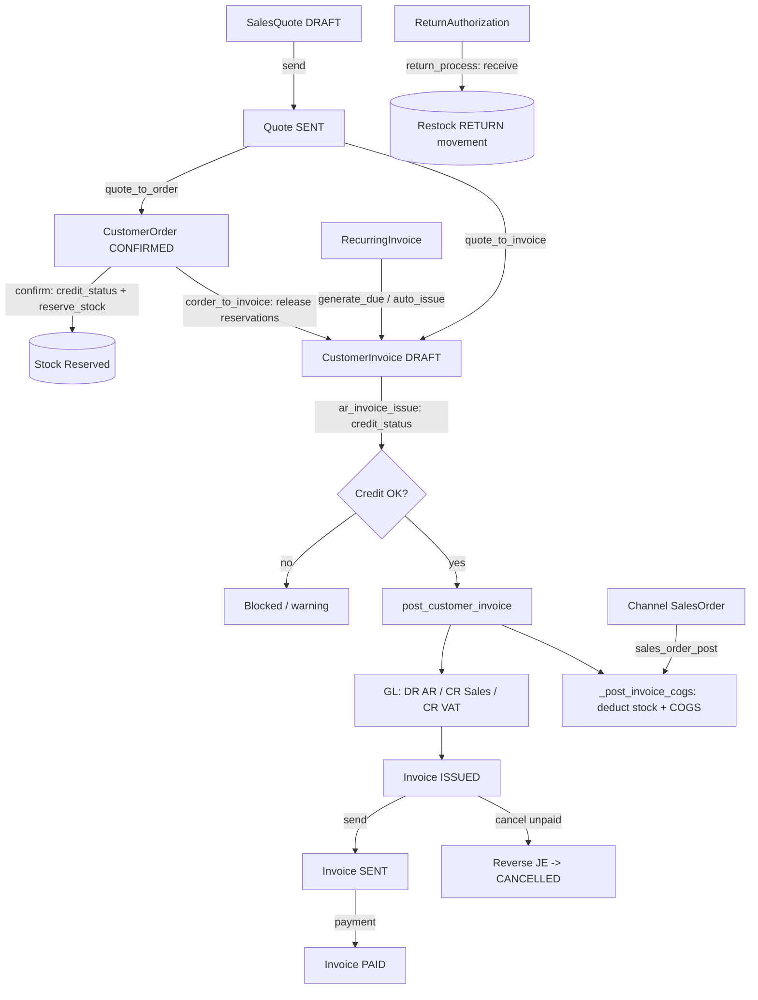

---

## 9. Finance and Accounting

### Purpose
A double-entry general ledger that turns operational events (invoices, payments, expenses, credit notes, goods receipts, stock changes) into balanced journal entries automatically. It also handles cash recording (customer receipts, supplier payments, customer refunds) with FIFO allocation against open invoices, plus bank-statement reconciliation. Designed for a UK SME: VAT input/output accounts feed the MTD VAT return, and sensitive cash records are soft-deleted (never hard-deleted) for audit.

### Roles involved
- **Finance** (Django group `Finance`, membership roles ACCOUNTANT and FINANCE) — primary writer for payments, GL accounts, credit notes, expenses, reconciliation.
- **Admin** — full access; sees everything.
- **Read-only** — can view the Journal (`journal_detail` allows ROLE_READONLY) and financial reports; no write access.
- Other roles (Manager, Sales, Warehouse, Purchasing) can only *record* expenses (the `/expenses/` page is open to them), but posting expenses to the GL is Finance/Admin.

### Workflow
1. **Chart of accounts** is set up per tenant (`/gl/accounts/`). The GL service relies on fixed default codes (e.g. 1000 Inventory, 1050 Bank, 1100 AR, 2000 AP, 2100 GRNI, 2200 VAT Output, 1300 VAT Input, 4000 Sales, 5000 COGS).
2. **Source documents post automatically.** Issuing a customer invoice calls `post_customer_invoice` (DR AR / CR Sales / CR VAT Output, then deducts stock and posts COGS). Posting a supplier invoice calls `post_supplier_invoice` (DR GRNI / DR VAT Input / CR AP). Goods receipt → `post_inventory_receipt`; stock adjustments → `post_stock_adjustment`.
3. **Record a customer receipt** at `/payments/receipts/new/`: the system pulls that customer's open (ISSUED) invoices oldest-first and allocates the receipt **FIFO** (`_allocate_fifo`), then `post_payment` books DR Bank / CR AR and marks fully-settled invoices PAID.
4. **Record a supplier payment** at `/payments/payments/new/`: FIFO allocation against POSTED supplier invoices, then DR AP / CR Bank.
5. **Record a customer refund** at `/payments/refunds/new/`: DR AR / CR Bank (no allocation).
6. **Credit notes** (`/credit-notes/new/`) are drafted then posted (`post_credit_note`); a sales credit reverses Sales/VAT Output against AR, a purchase credit reverses against AP.
7. **Expenses** are recorded, optionally submitted/approved, then posted (`post_expense`) to the chosen expense account.
8. **Import the bank statement** (`/bank/transactions/import/`, CSV: date, description, amount), then **reconcile** at `/bank/reconcile/` — auto-match or manually match each line to a Payment or paid Expense and mark reconciled.
9. **Reverse / delete:** soft-deleting a payment (`/payments/<id>/delete/`) calls `reverse_payment` to post a mirror entry, frees the settled invoices, and flags the row deleted (kept for audit).
10. Resulting balances flow into the financial reports (trial balance, P&L, balance sheet) and the VAT return.

### Input data
- GL account: code, name, type (ASSET/LIABILITY/EQUITY/INCOME/COGS/EXPENSE), active flag.
- Payment: direction, customer/supplier, date, amount, method (BANK/CARD/CASH/CHEQUE/OTHER), reference, notes.
- Credit note: kind (SALES/PURCHASE), number, date, party, optional linked invoice, reason, lines (product/description, qty, unit amount, tax code, account).
- Expense: date, payee, optional supplier, category (an expense/COGS GLAccount), net amount, tax code, paid-now flag, method, receipt file.
- Bank transaction: date, description, signed amount (+in / −out), reference.

### Output generated
- `JournalEntry` + balanced `JournalLine` rows, tagged by `ref_type` (AR_INVOICE, AP_INVOICE, PAYMENT, PAYMENT_REVERSAL, EXPENSE, CREDIT_NOTE, GRN, COGS, STOCK_ADJ) and `ref_id`.
- Status transitions: CustomerInvoice → PAID when fully settled; SupplierInvoice → POSTED; Payment/Expense/CreditNote → POSTED.
- `PaymentAllocation` rows linking cash to invoices.
- Reconciled bank transactions (`is_reconciled`).
- Credit-note PDF (`/credit-notes/<id>/pdf/`). Finance CSV export (`/finance/export/<kind>.csv`).

### Related modules
- **Sales / AR** (CustomerInvoice → receipts, sales credit notes).
- **Procurement / AP** (SupplierInvoice → supplier payments, GRNI, purchase credit notes).
- **Inventory** (COGS, inventory receipt, stock-adjustment postings).
- **VAT (MTD)** — VAT input/output accounts feed the 9-box `VatReturn`.
- **Reports** (trial balance, P&L, balance sheet, aged debtors/creditors, cash flow) read the GL.

### Validations & rules
- **Tenant scoping:** every entity is filtered by `tenant`; `_acc()` resolves accounts per tenant by code.
- **Idempotency:** posting functions short-circuit if a JE for that `(ref_type, ref_id)` already exists, so re-issuing/re-posting never double-counts.
- **Double-entry integrity:** each posting writes balancing debit/credit lines; `JournalEntry.total_debit`/`total_credit` expose the check (note: balance is enforced by the service logic, not a DB constraint).
- **FIFO allocation:** receipts/payments settle oldest open invoices first.
- **Soft-delete (sensitive):** `Payment` uses `SoftDeleteManager` (`is_deleted`, `deleted_by`, `deleted_at`); the default manager hides deleted rows, `all_objects` retains them. Deletion posts a reversing entry rather than removing ledger history.
- **No GL hard-edit:** journal entries are not editable through the UI; corrections go via reversals/new postings.
- **GLAccount uniqueness:** `(tenant, code)` unique; accounts are PROTECTed from deletion by journal lines and expenses.
- **Bank reconciliation posts nothing** to the ledger — it is matching/preparation only.
- **Supplier invoices have no PAID state** — once settled they remain POSTED.
- Approval thresholds: not implemented for payments/credit notes (expenses have a DRAFT→SUBMITTED→approve flow; payments and credit notes post directly with Finance/Admin rights).

### Database entities
`GLAccount`, `JournalEntry`, `JournalLine`, `Payment`, `PaymentAllocation`, `Expense`, `CreditNote`, `CreditNoteLine`, `BankTransaction`. Reads/updates `CustomerInvoice`, `SupplierInvoice`, `TaxCode`, `InventoryMovement`, `Location`, `Tenant`.

### API / page requirements
- Payments: `/payments/`, `/payments/receipts/new/`, `/payments/payments/new/`, `/payments/refunds/new/`, `/payments/<id>/`, `/payments/<id>/delete/`.
- General ledger: `/gl/accounts/`, `/gl/accounts/new/`, `/gl/accounts/<id>/edit/`, `/gl/journal/`, `/gl/journal/<id>/`.
- Credit notes: `/credit-notes/`, `/credit-notes/new/`, `/credit-notes/<id>/`, `/credit-notes/<id>/post/`, `/credit-notes/<id>/pdf/`.
- Expenses: `/expenses/`, `/expenses/new/`, `/expenses/<id>/`, `/expenses/<id>/post/`, plus submit/approve/reject.
- Bank: `/bank/transactions/`, `/bank/transactions/new/`, `/bank/transactions/import/`, `/bank/reconcile/`.
- AP posting trigger: `/invoices/<id>/post/`. Finance export: `/finance/export/<kind>.csv`.

### Flow diagram
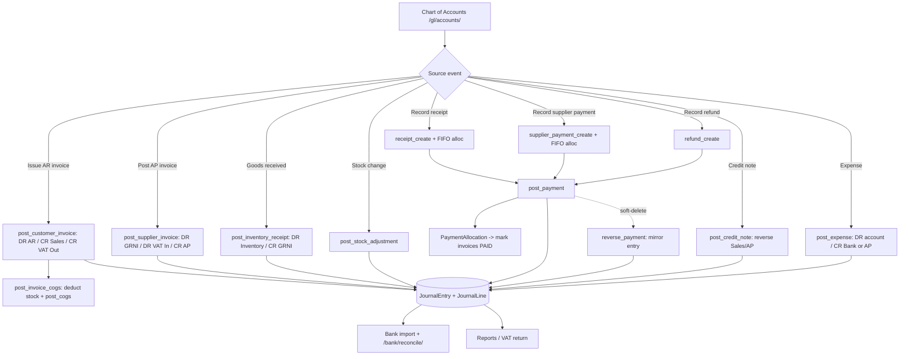

---

## 10. VAT and UK Tax Compliance

### Purpose
Computes Making Tax Digital (MTD) 9-box VAT returns for a UK tenant by aggregating VAT at transaction-line level across every VAT-bearing document in a chosen period. It also manages the tenant's library of VAT tax codes (rate + treatment) that drive how each line is taxed and reported. Returns are saved as DRAFT and can be marked SUBMITTED; live HMRC filing is intentionally a clearly-labelled local stub.

### Roles involved
- **Finance** (`ROLE_FINANCE` — covers both the Finance and Accountant membership roles, which both map to the Django `Finance` group): full read/write on tax codes and VAT returns.
- **Admin** (`ROLE_ADMIN`): full read/write.
- **Read-only** (`ROLE_READONLY`): read access to tax code list, VAT preview/returns and VAT records; cannot create/edit/save/submit.

### Workflow
1. Finance/Admin maintains VAT tax codes at `/tax-codes/` — create/edit a `TaxCode` with a `code`, `name`, `rate` (decimal fraction, e.g. `0.2000`) and `kind` (standard/reduced/zero/exempt/outside-scope).
2. Tax codes are selected on individual document lines (sales invoices, supplier bills, expenses, credit notes), so each line carries its own VAT treatment.
3. To prepare a return, the user opens `/vat/`, enters a period (`from`/`to`), and the page renders a live preview by calling `compute_vat_return`.
4. `vat_transactions` walks every VAT-bearing line in the period; `vat_summary` aggregates output/input VAT and a per-rate breakdown; `compute_vat_return` maps the totals onto the nine boxes.
5. The user POSTs to `/vat/save/`, which calls `save_vat_return` to persist (or refresh) a DRAFT `VatReturn` via `update_or_create` keyed on `(tenant, period_from, period_to)`.
6. The saved return is shown at `/vat/<id>/` with all nine boxes.
7. The user POSTs to `/vat/<id>/submit/`; `submit_vat_return` flips status DRAFT→SUBMITTED, stamps `submitted_at`, and writes a `LOCAL-STUB-<id>` reference. A warning message explicitly states live HMRC MTD filing is not connected.
8. The digital VAT records (audit trail behind a return) are viewable at `/vat/records/`, defaulting to the current financial year.

### Input data
- `TaxCode` definitions: code, name, rate, kind, is_active.
- Reporting period: `date_from` / `date_to`.
- Source documents in the period (read-only inputs): `CustomerInvoice` lines (status ISSUED/SENT/PAID), `SupplierInvoice` lines (status POSTED), `Expense` records (status POSTED), `CreditNote` lines (status POSTED, sales or purchase).

### Output generated
- Live 9-box preview (boxes 1–9) plus plain-English summary and per-rate breakdown.
- Persisted `VatReturn` records (DRAFT, then SUBMITTED).
- `submitted_at` timestamp and `hmrc_reference` (`LOCAL-STUB-<id>` — not a real HMRC receipt).
- Digital VAT records list (one row per VAT-bearing line; credit notes signed negative).
- Audit log entries: `VAT_RATE_CHANGED`, `VAT_RETURN_SAVED`, `VAT_RETURN_SUBMITTED`, `RECORD_DELETED`.
- No GL postings are generated by this module (VAT is reported, not posted, here).

### Related modules
- **Sales / AR** — `CustomerInvoice` lines feed output VAT (boxes 1, 6).
- **Procurement / AP** — `SupplierInvoice` lines feed input VAT (boxes 4, 7).
- **Expenses** — POSTED `Expense` records feed input VAT.
- **Credit Notes** — sales/purchase credit notes reduce output/input VAT respectively.
- **Reports** — uses `reports_service.current_financial_year` to default the VAT records period.
- **Audit Log** — every mutating action is logged.

### Validations & rules
- **Tenant scoping**: all `TaxCode` and `VatReturn` queries filter by tenant; tax code `code` is unique per tenant.
- **One return per period**: `VatReturn` is unique on `(tenant, period_from, period_to)`; saving refreshes the existing DRAFT rather than duplicating.
- **Period validity**: `vat_save` rejects missing dates or `date_to < date_from`.
- **Treatment rules**: outside-scope (`OUTSIDE`) supplies are excluded from net boxes 6/7 (`in_vat_boxes` is False); zero-rated and exempt supplies are included at a zero rate. A line with no tax code is treated as "No VAT" but still included in net boxes.
- **Document status gating**: only ISSUED/SENT/PAID sales invoices, POSTED supplier bills, POSTED expenses and POSTED credit notes are picked up.
- **Box 2/8/9**: hard-coded to 0.00 (post-Brexit GB assumption — EU acquisitions/supplies not implemented).
- **Submission immutability**: `submit_vat_return` is idempotent — a return already SUBMITTED is returned unchanged.
- **MTD stub**: actual HMRC submission is NOT implemented; the single replacement seam is `submit_vat_return`, and the user is warned the reference is a local stub.
- **Soft-delete**: not implemented for tax codes — `taxcode_delete` performs a hard `obj.delete()`.

### Database entities
- `TaxCode` (with `Kind` choices STANDARD/REDUCED/ZERO/EXEMPT/OUTSIDE and `in_vat_boxes` property)
- `VatReturn` (with `Status` DRAFT/SUBMITTED and box1–box9 fields)
- Read-only sources: `CustomerInvoice`, `SupplierInvoice`, `Expense`, `CreditNote` (and their lines + `tax_code` FKs)

### API / page requirements
- `GET /tax-codes/` → `taxcode_list`
- `GET/POST /tax-codes/new/` → `taxcode_create`
- `GET/POST /tax-codes/<int:tax_id>/edit/` → `taxcode_edit`
- `GET/POST /tax-codes/<int:tax_id>/delete/` → `taxcode_delete`
- `GET /vat/?from=&to=` → `vat_index` (live 9-box preview + saved returns)
- `POST /vat/save/` → `vat_save`
- `GET /vat/<int:vr_id>/` → `vat_detail`
- `POST /vat/<int:vr_id>/submit/` → `vat_submit` (local stub)
- `GET /vat/records/?from=&to=` → `vat_records`
- Service functions (`core/services/vat.py`): `vat_transactions`, `vat_summary`, `compute_vat_return`, `save_vat_return`, `submit_vat_return`.
- No JSON/REST API — these are server-rendered Django views/templates.

### Flow diagram
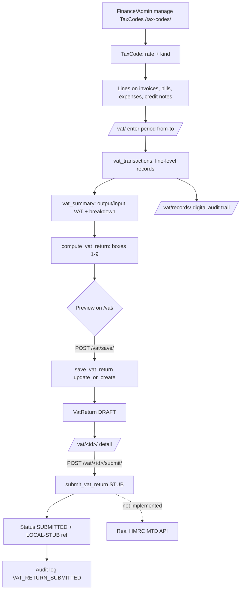

---

## 11. Expenses

### Purpose
Lets staff record everyday business costs (rent, fuel, software, professional fees, etc.) that arrive without a formal supplier bill, optionally attaching a receipt photo or PDF. Each expense carries a net amount plus a VAT tax code, runs through a Draft → Submitted → Posted approval workflow, and on posting generates the GL double-entry (DR expense account + DR VAT input, CR Bank or Accounts Payable).

### Roles involved
- **Admin** — full access (submit, approve, post, reject).
- **Finance** — approver: submit, approve, reject, post (`EXPENSE_APPROVERS = [ROLE_FINANCE, ROLE_ADMIN]`).
- **Manager, Sales, Warehouse, Purchasing** — staff: create, save draft, submit for approval (`EXPENSE_STAFF = [ROLE_ADMIN, ROLE_FINANCE, ROLE_PROCUREMENT, ROLE_WAREHOUSE, ROLE_SALES]`; note Manager maps to the Procurement/Warehouse/Sales groups).
- **Read-only** — may view the list and detail only (`expense_list` / `expense_detail` include `ROLE_READONLY`).
- **Accountant** appears in the sidebar entry for `/expenses/` but is not in `EXPENSE_STAFF`/`EXPENSE_APPROVERS`, so its write access is via the Finance group mapping.

### Workflow
1. A staff user opens `/expenses/new/` and fills the form: date, payee, optional supplier, category (an expense GL account), net amount, tax code, payment method, paid/reimbursable flags, reference, and an optional receipt file.
2. On submit, the view sets `tenant` and `currency_code` from the tenant, saves the record, then branches on the form `action`:
   - **Save draft** → status `DRAFT`.
   - **Submit** → status `SUBMITTED`, `submitted_by` set, audit log `expense_submit`.
   - **Post** (approver, below threshold) → `post_expense()` runs immediately, status `POSTED`.
   - **Post** (approver, at/above threshold) → forced to `SUBMITTED` with a warning that approval is required.
3. A draft can later be submitted via `/expenses/<id>/submit/` (staff, only when `DRAFT`).
4. An approver (Finance/Admin) reviews via `/expenses/<id>/` and either approves (`/approve/`) or rejects (`/reject/` with an optional reason).
5. On **approve**: `post_expense()` posts the GL entry and sets status `POSTED`; `approved_by` / `approved_at` are recorded; audit `expense_approve`.
6. On **reject**: status `REJECTED`, `rejected_reason` stored, `approved_by`/`approved_at` set; audit `expense_reject`.
7. `/expenses/<id>/post/` (Finance/Admin) is a direct post path for any non-posted expense, bypassing approval gating.

### Input data
- Expense date, payee (merchant), optional supplier link.
- Category — an active `GLAccount` of type EXPENSE (form restricts the queryset to `type=EXPENSE, is_active=True`).
- Description, net amount (before VAT), tax code (optional; defaults to tenant `default_tax_code`).
- Payment method (Bank transfer / Card / Cash / Other), reference.
- Flags: `paid` (paid now vs owed), `reimbursable` (paid personally).
- Receipt file upload — validated to `.pdf/.png/.jpg/.jpeg/.gif/.webp/.heic`, stored tenant-scoped under `expense_receipts/<tenant_id>/`.

### Output generated
- An `Expense` record with status Draft / Submitted / Rejected / Posted.
- On posting, a balanced `JournalEntry` (`ref_type="EXPENSE"`, `ref_id=<expense.id>`) with `JournalLine`s: DR category account (net), DR VAT Input (tax, account key `vat_input`) when tax is non-zero, CR Bank (`bank`) if `paid` else CR Accounts Payable (`ap`) for the gross total.
- Audit-log entries: `expense_submit`, `expense_approve`, `expense_reject`.
- Posted expenses flow into VAT input reclaim and P&L expense reporting via the journal.

### Related modules
- **General Ledger / Chart of Accounts** — categories are EXPENSE `GLAccount`s; posting writes `JournalEntry`/`JournalLine`.
- **VAT / Tax Codes** — `tax_code` drives reclaimable VAT Input.
- **Suppliers / Accounts Payable** — optional supplier link; unpaid expenses credit AP.
- **Bank** — paid expenses credit the Bank account (feeds bank reconciliation).
- **Reports** — Profit & Loss (expense accounts) and VAT return.
- **Inter-company** — `is_intercompany` flag marks group purchases for consolidation elimination (set programmatically, not in the standard form).
- **Tenant Settings** — `expense_approval_threshold` configured under Company Profile.

### Validations & rules
- **Approval threshold**: if `tenant.expense_approval_threshold > 0` and `expense.total >= threshold`, the expense cannot be posted on creation and is forced to Submitted for approval.
- **Approve/reject gate**: only `SUBMITTED` expenses can be approved or rejected.
- **Submit gate**: `/submit/` only acts when status is `DRAFT`.
- **Post idempotency**: `post_expense()` returns the existing journal entry if already `POSTED` (no double-posting); `/post/` no-ops when already posted.
- **Category restriction**: only active EXPENSE-type GL accounts selectable.
- **Receipt type validation**: PDF or image extensions only.
- **Tenant scoping**: every query filters `tenant=_get_default_tenant(request)`; receipts stored per-tenant directory.
- **Referential protection**: `category`, `supplier`, `tax_code` use `on_delete=PROTECT`.
- **No soft-delete or immutability lock** on posted expenses is implemented — there is no edit/delete view or void path for a posted expense; not implemented.

### Database entities
- `Expense` (statuses DRAFT/SUBMITTED/REJECTED/POSTED; methods BANK/CARD/CASH/OTHER; computed `tax_amount`, `total`).
- `GLAccount` (EXPENSE-type accounts used as categories; e.g. 6100 Rent & Rates, 6200 Utilities, 6400 Travel & Subsistence, 6700 Software & Subscriptions, etc.).
- `TaxCode`, `Supplier`, `Tenant` (holds `expense_approval_threshold`, `default_tax_code`, `currency_code`).
- `JournalEntry` / `JournalLine` (the posted double-entry).
- `auth.User` via `submitted_by`, `approved_by`, `posted_by`.
- Note: `Expense` has no line-item child model — it is a single net amount plus one tax code.

### API / page requirements
- `GET /expenses/` → `expense_list` (list + total; read-only roles allowed).
- `GET/POST /expenses/new/` → `expense_create`.
- `GET /expenses/<int:expense_id>/` → `expense_detail` (shows linked journal entry).
- `POST /expenses/<int:expense_id>/submit/` → `expense_submit`.
- `POST /expenses/<int:expense_id>/approve/` → `expense_approve`.
- `POST /expenses/<int:expense_id>/reject/` → `expense_reject` (reads `reason`).
- `POST /expenses/<int:expense_id>/post/` → `expense_post` (Finance/Admin).
- No JSON/REST API — these are server-rendered Django views/templates under `core/templates/expenses/`.

### Flow diagram
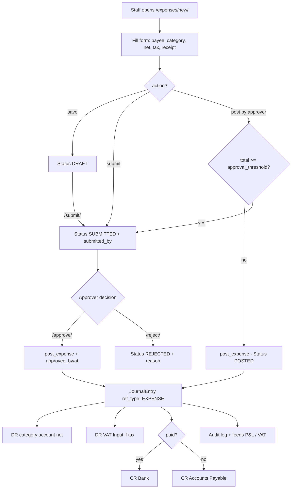

---

## 12. Reports and Dashboards

### Purpose
Read-only reporting layer that turns the General Ledger, AR/AP sub-ledgers and inventory balances into the financial, sales and operational reports a UK SME needs to run day to day. It also drives the role-based landing dashboards that surface headline KPIs and a per-role launcher of accessible modules. All figures are computed live from posted data (no separate reporting tables) and are tenant-scoped, with stock/inventory reports further scoped to the locations a user may access.

### Roles involved
- Admin: every report and dashboard.
- Accountant / Finance: financial statements (Trial Balance, P&L, Balance Sheet, Cash Flow), Aged Debtors/Creditors, Consolidated, Supplier Scorecard, all sales reports, stock/inventory reports.
- Manager: Stock Valuation, Inventory Analytics, Profitability, Supplier Scorecard, sales reports, operations dashboard.
- Sales: sales reports (history, by product/customer/channel, profitability) and sales dashboard.
- Warehouse: Stock Valuation, Inventory Analytics, warehouse dashboard.
- Purchasing: Stock Valuation, Inventory Analytics, Supplier Scorecard, purchasing dashboard.
- Read-only: all financial reports, stock reports, profitability and consolidated (read-only dashboard).

### Workflow
1. User logs in and hits `/dashboard/`, which routes to their role dashboard (`landing`/`_make_dashboard`); the dashboard renders role KPIs via `_dashboard_kpis` plus a launcher built from `sidebar_for_role`.
2. User opens a report index: `/reports/` (financial), `/sales/reports/` (sales), or a direct report link.
3. User optionally sets a period (`?from=`/`?to=`) or point-in-time (`?as_of=`); financial period reports default to the tenant's current financial year (`current_financial_year`, default April start).
4. The view calls the matching service function in `services/reports.py`, `services/sales_reports.py` or `services/purchasing.py`.
5. Stock/inventory reports resolve the user's accessible locations via `accessible_location_ids` and pass `location_ids` to scope valuation and lot detail.
6. The report renders to its template; a header export link points at `finance_export` with the report's `export_kind` and current query string.
7. User clicks export and downloads CSV (default) or XLSX via `?format=xlsx` (`_export_response`).
8. Group/consolidated reporting (`/reports/consolidated/`) aggregates across the companies in the user's group (`group_companies`) and applies inter-company eliminations.

### Input data
- Posted `JournalEntry` / `JournalLine` rows (the GL is the source for all financial statements).
- `CustomerInvoice` (statuses Issued/Sent/Paid) and `SupplierInvoice` (Posted) with their lines, payment allocations and credit notes.
- `InventoryBalance`, `InventoryLotBalance`, `InventoryCostLayer` (FIFO layers) and `Product` cost fields (average/standard cost, cost method).
- `InventoryMovement` SALE rows (ref_type `AR_INVOICE`) for COGS in profitability.
- `SalesOrder` (Posted channel/ecommerce orders) for sales-by-channel.
- `GoodsReceipt` and `PurchaseOrderLine` for supplier scorecard OTD and price variance.
- `InterCompanyTransaction` for consolidated eliminations.
- Query params: `from`, `to`, `as_of`, `format`.

### Output generated
- Financial statements: Trial Balance, Profit & Loss, Balance Sheet (with retained earnings rolled into equity), Cash Flow Summary.
- Aged Debtors and Aged Creditors bucketed current / 1-30 / 31-60 / 61-90 / 90+.
- Stock Valuation (qty x cost) and Inventory Analytics (value per location, lot/serial/expiry detail, period COGS, turnover, days-of-inventory).
- Sales reports: history, by product, by customer, by channel, profitability (revenue - COGS with margin %).
- Supplier Scorecard: spend, on-time-delivery %, purchase price variance.
- Consolidated group P&L / balance sheet / stock totals with inter-company eliminations.
- Dashboard KPI cards per role.
- CSV/XLSX downloads. No PDF export and no scheduled/emailed reports are implemented.

### Related modules
- General Ledger (all financial statements read `JournalLine`).
- Accounts Receivable / Accounts Payable (aged reports, KPIs, cash flow).
- Inventory (valuation, analytics, lot/cost layers, location access).
- Sales / Orders (sales analytics, channel orders, profitability COGS movements).
- Purchasing (supplier scorecard from bills, GRNs, PO lines).
- Multi-company / Inter-company (consolidated reporting and eliminations).
- VAT (export endpoint shares `finance_export` for vat-return/transactions).

### Validations & rules
- All queries filter by `tenant`; stock/inventory reports additionally filter by `location_ids` from `accessible_location_ids`.
- Reports are read-only; views are `@role_required` with read groups wider than write groups (e.g. financial reports allow Finance/Admin/Read-only).
- Sign conventions enforced in `account_balances`: ASSET/EXPENSE/COGS are debit-normal, LIABILITY/EQUITY/INCOME credit-normal.
- Trial Balance and Balance Sheet expose a `balanced` flag (debits == credits; assets == liabilities + equity-with-earnings).
- Aging only counts open invoices with positive `outstanding`; AR uses statuses ISSUED/SENT, AP uses POSTED.
- FIFO-costed products are valued from remaining `InventoryCostLayer` rows; others at moving-average/standard cost.
- P&L/Cash-Flow default to the tenant's financial year (`financial_year_start_month`, default 4).
- Consolidated only includes companies in the user's group and eliminates `InterCompanyTransaction` amounts between in-scope companies.
- A failing KPI card is swallowed so it never breaks the dashboard; users may only view their own role's dashboard (Admin may view any).
- Bulk data export (`data_export`) is separately gated by the `EXPORT_DATA` permission.

### Database entities
- `JournalEntry`, `JournalLine`, `GLAccount`
- `CustomerInvoice`, `SupplierInvoice`, `CustomerOrder`, `SalesQuote`, `SalesOrder`
- `InventoryBalance`, `InventoryLotBalance`, `InventoryCostLayer`, `InventoryMovement`, `Product`, `StockAdjustment`
- `PurchaseOrder`, `PurchaseOrderLine`, `PurchaseRequisition`, `GoodsReceipt`
- `InterCompanyTransaction`, `AuditLog`
- No dedicated report/snapshot model exists; reports are computed on demand.

### API / page requirements
- Dashboards: `/dashboard/` plus `/dashboard/{admin,accountant,manager,sales,warehouse,purchasing,finance,read-only}`.
- Financial reports: `/reports/`, `/reports/trial-balance/`, `/reports/profit-and-loss/`, `/reports/balance-sheet/`, `/reports/cash-flow/`, `/reports/aged-receivables/`, `/reports/aged-payables/`, `/reports/stock-valuation/`, `/reports/inventory-analytics/`, `/reports/consolidated/`.
- Sales reports: `/sales/reports/`, `/sales/reports/history/`, `/sales/reports/by-product/`, `/sales/reports/by-customer/`, `/sales/reports/by-channel/`, `/sales/reports/profitability/`.
- Procurement report: `/reports/supplier-scorecard/`.
- Exports: `/finance/export/<kind>.csv` (`finance_export`, supports `?format=xlsx`), `/export/<kind>.csv` (`data_export`), `/audit/export.csv`.
- These are server-rendered Django pages, not a JSON API.

### Flow diagram
```mermaid
flowchart TD
    A[User login] --> B[/dashboard/ landing]
    B --> C[Role dashboard via _make_dashboard]
    C --> D[_dashboard_kpis KPI cards]
    C --> E[sidebar_for_role launcher]
    E --> F{Report category}
    F -->|Financial| G[/reports/* views/]
    F -->|Sales| H[/sales/reports/* views/]
    F -->|Procurement| I[/reports/supplier-scorecard/]
    F -->|Group| J[/reports/consolidated/]
    G --> K[services/reports.py]
    H --> L[services/sales_reports.py]
    I --> M[purchasing.supplier_scorecard]
    J --> N[group_companies + reports.consolidated]
    K --> O[GL JournalLine + AR/AP + Inventory]
    O --> P{Location-scoped?}
    P -->|stock/analytics| Q[accessible_location_ids]
    K --> R[Render template]
    L --> R
    M --> R
    N --> R
    R --> S[finance_export CSV / XLSX]
```

---

## 13. Documents / PDFs

### Purpose
Provides a single, pure-Python PDF rendering layer that turns sales and purchasing documents into print-ready, branded PDFs for download, inline viewing, and email attachment. It is a shared cross-cutting service rather than a standalone module, consumed by AR, Sales, Procurement, Finance, and Customers to produce supplier-facing and customer-facing paperwork.

### Roles involved
Document PDFs inherit the access rules of the calling view, so roles vary per document:
- Purchase Order PDF (`po_pdf`): Admin, Purchasing (Procurement group), Warehouse, Finance/Accountant, Read-only.
- Customer Invoice PDF / send (`ar_invoice_pdf`, `ar_invoice_send`): Sales, Finance/Accountant, Admin.
- Quote, Sales Order, Credit Note, Customer Statement PDFs follow their owning views' role gates (Sales/Admin/Finance for sales documents; Finance/Accountant/Admin for credit notes).

### Workflow
1. A user opens a source document detail page (e.g. PO, invoice, quote, statement).
2. User clicks "Download/View PDF" or "Send", hitting the document's `…/pdf/` or `…/send/` route.
3. The view loads the tenant-scoped record via `get_object_or_404(Model, id=…, tenant=tenant)`.
4. The view calls `core.services.pdf.pdf_response(filename, template, context, download=…)` for browser delivery, or `render_to_pdf(template, context)` for raw PDF bytes when emailing.
5. `render_to_pdf` runs `render_to_string` on the document template, then `xhtml2pdf.pisa.CreatePDF` writes HTML to a `BytesIO` buffer.
6. On success the PDF bytes are returned; on render error `render_to_pdf` returns `None` and `pdf_response` returns an HTTP 500 ("Could not generate PDF.").
7. For viewing, `pdf_response` sets `Content-Type: application/pdf` with `Content-Disposition` of `inline` (most viewers, `download=False`) or `attachment`.
8. For email (e.g. `ar_invoice_send`), the PDF bytes are wrapped as an attachment tuple `(filename, pdf, "application/pdf")` and passed to the notify/email layer alongside an HTML body.

### Input data
- Tenant branding from the `Tenant` record: `trading_name`/`name`, address lines, VAT number, email, `invoice_footer`.
- The source document instance and its line items (e.g. `po.lines`, invoice lines).
- Per-document context keys: `doc_title`, `number`, `notes`, and `terms` (invoices).
- Computed money values (subtotal, VAT, total) where the source view calculates them.

### Output generated
- Customer Invoice PDF — `invoice-<invoice_number>.pdf` (template `documents/invoice_pdf.html`).
- Quote PDF — `quote-<quote_number>.pdf` (`documents/quote_pdf.html`).
- Sales Order PDF — `sales-order-<order_number>.pdf` (`documents/order_pdf.html`).
- Purchase Order PDF — `purchase-order-<po_number>.pdf` (`documents/po_pdf.html`).
- Credit Note PDF — `credit-note-<credit_note_number>.pdf` (`documents/credit_note_pdf.html`).
- Customer Statement PDF — `statement-<customer.name>.pdf` (`documents/statement_pdf.html`).
- Email attachments (same bytes) for invoice send, PO send, quote send, and statement email.
- No GL postings or status changes are produced by the PDF layer itself; status side-effects (e.g. invoice → SENT) belong to the calling send views.

### Related modules
- Accounts Receivable / Customer Invoices (invoice PDF + send).
- Sales (Quotes, Sales/Customer Orders PDFs + send).
- Procurement (Purchase Order PDF + send to supplier).
- Finance (Credit Note PDF).
- Customers (Customer Statement PDF + email).
- Notifications / email layer (`core.notify`, Django `EmailMessage`) which carries the PDF attachment.

### Validations & rules
- Tenant scoping: every PDF view fetches its record with `tenant=tenant`, so PDFs cannot cross organisation boundaries.
- Render failure handling: a failed `pisa.CreatePDF` yields `None`; download returns HTTP 500, and email send proceeds without the attachment (attachment set to `None`).
- Templates are standalone and must use only xhtml2pdf's limited CSS subset; they do NOT extend `base.html` (`_pdf_base.html` is the shared base with inline `@page` A4 styling).
- VAT line on the PDF only renders when `tenant.vat_registered` and `tenant.vat_number` are set.
- Email-send guards live in the caller, not the PDF layer (e.g. `po_send` blocks cancelled/closed POs and requires a supplier email; `ar_invoice_send` enforces credit status and issues a draft before sending).
- No persistent storage of generated PDFs — they are rendered on demand each request (not cached or filed against the record).

### Database entities
The PDF service itself defines no models; it reads existing entities:
- `Tenant` (branding/footer).
- `CustomerInvoice` (+ lines).
- `Quote` / quote lines.
- `CustomerOrder` / order lines (sales order).
- `PurchaseOrder` / `PurchaseOrderLine`.
- `CreditNote`.
- `Customer` (for statement header and ledger entries).

### API / page requirements
- `GET /ar/invoices/<id>/pdf/` → `ar_invoice_pdf` (inline).
- `POST /ar/invoices/<id>/send/` → `ar_invoice_send` (email + attachment, marks SENT).
- `GET /quotes/<id>/pdf/` → `quote_pdf`; `POST /quotes/<id>/send/` → `quote_send`.
- `GET /customer-orders/<id>/pdf/` → `corder_pdf`.
- `GET /po/<id>/pdf/` → `po_pdf` (inline); `POST /po/<id>/send/` → `po_send`. Also `GET /po/<id>/print/` → `po_print` (HTML print view, not PDF).
- `GET /credit-notes/<id>/pdf/` → `credit_note_pdf`.
- `GET /customers/<id>/statement/pdf/` → `customer_statement_pdf`; `POST /customers/<id>/statement/email/` → `customer_statement_email`.
- Service entry points: `core.services.pdf.render_to_pdf(template_src, context)` and `pdf_response(filename, template_src, context, download=True)`.

### Flow diagram
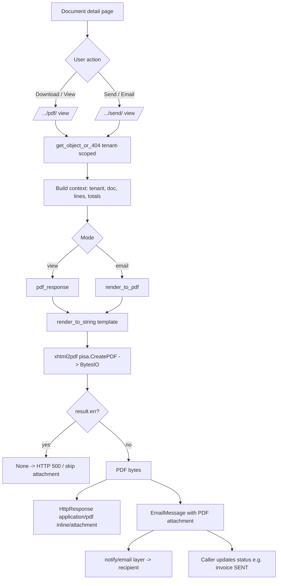

---

## 14. Notifications and Alerts

### Purpose
SwifPro BI has no dedicated notification model or inbox; instead it combines best-effort transactional emails (invoices, quotes, dunning reminders, access-request and credential emails), an in-app low-stock alerts page, and Django's `messages` framework for toast feedback. All email sends are fire-and-forget (`fail_silently=True`) so a mail-server problem never breaks the underlying business flow. Overdue-payment dunning and quote-expiry alerts run via a once-a-day housekeeping pass, either opportunistically on page load or from a scheduled management command.

### Roles involved
- **Admin** — receives new access-request emails (`notify_admins_new_request`); configures dunning on the tenant; sees all alert pages.
- **Sales / Manager** — email quotes (`notify_sales_document`) and customer invoices (`notify_invoice`); trigger recurring-invoice runs; view low-stock alerts.
- **Accountant / Finance** — email/issue invoices, rely on automatic overdue dunning reminders.
- **Warehouse / Purchasing** — consume the Low Stock alert page and reorder from it.
- **Read-only** — sees in-app `messages` toasts only; no send actions.
- Applicants (non-role) receive approval/rejection/credential emails.

### Workflow
1. A user action issues a document (invoice via `ar_invoice_*`, quote via the quote send view). The view calls the relevant `notify.*` function with the request and an optional PDF attachment tuple.
2. `notify_invoice` / `notify_sales_document` build an `EmailMessage`, attach the PDF if supplied, and `send(fail_silently=True)`; they return `True`/`False` depending on whether the customer has an email.
3. The view reports the outcome to the user through `messages.success/info/error` (in-app toast).
4. Separately, on any post-login landing (`views.py:339`), `housekeeping.opportunistic(request)` runs once per tenant per day (throttled by `Tenant.last_housekeeping_date`).
5. `run_for_tenant` expires stale quotes (`expire_quotes`), generates due recurring invoices (`recurring.generate_due`), and sends overdue reminders (`send_overdue_reminders`).
6. `send_overdue_reminders` iterates open, past-due `CustomerInvoice`s with positive `outstanding`, skipping any reminded within `dunning_interval_days`, and emails via `notify_overdue_invoice`.
7. On a successful reminder, the invoice's `last_reminder_at` and `reminder_count` are updated so the dunning cadence is enforced.
8. A nightly `run_sales_housekeeping` management command does the same across all tenants for installs that prefer external cron/Task Scheduler over opportunistic runs.
9. The Low Stock page (`/inventory/low-stock/`) computes, on demand, products below their reorder level and offers a reorder action that creates Purchase Requisitions.

### Input data
- Customer email (`Customer.email`), invoice/quote totals, numbers, dates, `currency_code`, `tenant.name`.
- Tenant dunning config: `dunning_enabled` (default True), `dunning_interval_days` (default 7).
- Per-invoice dunning state: `last_reminder_at`, `reminder_count`, `due_date`, `outstanding`, `status` (must be in `CustomerInvoice.OPEN_STATES`).
- Access-request fields (name, employee_id, email, team, message) for admin/applicant emails.
- Generated temporary passwords / usernames for credential emails.
- Product `reorder_level`, `on_hand_total`, `preferred_supplier` for low-stock alerts.

### Output generated
- **Emails** (subjects prefixed `[SwifPro BI]` for account emails): invoice email, overdue payment reminder, quote/sales-document email, new-access-request notice to admins, applicant approved (with temp credentials), applicant rejected, admin invite credentials.
- **In-app toasts** via Django `messages` (success/info/error).
- **Status side effects**: quotes flipped to `EXPIRED`; recurring invoices generated; invoice `last_reminder_at`/`reminder_count` bumped; `tenant.last_housekeeping_date` set.
- **Low Stock alert list** (rendered `inventory/low_stock.html`) and resulting Purchase Requisitions from the reorder action.
- Not implemented: there is no persisted notification log/inbox model, no read/unread tracking, and no SMS/push channel — alerts are email + transient `messages` + on-demand pages only.

### Related modules
- **AR / Invoicing** — invoice emails and overdue dunning.
- **Sales / Quotes** — quote emails and quote-expiry automation.
- **Recurring Invoices** — generated as part of the same housekeeping pass.
- **Inventory / Procurement** — Low Stock alerts feed Purchase Requisitions.
- **User Access / Onboarding** — access-request and credential emails.
- **Tenant settings** — dunning enable/interval configuration.
- **Audit Log** — `RECURRING_GENERATED` and related actions are logged.

### Validations & rules
- All emails are best-effort: `fail_silently=True`; senders return `False` (no exception) when the recipient has no email.
- Dunning skipped entirely when `Tenant.dunning_enabled` is False; interval falls back to 7 days if `dunning_interval_days` is unset.
- A reminder is suppressed if `last_reminder_at` is within `dunning_interval_days`, if `outstanding <= 0.00`, or if the invoice is not in `OPEN_STATES`.
- Opportunistic housekeeping is throttled to once per day per tenant (`last_housekeeping_date`) and never raises into the request path (wrapped in try/except).
- All querysets are tenant-scoped (`tenant=tenant`); admin-notification recipients are scoped to the tenant's Admin memberships plus active superusers.
- Low-stock alerting only considers active products with `reorder_level > 0` and lists those whose `on_hand_total < reorder_level`.

### Database entities
- `Tenant` (`dunning_enabled`, `dunning_interval_days`, `last_housekeeping_date`)
- `CustomerInvoice` (`last_reminder_at`, `reminder_count`, `OPEN_STATES`, `outstanding`)
- `Customer` (`email`)
- `SalesQuote` (status transitions to `EXPIRED`)
- `Product` (`reorder_level`, `on_hand_total`, `preferred_supplier`) for low-stock
- `OrgMembership` / `User` (admin recipient resolution)
- `AccessRequest` (access-request emails)
- No dedicated `Notification` model exists.

### API / page requirements
- `/inventory/low-stock/` → `views.low_stock` (alert page)
- `/inventory/low-stock/reorder/` → `views.low_stock_reorder` (POST, creates requisitions)
- `/recurring-invoices/run-due/` → `views.recurring_run_due` (POST, manual housekeeping trigger)
- `/dashboard/` post-login redirect → triggers `housekeeping.opportunistic`
- Management commands: `run_sales_housekeeping`, `run_recurring_invoices` (cron/Task Scheduler)
- Email senders (not URLs) in `core/notify.py`: `notify_invoice`, `notify_overdue_invoice`, `notify_sales_document`, `notify_admins_new_request`, `notify_applicant_approved`, `notify_applicant_rejected`, `notify_credentials`
- Note: `notify_sales_document` is wired only for Quotes (`views.py:4132`); sales-order emailing is not currently invoked despite the generic helper.

### Flow diagram
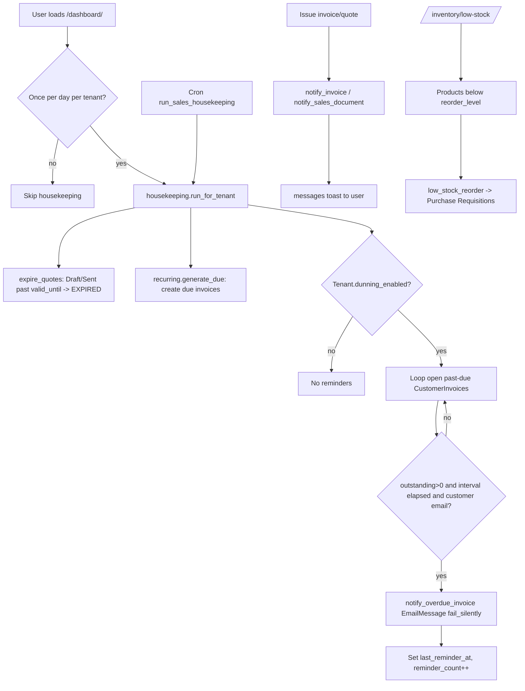

---

## 15. Audit Logs

### Purpose
Provides an append-only security and change-tracking trail that records who did what, when, and from where across the tenant. It captures logins, access-denied events, sensitive data changes, deletions, exports, and configuration changes so an admin can later prove and investigate activity. The trail is tamper-resistant: existing records cannot be modified, only created.

### Roles involved
- **Admin** — the only role that can view, filter, and export the audit log (the viewer is gated by `@role_required([ROLE_ADMIN], [ROLE_ADMIN])`). Every other role can *generate* audit entries implicitly through their normal actions (e.g. Warehouse stock adjustments, Sales invoice deletions, Finance VAT changes), but cannot read the log.

### Workflow
1. A user performs an action anywhere in the app (logs in, deletes a draft invoice, adjusts stock, changes VAT settings, exports data, etc.).
2. The relevant view (or a Django auth signal) calls `core.audit.log_audit(...)` with the action code plus optional who/what context (`entity_type`, `entity_id`, `old_value`, `new_value`, `detail`).
3. `log_audit` resolves the authenticated user, captures the request `path`, client IP (honouring `X-Forwarded-For`), and truncated user-agent, then creates an `AuditLog` row scoped to the active `tenant`. It is best-effort and never raises into the request path.
4. Login, logout, and failed-login events are captured automatically via `user_logged_in` / `user_logged_out` / `user_login_failed` signal receivers in `core/signals.py`.
5. An Admin opens `/audit/`, optionally filtering by action, free-text (`q`), and date range (`from`/`to`); the latest 500 matching rows render.
6. The Admin can download the trail (up to 5000 rows) via `/audit/export.csv` (CSV, or `?format=xlsx` for Excel) — this export is itself logged as `DATA_EXPORTED`.

### Input data
- Action code (e.g. `LOGIN`, `STOCK_ADJUSTED`, `INVOICE_DELETED`).
- Acting user / username, and active tenant.
- Optional structured context: `entity_type`, `entity_id`, `old_value`, `new_value`, free-text `detail`.
- Request metadata: `path`, IP (`X-Forwarded-For` / `REMOTE_ADDR`), user-agent (truncated to 255 chars).
- Viewer filters: `action`, `q`, `from`, `to`, and export `format`.

### Output generated
- An immutable `AuditLog` record with a server timestamp (`created_at`).
- A read-only filtered audit viewer (`audit_log.html`).
- CSV / XLSX export of the trail (columns: timestamp, action, user, entity_type, entity_id, old_value, new_value, detail, path, ip, user_agent).
- A `change_summary` property rendering `old_value → new_value` for change events.
- No GL postings are produced by this module.

### Related modules
- **Authentication / Users & Roles** — `LOGIN`, `LOGIN_FAILED`, `LOGOUT`, `PASSWORD_CHANGED`, `ROLE_CHANGED`, `PERMISSION_CHANGED`, `USER_INVITED`, `USER_REMOVED`, `ACCESS_REQUEST*`, `LOCATION_ACCESS_CHANGED`.
- **Inventory** — `STOCK_ADJ_REQUESTED`, `STOCK_ADJUSTED`, `STOCK_ADJ_APPROVED/REJECTED`, `PRODUCT_COST_CHANGED`.
- **Sales / AR** — `INVOICE_DELETED`, `INVOICE_SENT`, `INVOICE_CANCELLED`, `QUOTE_*`, `ORDER_*`, `RECURRING_GENERATED`, `REFUND_RECORDED`, `STATEMENT_SENT`.
- **Finance / VAT** — `PAYMENT_DELETED`, `VAT_SETTINGS_CHANGED`, `VAT_RATE_CHANGED`, `VAT_RETURN_SAVED/SUBMITTED`, `INTERCOMPANY_SALE`.
- **Settings / Admin** — `ORG_CREATED`, `SETTINGS_CHANGED`, `GROUP_CHANGED`, `ACCESS_DENIED`, `DATA_EXPORTED`, generic `RECORD_DELETED`.

### Validations & rules
- **Append-only / immutable**: `AuditLog.save()` raises `ValueError` if a row with an existing PK is re-saved — records can never be updated or edited.
- **Tenant-scoped**: both the viewer and export filter strictly on the active tenant; on tenant deletion the FK is `SET_NULL` so the trail survives.
- **Admin-only access**: viewer and export require the Admin role; access-denied attempts elsewhere are themselves logged as `ACCESS_DENIED`.
- **Best-effort, non-blocking**: `log_audit` swallows all exceptions so audit failures never break the user's primary action.
- **Field truncation**: `entity_type` ≤ 80, `entity_id` ≤ 64, `detail` ≤ 255, `user_agent` ≤ 255 chars.
- **Viewer/export caps**: viewer shows max 500 rows, export max 5000 rows.
- **Soft-delete for sensitive records**: deletions of customer invoices and payments set `is_deleted` / `deleted_at` / `deleted_by` (the underlying row is retained) and emit `INVOICE_DELETED` / `PAYMENT_DELETED` audit entries rather than hard-deleting. Note: there is no auto-prune/retention job — entries persist indefinitely until manually managed.

### Database entities
- `AuditLog` (fields: `tenant`, `user`, `username`, `action`, `entity_type`, `entity_id`, `old_value`, `new_value`, `detail`, `path`, `ip`, `user_agent`, `created_at`).
- References `Tenant` and `auth.User` (both nullable, `SET_NULL`).

### API / page requirements
- `GET /audit/` → `views.audit_log_list` (name `audit_log_list`) — filterable HTML viewer; query params `action`, `q`, `from`, `to`.
- `GET /audit/export.csv` → `views.audit_log_export` (name `audit_log_export`) — CSV download; `?format=xlsx` returns Excel.
- Sidebar entry: **Administration → Audit Log** (`/audit/`, icon `shield-lock`, Admin only).
- Writer (not an endpoint): `core.audit.log_audit(...)`, invoked throughout `core/views.py` and `core/signals.py`.
- No JSON/REST API is exposed for this module.

### Flow diagram
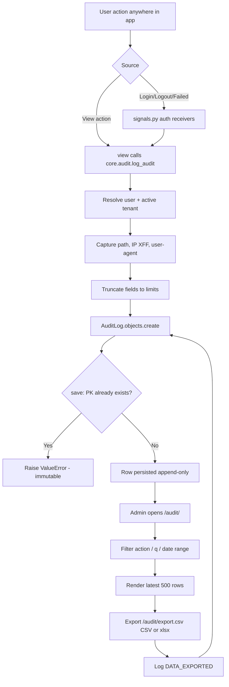

---

## 16. Import / Export

### Purpose
Provides bulk CSV import for master data (products, customers, suppliers) using upsert-by-key with per-row validation, plus CSV/Excel export of both master data and finance reports/ledgers. Lets a UK SME bootstrap its catalogue and contacts from spreadsheets and extract accounting data for accountants, HMRC filing prep, or backup. Every export is gated by the `export_data` permission and audited.

### Roles involved
- **Admin** — full import (products, customers, suppliers) and all exports.
- **Purchasing** (Procurement group) — import products and suppliers.
- **Sales** — import customers.
- **Finance / Accountant** — import customers; finance/master-data exports (via `EXPORT_DATA` permission).
- Any authenticated user — download blank import templates (`import_template` is `@login_required` only).
- Export endpoints are permission-gated by `EXPORT_DATA`, not role-gated, so any role granted that permission (including overrides) can export.

### Workflow
1. User downloads a template at `/import/<kind>/template.csv` (header row + one sample row from `CONFIG[kind]["sample"]`).
2. User fills the CSV and uploads it at `/products/import/`, `/customers/import/`, or `/suppliers/import/`.
3. `_run_import` validates the upload is a non-empty `.csv`, then `importer.read_rows` decodes it (UTF-8 BOM-tolerant) into dict rows.
4. The configured import function (`import_products` / `import_customers` / `import_suppliers`) iterates rows starting at line 2, validates each, and upserts via `update_or_create` keyed on the tenant + key column.
5. Bad rows are skipped and collected with their line number; valid rows still save (per-row resilience).
6. A summary (`created`, `updated`, `errors`, `total`) is flashed to the user and rendered on `imports/import.html`.
7. For export, user hits `/export/<kind>.csv` (master data) or `/finance/export/<kind>.csv` (finance), optionally with `?format=xlsx`.
8. `_export_response` picks CSV (default) or `.xlsx` (openpyxl) and streams the file; a `DATA_EXPORTED` audit entry is written.

### Input data
- Uploaded `.csv` file (`request.FILES["file"]`), UTF-8 with optional BOM.
- Products columns: `sku, name, product_type, category, brand, description, uom, cost_method, standard_cost, sales_price, is_active, barcode` (key = `sku`).
- Customers columns: `name, customer_type, contact_person, email, phone, vat_number, company_number, billing_address, shipping_address, payment_terms_days, tags` (key = `name`).
- Suppliers columns: `name, contact_person, email, phone, vat_number, company_number, address, currency_code, payment_terms_days, categories` (key = `name`).
- Export query params: `?format=xlsx|excel`, and for finance: `from`, `to`, `as_of` dates.

### Output generated
- Created/updated `Product` (+ auto-created `ProductCategory`, optional `ProductBarcode`), `Customer`, `Supplier` records.
- Import summary dict: created/updated/errors(line, message)/total.
- Master-data export files: `products.csv`, `customers.csv`, `suppliers.csv` (or `.xlsx`) — column order mirrors import so an export re-imports cleanly.
- Finance export files (CSV/XLSX): trial balance, P&L, balance sheet, cash flow, aged receivables/payables, general ledger (journal), expenses, payments, customer invoices, supplier bills, credit notes, bank transactions, VAT return (9 boxes), VAT transactions, sales-history/by-product/by-customer/by-channel.
- Audit log export: `audit-log.csv` (admin only, capped at 5000 rows).
- `DATA_EXPORTED` audit log entries with `kind (N rows)` detail.

### Related modules
- **Inventory / Products** — product + category + barcode upsert; export feeds stock valuation.
- **Customers / Sales** — customer import; customer-invoice and sales-report exports.
- **Suppliers / Procurement** — supplier import; supplier-bill exports.
- **Finance / GL** — journal, trial balance, P&L, balance sheet, payments, expenses, credit notes exports.
- **VAT (MTD)** — VAT return and VAT-transactions exports.
- **Audit Log** — audit export and `DATA_EXPORTED` logging.
- Bank statement import (`/bank/transactions/import/`) exists as a separate Finance feature, not part of `importer.py`.

### Validations & rules
- Tenant scoping: every import upsert and export query filters by the active tenant (`update_or_create(tenant=..., key=...)`, `.filter(tenant=tenant)`).
- Upload must end in `.csv` and be present, else rejected with a message.
- Per-row resilience: invalid rows are skipped with `(line_no, reason)`; one bad row never blocks the file.
- Products: `sku` and `name` required; invalid `standard_cost` skips the row; invalid `sales_price` falls back to 0; unknown `cost_method` → `AVERAGE`, unknown `product_type` → `STOCK`; `is_active` false-y strings (`0/false/no/inactive`) set inactive; `category` supports `Parent / Child` and is auto-created; barcode added only if not already present.
- Customers/Suppliers: `name` required; unknown `customer_type` → `COMPANY`; non-numeric `payment_terms_days` ignored; supplier `currency_code` defaults `GBP`.
- Export gating: `data_export` and `finance_export` require the `EXPORT_DATA` permission; `audit_log_export` is Admin-only via `role_required`.
- Finance period exports default to the current financial year when no `from`/`to` given.
- Excel sheet title truncated to 31 chars; header row bold + frozen.
- No delete-on-import (upsert only); imports are not transactional across the file (each row commits independently).

### Database entities
- `Product`, `ProductCategory`, `ProductBarcode`
- `Customer`, `Supplier`
- Finance read models: `JournalLine` / `JournalEntry`, `Expense`, `Payment`, `CustomerInvoice`, `SupplierInvoice`, `CreditNote`, `BankTransaction`
- `AuditLog` (for audit export and `DATA_EXPORTED` entries)

### API / page requirements
- `GET/POST /products/import/` → `import_products`
- `GET/POST /customers/import/` → `import_customers`
- `GET/POST /suppliers/import/` → `import_suppliers`
- `GET /import/<kind>/template.csv` → `import_template`
- `GET /export/<kind>.csv` → `data_export` (`kind` ∈ products/customers/suppliers; `?format=xlsx`)
- `GET /finance/export/<kind>.csv` → `finance_export` (`?format=xlsx`, `from`, `to`, `as_of`)
- `GET /audit/export.csv` → `audit_log_export`
- Helpers: `_run_import`, `importer.read_rows`, `importer.export_rows`, `importer.CONFIG`, `_export_response`, `_csv_response`, `_xlsx_response`, `_finance_export_data`.

### Flow diagram
```mermaid
flowchart TD
    A[User] --> B{Import or Export?}
    B -->|Import| C[Download template\n/import/&lt;kind&gt;/template.csv]
    C --> D[Upload CSV\n/products|customers|suppliers/import/]
    D --> E[_run_import: validate .csv]
    E -->|invalid file| F[Flash error]
    E -->|ok| G[read_rows: decode UTF-8 BOM]
    G --> H[CONFIG fn: import_products/customers/suppliers]
    H --> I[Per-row validate + update_or_create\ntenant-scoped]
    I --> J[Skip bad rows with line no]
    I --> K[Auto-create category / barcode]
    J --> L[Summary: created/updated/errors]
    K --> L
    B -->|Export| M{EXPORT_DATA permission}
    M -->|denied| N[403]
    M -->|granted| O[data_export / finance_export]
    O --> P[export_rows / _finance_export_data]
    P --> Q[_export_response\nCSV or xlsx via openpyxl]
    Q --> R[log_audit DATA_EXPORTED]
    R --> S[File download]
```

---

## 17. Integrations

### Purpose
Connects SwifPro BI to external sales channels (Shopify, Amazon) and outbound systems so a UK SME can pull channel orders/stock and reconcile them against internal inventory, and prepare HMRC MTD VAT returns. In the current build the channel sync and HMRC filing are deliberately mocked/stubbed seams: order sync runs from a management command with fake data, and VAT "submission" is recorded locally only. Email is the one genuinely live outbound integration, via Django's mail framework.

### Roles involved
- **Admin** — full access to channel connections, reconcile, VAT, channel sales orders.
- **Finance / Accountant** (Finance group) — create/edit/delete channel connections, save & submit VAT returns.
- **Sales** — create and post channel Sales Orders, view sales-order list.
- **Read-only** — view channel sales orders, VAT detail/records.
- Note: the `reconcile` view itself has no `@role_required` decorator on it (only `@login_required` upstream behaviour applies via the global pattern); any authenticated user reaching `/reconcile/` can view drift.

### Workflow
1. Admin/Finance creates a `ChannelConnection` at `/channels/new/` (channel = Shopify/Amazon, name, shop_domain, access_token).
2. A Shopify sync is triggered out-of-band by the management command `python manage.py sync_shopify` (there is **no web URL/button** for it).
3. `sync_shopify_for_tenant()` opens a `SyncRun`, calls `fake_fetch_shopify_orders()` (hard-coded mock data), and for each new order creates a `ChannelOrder` (idempotent via unique `external_order_id`).
4. For each order line it resolves the `Product` by SKU and calls `apply_movement(... movement_type="SALE", qty_delta=-qty ...)` into a "Shopify Warehouse" `Location`, then posts COGS via `post_cogs()`.
5. `fake_fetch_shopify_inventory_snapshot()` writes `ChannelSnapshot` rows (mock SKU/quantity), and the `SyncRun` is marked SUCCESS/FAILED.
6. A user opens `/reconcile/` to compare the latest `ChannelSnapshot` per SKU against summed `InventoryBalance.on_hand`, showing per-SKU drift.
7. Separately, channel/ecommerce `SalesOrder`s can be entered/posted at `/sales-orders/` (drift between manual and synced is not auto-resolved).
8. For VAT, Finance picks a period at `/vat/`, previews the 9 boxes (`compute_vat_return`), saves a DRAFT `VatReturn` (`/vat/save/`).
9. Finance submits at `/vat/<id>/submit/`; `submit_vat_return()` only sets status=SUBMITTED locally and stamps `hmrc_reference = "LOCAL-STUB-<id>"` — no HMRC API call.

### Input data
- Channel connection: channel type, connection name, `shop_domain`, `access_token` (stored plaintext — MVP note in code).
- Mock Shopify orders (`SHP-10001`, line items by SKU) and inventory snapshot — hard-coded in `sync_shopify.py`, not real API responses.
- Internal `InventoryBalance` / `Product.sku` for reconcile.
- VAT period dates (from/to) for return computation.

### Output generated
- `SyncRun` record (status RUNNING/SUCCESS/FAILED, detail line).
- `ChannelOrder` rows + inventory `StockMovement`s (type SALE) + COGS GL posting via `post_cogs`.
- `ChannelSnapshot` rows.
- Reconcile drift table (`channel_qty − swifpro_qty`) — view-only, no auto-adjustment.
- `VatReturn` (9 boxes), with `hmrc_reference` = `LOCAL-STUB-<id>` on submit. Audit events `VAT_RETURN_SAVED` / `VAT_RETURN_SUBMITTED`, `RECORD_DELETED` on channel delete.
- Outbound emails via `django.core.mail` (`send_mail` / `EmailMessage`) for quotes, invoices, statements, access requests.

### Related modules
- **Inventory** — `apply_movement`, `InventoryBalance` (reconcile + sync deductions).
- **General Ledger / Finance** — `post_cogs` on synced orders.
- **VAT/Tax** — VAT return draws on `CustomerInvoice`, `SupplierInvoice`, `Expense`, `CreditNote`, `TaxCode`.
- **Sales** — channel `SalesOrder` posting.
- **Notifications/Email** — `core/notify.py` outbound mail.

### Validations & rules
- All entities tenant-scoped (`tenant=` filters on every query).
- `ChannelOrder` is idempotent: `unique_together = (tenant, channel, external_order_id)` — re-syncing skips existing orders.
- `VatReturn` unique per `(tenant, period_from, period_to)`; `vat_save` rejects invalid/reversed periods; re-saving uses `update_or_create` (refreshes DRAFT figures).
- VAT submit is idempotent (returns early if already SUBMITTED); UI shows a warning that live HMRC filing is not connected.
- VAT computation: only `CustomerInvoice` in ISSUED/SENT/PAID, `SupplierInvoice`/`Expense`/`CreditNote` POSTED; out-of-scope codes excluded from boxes 6/7; credit notes negated.
- **Not implemented / honest gaps:** real Shopify & Amazon API clients are not implemented (Amazon has no sync at all; Shopify is fake fetch). Real HMRC MTD submission is a local stub. There is **no REST/JSON API** for external consumers. The sync has no web trigger (command-line only). Channel `access_token` is stored unencrypted.

### Database entities
- `SalesChannel` (TextChoices: SHOPIFY, AMAZON)
- `ChannelConnection`
- `SyncRun`
- `ChannelOrder`
- `ChannelSnapshot`
- `SalesOrder` (channel/ecommerce orders)
- `VatReturn`
- (reads) `Product`, `Location`, `InventoryBalance`, `CustomerInvoice`, `SupplierInvoice`, `Expense`, `CreditNote`, `TaxCode`

### API / page requirements
- `/channels/` `channel_list`, `/channels/new/` `channel_create`, `/channels/<id>/edit/` `channel_edit`, `/channels/<id>/delete/` `channel_delete`
- `/reconcile/` `reconcile`
- `/sales-orders/` `sales_order_list`, `/sales-orders/new/` `sales_order_create`, `/sales-orders/<id>/` `sales_order_detail`, `/sales-orders/<id>/post/` `sales_order_post`
- `/vat/` `vat_index`, `/vat/save/` `vat_save`, `/vat/<id>/` `vat_detail`, `/vat/<id>/submit/` `vat_submit`, `/vat/records/` `vat_records`
- Command: `manage.py sync_shopify` (no HTTP endpoint)
- No public REST API endpoints exist.

### Flow diagram
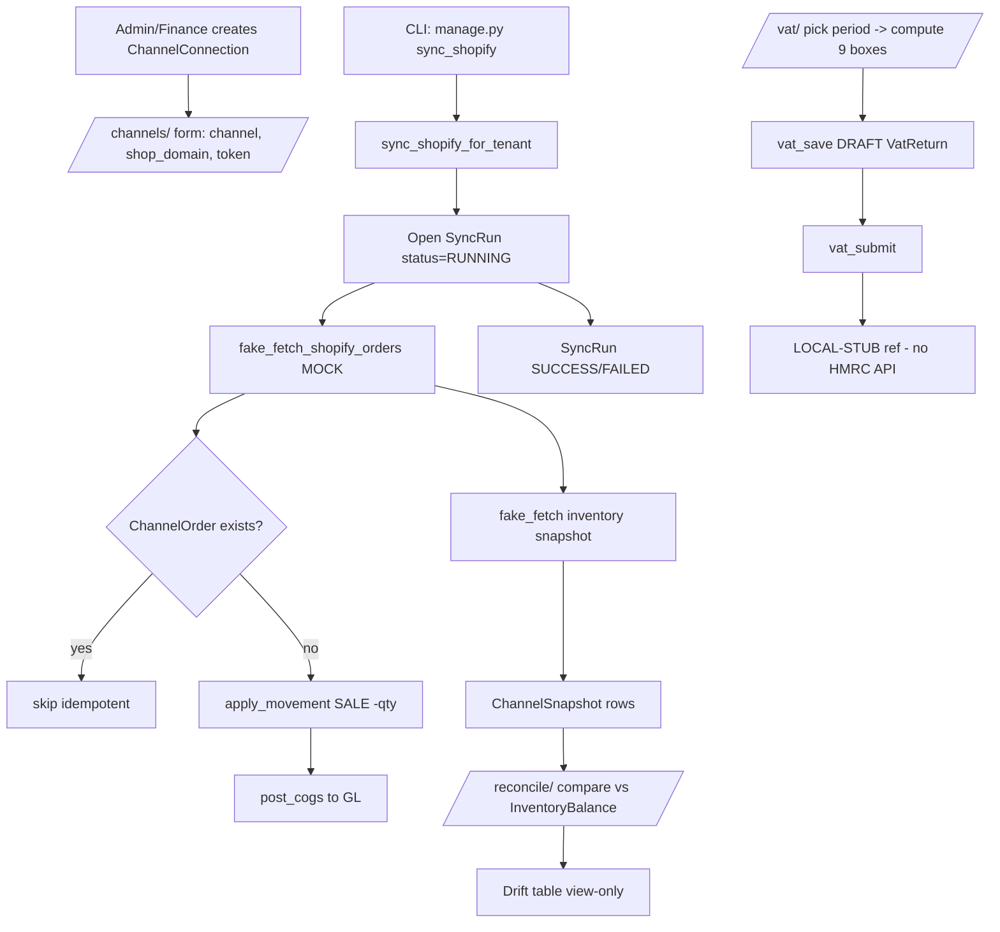

---

## 18. AI Assistant / Copilot

> **STATUS: PROPOSED — NOT YET IMPLEMENTED.** There is no AI assistant, copilot, LLM, or natural-language layer anywhere in `core/` today. A full-text search for `copilot`, `assistant`, `openai`, `anthropic`, `llm`, `gpt` returns zero source hits (only incidental `uom` substring matches in migrations). No `/copilot/` URL, no `CopilotConversation`/`CopilotMessage`/`CopilotAction` models, and no copilot service exist. Everything below is a design proposal grounded in the app's *real* services, models, roles and URLs so it can be built on top of them.

### Purpose
A read-mostly natural-language layer that lets a UK SME owner or finance user ask plain-English questions over existing SwifPro BI data ("what's my P&L this quarter?", "who's the most overdue customer?", "which products are below reorder?") and get answers sourced directly from the existing report services. It can also draft documents (sales invoices, POs, chase emails) and surface proactive insight alerts (overdue debtors, low stock, margin dips), but never posts to the ledger or sends anything without explicit human confirmation.

### Roles involved
- **Admin** — full copilot access; only role that can see cross-module/admin insights (audit, users); manages copilot enablement.
- **Accountant / Finance** — financial Q&A (P&L, balance sheet, aged debtors/creditors, VAT), draft chase emails and credit notes.
- **Manager** — operations Q&A (sales, inventory analytics, supplier scorecard), draft POs.
- **Sales** — sales/customer questions, draft quotes and customer invoices.
- **Purchasing** — stock/reorder questions, draft purchase orders/requisitions.
- **Warehouse** — low-stock and stock-movement questions (read-only answers).
- **Read-only** — Q&A over the reports they can already view; no drafting.

Proposed rule: the copilot inherits the *exact* visibility of the caller's role from `core/roles.py` `NAV` / group RBAC — it can never answer about a page the role cannot open.

### Workflow
1. User opens `/copilot/` (proposed) or a side panel and types a question.
2. Copilot persists the turn to a `CopilotMessage` under a `CopilotConversation` (tenant- and user-scoped).
3. An intent/router classifies the request into: **Q&A**, **draft document**, or **insight/alert**.
4. For Q&A, the copilot maps intent to a whitelisted, tenant-scoped read function (e.g. `services.reports.profit_and_loss(tenant, …)`, `aged_receivables(tenant)`, `stock_valuation(tenant)`, `services.sales_reports.profitability(tenant, …)`) and runs it with the caller's `tenant` and role-derived location/permission filters.
5. The LLM summarises the structured result in plain English and cites the underlying report/URL (e.g. links to `/reports/profit-and-loss/`).
6. For a draft request, the copilot pre-fills a form (e.g. an `InvoiceForm`/PO draft) and returns it as a **proposed action** — a `CopilotAction` row in `proposed` status. Nothing is written to business tables yet.
7. The user reviews the draft in the normal create page; on **Confirm**, the existing view/service performs the real create (and any GL posting via `services.gl`), exactly as a manual entry would.
8. Every copilot interaction and every confirmed action is written via `core.audit.log_audit(...)` to the existing `AuditLog`.
9. Background insight scan (scheduled, like existing `run_sales_housekeeping` / `run_recurring_invoices` commands) computes alerts and stores them as `insight`-type `CopilotMessage`s for the next session.

### Input data
- User's natural-language prompt and conversation history.
- Current `tenant` and `OrgMembership` role (for scoping/visibility).
- Read-only results from existing services: `reports.profit_and_loss`, `balance_sheet`, `aged_receivables`, `aged_payables`, `stock_valuation`, `inventory_analytics`, `cash_flow_summary`, `consolidated`; `sales_reports.sales_by_product/customer/channel`, `profitability`.
- For drafts: customer/supplier/product master data (`Customer`, `Supplier`, `Product`) to populate line items.

### Output generated
- Conversational answer text with citations/links to the real report pages.
- **Drafts (never auto-posted):** proposed `CustomerInvoice`, `PurchaseOrder`, `PurchaseRequisition`, `CreditNote`, or chase/RFQ email text — held as `CopilotAction(status=proposed)`.
- **Insight alerts:** overdue-debtor, low-stock, margin-dip, VAT-deadline notices.
- **No GL postings of its own.** GL entries only happen when the user confirms and the existing service (`services.gl`) runs.
- Audit records in `AuditLog` for every question and every confirmed action.

### Related modules
- **Reports / Finance** — primary data source (P&L, balance sheet, aged debtors/creditors, VAT, cash flow).
- **Sales** — sales reports + draft quotes/customer invoices.
- **Procurement** — supplier scorecard + draft POs/requisitions.
- **Inventory** — stock valuation, low-stock, inventory analytics.
- **Audit & Access** — `core.audit` / `AuditLog` for the immutable trail; `core.roles` / RBAC for scoping.

### Validations & rules
- **Read-mostly / write-via-confirmation:** copilot can call only a whitelisted set of read functions directly; any state change must go through the existing view + human **Confirm** step — it cannot post a journal, send an email, or create a document autonomously.
- **Tenant scoping:** every service call passes the request's `tenant`; the copilot can never read another tenant's data (mirrors existing `core.current` / middleware scoping).
- **Role visibility:** answers and draft permissions are gated by the caller's role exactly as `NAV` gates pages; Read-only cannot draft.
- **Credit-limit / threshold respect:** draft invoices/POs surface (but do not bypass) existing checks such as customer credit limits and the tenant's `stock_adjustment_approval_threshold` — the human still hits the real validations on confirm.
- **Immutability & audit:** every prompt, answer and confirmed action logged via `log_audit`; conversation/messages should be append-only (soft-delete only, consistent with `deleted_at` pattern used on invoices).
- **No hallucinated numbers:** financial figures must come from a service call, not the model's free text; if no whitelisted function matches, the copilot declines rather than guessing.
- *(Proposed)* PII/prompt-injection guardrails on any externally-sourced text (e.g. supplier emails) before it reaches the model.

### Database entities
*All proposed — none exist yet. Reuses existing:* `Tenant`, `OrgMembership`, `UserProfile`, `AuditLog`, plus the read-only report sources (`CustomerInvoice`, `Product`, `GLEntry`, etc.).

Proposed new models:
- **`CopilotConversation`** — `tenant` (FK), `user` (FK), `title`, `created_at`, `deleted_at` (soft-delete).
- **`CopilotMessage`** — `conversation` (FK), `role` (`user`/`assistant`/`insight`), `content`, `cited_report`, `created_at`.
- **`CopilotAction`** — `message` (FK), `action_type` (`draft_invoice`/`draft_po`/`draft_email`/…), `payload` (JSON), `status` (`proposed`/`confirmed`/`discarded`), `confirmed_by`, `confirmed_at`, `result_entity_type`, `result_entity_id`.

### API / page requirements
*All proposed — none of these routes exist in `core/urls.py` today.*
- `GET /copilot/` — conversation UI (proposed nav entry, Admin-gated initially, then per-role).
- `POST /copilot/ask/` — submit a question; returns answer + citations.
- `POST /copilot/action/<id>/confirm/` — confirm a proposed draft; hands off to the existing create view/service.
- `POST /copilot/action/<id>/discard/` — discard a draft.
- `GET /copilot/insights/` — list current insight alerts.
- Existing real endpoints it *links to / hands off to:* `/reports/profit-and-loss/`, `/reports/aged-receivables/`, `/reports/stock-valuation/`, `/sales/reports/profitability/`, `/ar/invoices/`, `/po/`, `/credit-notes/`, `/vat/`.

### Flow diagram
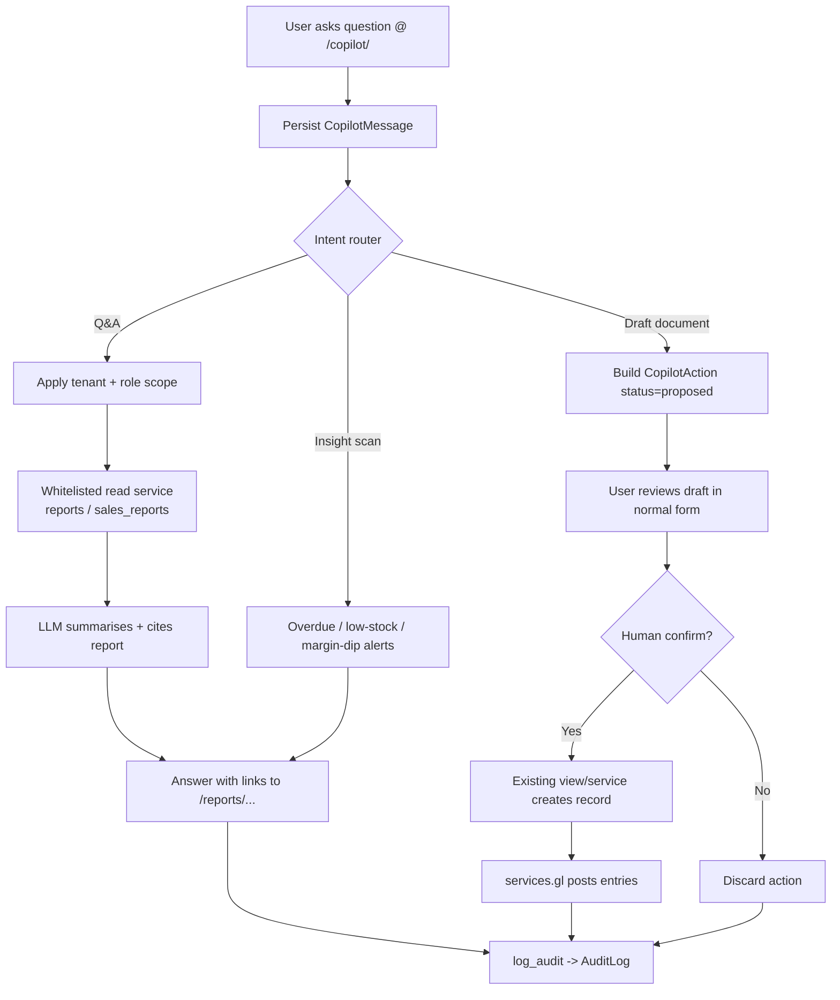

Relevant files inspected: `d:\swifpro_bi\core\roles.py`, `d:\swifpro_bi\core\audit.py`, `d:\swifpro_bi\core\services\reports.py`, `d:\swifpro_bi\core\services\sales_reports.py`, `d:\swifpro_bi\core\models.py`, `d:\swifpro_bi\core\urls.py` (no copilot routes present).

---

## 19. End-to-end ERP flow

How the whole system connects — from company setup through master data, the buy-side and sell-side transaction
cycles, into the General Ledger, VAT, reporting, and the cross-cutting services (documents, notifications, audit,
import/export, integrations, copilot).

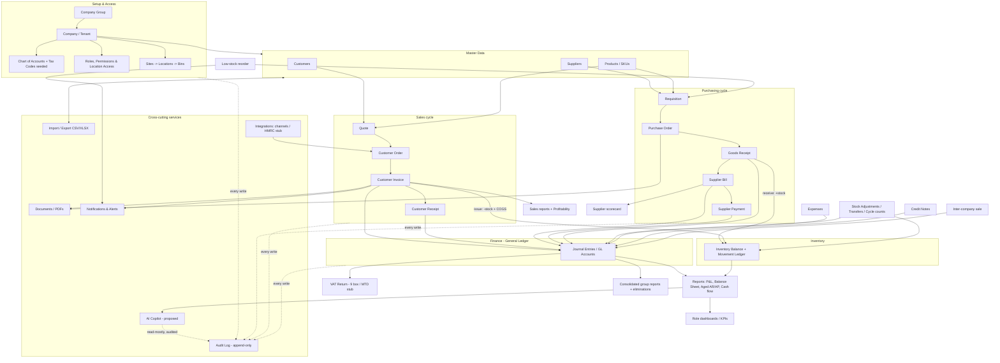

---

### Appendix — module connectivity matrix

| Module | Feeds into | Reads from |
|---|---|---|
| Company Setup | every module (tenant scope, defaults) | — |
| Roles & Permissions | every module (access control) | Company Setup |
| Customer Mgmt | Sales, Finance (AR), Reports | Company Setup |
| Supplier Mgmt | Purchasing, Finance (AP), Reports | Company Setup |
| Product/SKU | Inventory, Purchasing, Sales | Suppliers, Tax codes |
| Inventory | Sales (COGS), Finance (GL), Reports | Purchasing (GRN), Products, Locations |
| Purchasing | Inventory, Finance (AP), Suppliers, VAT | Requisitions, Products, Suppliers |
| Sales | Inventory, Finance (AR), VAT, Reports | Customers, Products |
| Finance & Accounting | VAT, Reports, Consolidation | Sales, Purchasing, Inventory, Expenses |
| VAT | Reports, HMRC (stub) | Sales, Purchasing, Expenses |
| Expenses | Finance (GL/AP), VAT, Suppliers | Company Setup (threshold) |
| Reports & Dashboards | Copilot | GL, Inventory, Sales, Purchasing |
| Documents/PDFs | Notifications (attachments) | Sales, Purchasing, Finance |
| Notifications | users (email/in-app) | Sales, Inventory, Finance |
| Audit Logs | Reports (compliance) | every module |
| Import/Export | Master data, Finance | every module |
| Integrations | Sales (channels), VAT (HMRC) | Products, Inventory |
| AI Copilot (proposed) | users | Reports, all modules (read) |

