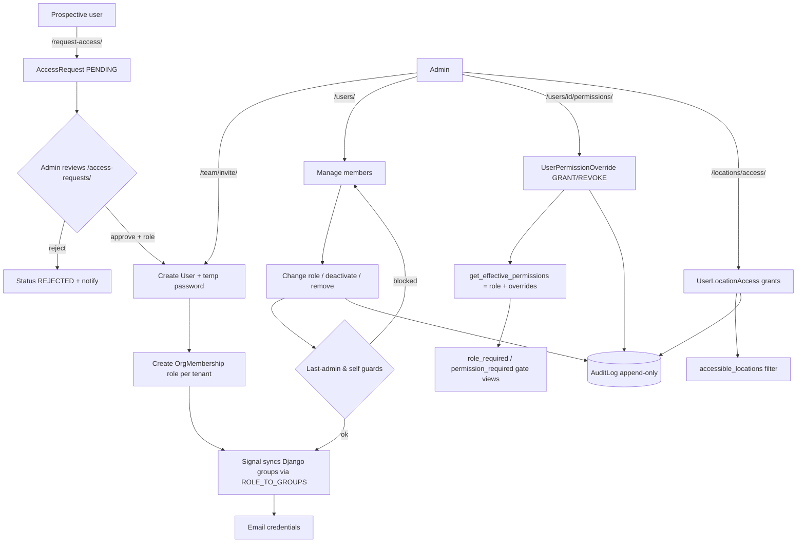

# 2. User Roles and Permissions

### Purpose
Controls who can access the SwifPro BI app and what each person may do within a given company (tenant). Access is governed per-organisation: a single login can belong to multiple companies with a different role in each, and an Admin can fine-tune individual users with per-permission overrides and per-location restrictions. All sensitive changes are recorded in an append-only audit trail.

### Roles involved
- **Admin** (Owner/Admin): full access; the only role that can manage users, roles, permissions, location access, access requests and the audit log.
- **Accountant, Manager, Sales, Warehouse, Purchasing, Finance, Read-only**: subjects of role/permission assignment. They receive a baseline permission set from the role matrix; none of them can administer users.

Note: a person's effective access is always evaluated against the **active organisation's** membership role, not a union across all their orgs (see `core/auth.effective_groups`).

### Workflow
1. A prospective user submits the public **Request access** form (`/request-access/`), creating an `AccessRequest` with status `PENDING`. Alternatively an Admin skips this and invites someone directly.
2. Admin reviews pending requests at `/access-requests/` and either **rejects** (status `REJECTED`, applicant emailed) or **approves** with a chosen role.
3. On approval (or direct invite at `/team/invite/`), a Django `User` is created with a unique username and a random temporary password; a `UserProfile` (fallback tenant) and an `OrgMembership` (role in the active tenant) are created, and credentials are emailed.
4. The `OrgMembership` post-save signal syncs the user into the matching Django auth groups via `ROLE_TO_GROUPS`, so per-view RBAC (`role_required`) takes effect immediately.
5. Admin manages the team at `/users/`: change role, deactivate/reactivate, or remove a member.
6. On a role change, the signal re-syncs groups; existing `UserPermissionOverride` rows are either reset to the new role default or pruned (kept) depending on the tenant's `keep_permissions_on_role_change` policy.
7. Admin can fine-tune one member at `/users/<id>/permissions/`, adding GRANT/REVOKE overrides on top of the role baseline.
8. Admin restricts users to specific warehouses/locations via the matrix at `/locations/access/` (`UserLocationAccess`).
9. Admin reviews/exports the security trail at `/audit/`.
10. At request time, `get_effective_permissions` resolves role baseline + overrides; `role_required` / `permission_required` decorators gate each view.

### Input data
- Access request: name, email, optional employee ID, team, message.
- Invite: name, email, role (from `ROLE_CHOICES`).
- Role assignment: the 8-value role code per membership.
- Per-user permission deltas: permission code + effect (GRANT/REVOKE).
- Location grants: which `Location` rows a user may access.
- Tenant access policy toggle: `keep_permissions_on_role_change`.

### Output generated
- New `User` + `OrgMembership` (+ `UserProfile`) accounts; emailed temporary credentials.
- Django auth-group membership synced from the role.
- `UserPermissionOverride` and `UserLocationAccess` records.
- `AccessRequest` status transitions: `PENDING → APPROVED | REJECTED`.
- `AuditLog` entries: `ROLE_CHANGED`, `PERMISSION_CHANGED`, `USER_INVITED`, `USER_DEACTIVATED`/`USER_REACTIVATED`, `USER_REMOVED`, `ACCESS_REQUEST_APPROVED`/`ACCESS_REQUEST_REJECTED`, `LOCATION_ACCESS_CHANGED`, `SETTINGS_CHANGED`.
- Roles × permissions matrix view (read-only display of `ROLE_PERMISSIONS`).
- No GL postings (this module produces none).

### Related modules
- **All operational modules** (Sales, Procurement, Inventory, Finance, Reports): each view is gated by `role_required`/`permission_required` derived from this module.
- **Inventory / Locations**: `UserLocationAccess` filters which locations a user sees via `accessible_locations`.
- **Onboarding**: the "Invite your team" step links here.
- **Audit Log module**: consumes the `AuditLog` rows this module writes.
- **Multi-company / Company Group**: roles are per-tenant; the active-tenant resolver (`core/access`) decides which membership governs the request.

### Validations & rules
- **Tenant scoping**: every membership/override/location grant is keyed to a `Tenant`; `OrgMembership` is `unique_together (user, tenant)`.
- **Last-admin protection**: you cannot change the role of, deactivate, or remove the last active Owner/Admin (`_active_admin_count`).
- **Self-protection**: you cannot deactivate or remove yourself.
- **Admin overrides are inert**: Admins always have the full permission set; `UserPermissionOverride` does not apply to them (and their member-permissions page is read-only).
- **Override resolution**: effective = role baseline + GRANTs − REVOKEs, intersected with the known catalog (`effective_permissions`).
- **Role-change policy**: overrides reset to role default unless `keep_permissions_on_role_change` is on, in which case now-redundant overrides are pruned.
- **Location default-open**: a user with zero `UserLocationAccess` rows (or an Admin) is unrestricted; adding rows narrows access.
- **Audit immutability**: `AuditLog.save()` raises if an existing record is updated — append-only.
- **Access-request idempotency**: only `PENDING` requests can be approved/rejected.
- **Superuser bypass**: Django superusers pass all `role_required`/`permission_required` checks and get all permissions.
- Role values validated against `ROLE_CHOICES` on invite, approval, and role change.

### Database entities
- `OrgMembership` — role per user per tenant (`is_default` for preferred org).
- `UserPermissionOverride` — per-user GRANT/REVOKE delta, scoped to a tenant.
- `UserLocationAccess` — per-user allowed locations.
- `AccessRequest` — self-service access requests with review fields.
- `AuditLog` — append-only security/audit trail.
- `UserProfile` — fallback primary tenant for a user.
- `Tenant` — holds the `keep_permissions_on_role_change` policy and `role_landing`.
- Django `auth.User` / `auth.Group` — the underlying account and RBAC groups synced from roles.
- Supporting code (not models): `core/roles.py`, `core/permissions.py`, `core/auth.py`, `core/access.py`, `core/signals.py`.

### API / page requirements
- `GET /users/` → `members_list` (Admin).
- `POST /users/<membership_id>/role/` → `member_change_role`.
- `POST /users/<membership_id>/active/` → `member_toggle_active`.
- `POST /users/<membership_id>/remove/` → `member_remove`.
- `GET|POST /users/<membership_id>/permissions/` → `member_permissions`.
- `GET|POST /team/invite/` → `invite_user`.
- `GET|POST /team/permissions/` → `roles_permissions` (matrix + access-policy toggle).
- `GET|POST /request-access/` → `request_access` (public).
- `GET /access-requests/` → `access_request_list`.
- `POST /access-requests/<req_id>/action/` → `access_request_action` (approve/reject).
- `GET|POST /locations/access/` → `location_access`.
- `GET /audit/` → `audit_log_list`; `GET /audit/export.csv` → `audit_log_export`.

Note: there is **no separate persisted `Invite`/token model** — invites create the account immediately and email a temporary password; there is no email-link acceptance flow.

### Flow diagram

---

[← Back to module index](README.md)
