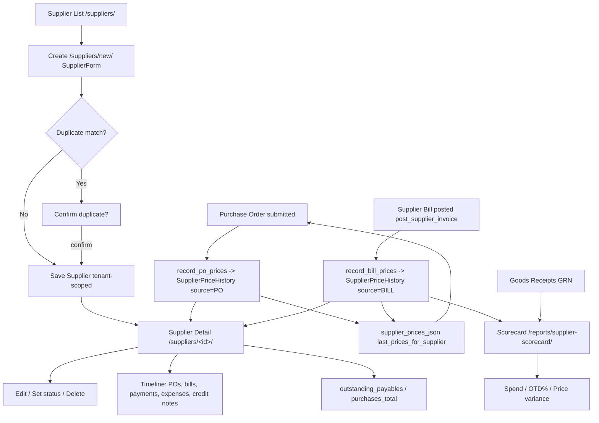

# 4. Supplier Management

### Purpose
Maintains the tenant's supplier master data (contact, VAT/company numbers, currency, payment terms, bank details, status and categories) and presents a 360-degree supplier profile aggregating purchase orders, bills, payments, expenses and credit notes. It also captures supplier+product unit-cost history (used to prefill PO prices) and feeds a supplier performance scorecard covering spend, on-time delivery and price variance.

### Roles involved
- **Admin** - full access (create/edit/delete, view, scorecard).
- **Purchasing** (Procurement group) - create/edit/delete and view suppliers; the primary user.
- **Manager** - list/scorecard access via nav (Operations role spans Procurement).
- **Finance / Accountant** - read suppliers and view the scorecard (Finance group); needed for payables and payments.
- **Read-only** - can view `supplier_detail` and the scorecard.

Note: `supplier_create`/`supplier_edit`/`supplier_delete` are restricted to Admin + Procurement only (`role_required([ROLE_ADMIN, ROLE_PROCUREMENT], ...)`).

### Workflow
1. Purchasing/Admin opens `/suppliers/` (`supplier_list`) and searches/filters by name, email, phone, VAT/company number, contact, status or category.
2. Creates a supplier via `/suppliers/new/` (`SupplierForm`). On save, `_find_supplier_duplicates` checks for existing matches on email/phone/VAT/company number/name; if found, the user must confirm (`confirm_duplicate=1`) before saving.
3. Supplier is saved against the current tenant and redirects to `supplier_detail`.
4. The supplier is selected on Purchase Orders; when a PO is submitted, `record_po_prices` writes a `SupplierPriceHistory` record (source=PO) per line.
5. At PO entry, `/po/supplier/<id>/prices/` (`supplier_prices_json` → `last_prices_for_supplier`) returns the latest unit cost per product to prefill line prices.
6. Goods receipts and supplier bills are raised against the supplier; when a bill is posted to the GL (`post_supplier_invoice`), `record_bill_prices` writes `SupplierPriceHistory` records (source=BILL).
7. `/suppliers/<id>/` (`supplier_detail`) renders the full profile: POs, bills, payments, expenses, purchase credit notes, outstanding payables, products supplied, price history and a merged activity timeline.
8. Performance is reviewed at `/reports/supplier-scorecard/` (`report_supplier_scorecard` → `purchasing.supplier_scorecard`) for a chosen period.
9. Suppliers may be edited, set to Inactive/On hold, or hard-deleted (with an audit log entry).

### Input data
- Supplier identity: name (unique per tenant), contact_person, email, phone.
- Compliance: vat_number, company_number.
- Commercial: currency_code (default GBP), payment_terms_days (blank = company default), categories (comma-separated), status.
- Bank details: bank_name, bank_account_name, bank_sort_code, bank_account_number.
- address, notes.
- CSV bulk import via `/suppliers/import/` (`import_suppliers`).

### Output generated
- Supplier records (`Supplier`) with status ACTIVE / INACTIVE / ON_HOLD.
- `SupplierPriceHistory` rows (source PO / BILL / MANUAL) - idempotent per (supplier, product, source, reference).
- Supplier 360 profile page (POs, bills, payments, expenses, credit notes, timeline).
- Computed `outstanding_payables` (sum of posted-bill outstanding) and `purchases_total` (posted bills).
- Supplier scorecard data: spend, bill count, GRN/receipt count, on-time-delivery %, price variance.
- Audit log entry on deletion (`RECORD_DELETED`).
- No standalone PDF/statement is generated for suppliers - not implemented (statements exist for customers only).

### Related modules
- **Purchase Orders** - POs reference the supplier; submission captures PO prices; price-prefill JSON.
- **Purchase Requisitions / Backorders** - feed POs to suppliers.
- **Supplier Invoices (AP bills)** - bills posted against suppliers; drive spend and price variance.
- **Payments** - supplier payments shown on the profile and timeline.
- **Expenses** - expenses linked to a supplier appear on the profile.
- **Credit Notes** - purchase credit notes (`Kind.PURCHASE`); return-to-supplier credits via `create_return_credit_note`.
- **Shipments / Goods Receipts** - GRNs drive the OTD metric in the scorecard.
- **Inventory / Products** - products name a `preferred_supplier`; price history feeds standard cost context.
- **General Ledger** - bill posting (`post_supplier_invoice`) triggers price capture.

### Validations & rules
- **Tenant scoping** - every query filters by the current tenant (`_get_default_tenant`); `unique_together = (tenant, name)`.
- **Duplicate detection** - soft warning on email/phone/VAT/company number/name; requires explicit confirmation, not a hard block.
- **Name uniqueness** - DB `IntegrityError` surfaced as a form error.
- **Price-history capture** - no-op when supplier/product/cost missing or unit_cost ≤ 0; idempotent via `update_or_create` on (tenant, supplier, product, source, reference).
- **Deletion is a hard delete** (`obj.delete()`), not a soft-delete; only Admin/Procurement; audit-logged. No guard preventing deletion of suppliers with linked POs/bills (relies on FK cascade behaviour).
- **Status** drives availability but is not enforced as a posting block in this module.
- No approval thresholds or credit limits exist for suppliers (those apply to POs/customers, not suppliers).

### Database entities
- `Supplier` (with `Supplier.Status`: ACTIVE/INACTIVE/ON_HOLD; properties `category_list`, `outstanding_payables`).
- `SupplierPriceHistory` (with `Source`: PO/BILL/MANUAL).
- Referenced read-only on the profile/scorecard: `PurchaseOrder`, `PurchaseOrderLine`, `SupplierInvoice`, `SupplierInvoiceLine`, `GoodsReceipt`, `Payment`, `Expense`, `CreditNote`, `Product`.

### API / page requirements
- `GET /suppliers/` - `supplier_list` (search + status/category filters).
- `GET/POST /suppliers/new/` - `supplier_create`.
- `GET /suppliers/<int:supplier_id>/` - `supplier_detail` (360 profile).
- `GET/POST /suppliers/<int:supplier_id>/edit/` - `supplier_edit`.
- `GET/POST /suppliers/<int:supplier_id>/delete/` - `supplier_delete`.
- `GET /suppliers/import/` - `import_suppliers` (CSV); `GET /import/<kind>/template.csv` - `import_template`.
- `GET /po/supplier/<int:supplier_id>/prices/` - `supplier_prices_json` (latest cost per product, JSON).
- `GET /reports/supplier-scorecard/` - `report_supplier_scorecard`.

### Flow diagram

---

[← Back to module index](README.md)
