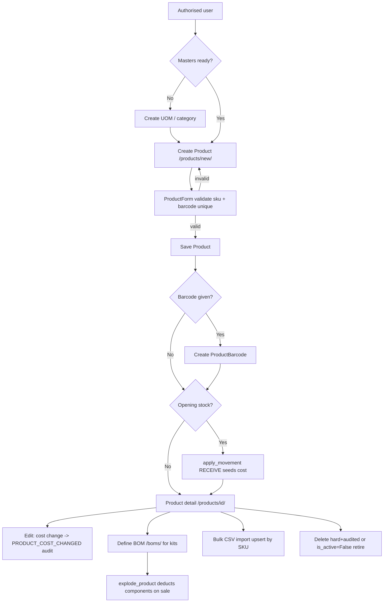

# 5. Product / SKU Management

### Purpose
Central master-data module for every sellable, purchasable and stockable item in the tenant. It defines SKUs with type, category, pricing, tax code, costing method and batch/serial-tracking flags, plus supporting masters: barcodes, units of measure with conversions, and bills of materials (kits). Every other operational module (inventory, purchasing, sales, GL valuation) references `Product` records created here.

### Roles involved
- Admin — full create/edit/delete on products, categories, BOMs, UOMs, CSV import.
- Manager — read access to products/categories/BOMs (via Procurement group mapping in `roles.py`).
- Purchasing — create/edit products, categories, BOMs, UOMs; run product CSV import (the views use `ROLE_PROCUREMENT`, which Purchasing maps to).
- Warehouse — read products, product categories, product detail.
- Sales — read product list/detail and BOM list/detail (no create/edit).
- Read-only — read product list, detail and categories only.

Note: views use the underlying Django-group roles (`ROLE_ADMIN`, `ROLE_PROCUREMENT`, `ROLE_WAREHOUSE`, `ROLE_SALES`, `ROLE_FINANCE`, `ROLE_READONLY`). Membership roles Manager/Accountant inherit access through the `ROLE_TO_GROUPS` mapping.

### Workflow
1. (Optional) Define supporting masters first: UOMs at `/uoms/`, conversions at `/uom-conversions/`, and product categories at `/product-categories/`.
2. Create a product at `/products/new/` (`product_create`) — enter SKU, name, type, category, pricing, tax code, cost method, reorder level, preferred supplier and tracking flags via `ProductForm`.
3. On save the form optionally captures one barcode (creates a `ProductBarcode`) and optional opening stock, which triggers a one-off `apply_movement` RECEIVE into the chosen location (seeding cost).
4. View the product profile at `/products/<id>/` (`product_detail`): stock by location, recent movements, barcodes, sales history, purchase history, supplier price history and margin.
5. Edit at `/products/<id>/edit/` (`product_edit`); a change to `standard_cost` writes a `PRODUCT_COST_CHANGED` audit entry.
6. For kit/bundle SKUs, create a BOM at `/boms/new/`, then add component lines on the BOM detail page (`bom_detail` with `BOMLineFormSet`).
7. When a kit is sold/picked, `explode_product()` resolves the first active BOM and deducts component stock instead of the kit itself.
8. Bulk load via `/products/import/` (CSV upsert by SKU); a template is downloadable at `/import/products/template.csv`.
9. Delete a product at `/products/<id>/delete/` (hard delete, audited) — or set `is_active=False` to retire it without removing history.

### Input data
- SKU (unique per tenant, case-insensitive), name, product type, category, brand, description, image.
- Variant fields: `parent` style SKU, `variant_name`, `option1`/`option2`/`option3`, `pack_size`.
- UOM: `base_uom` (FK) and legacy `uom` text (default "each").
- Pricing: `sales_price`, `tax_code` (FK `TaxCode`).
- Costing: `cost_method` (FIFO / AVERAGE / STANDARD), `standard_cost`, `reorder_level`, `preferred_supplier`.
- Tracking flags: `track_lots`, `track_expiry`, `track_serial`.
- Optional single barcode; optional opening stock + opening location.
- BOM: parent product, BOM name, active flag; lines of component product + qty + UOM.
- CSV columns for import: sku, name, product_type, category, brand, description, uom, cost_method, standard_cost, sales_price, is_active, barcode.

### Output generated
- `Product` records (and `ProductBarcode`, `BillOfMaterials`/`BillOfMaterialsLine`, `ProductCategory`, `UnitOfMeasure`, `UOMConversion`).
- Opening-stock `InventoryMovement` (type RECEIVE, ref_type "OPENING") when opening stock is supplied.
- `average_cost` maintained on inbound movements (moving average); derived `cost_price`, `margin`, `margin_pct`, `on_hand_total` properties.
- Audit entries: `PRODUCT_COST_CHANGED` on standard-cost change; `RECORD_DELETED` on product/category/BOM delete.
- No GL postings originate directly from this module — product master only feeds valuation/COGS in inventory and sales modules.

### Related modules
- Inventory — `InventoryBalance`/`InventoryMovement` keyed by product; opening stock, on-hand, reorder level, lot/serial tracking.
- Purchasing — `preferred_supplier`, `SupplierPriceHistory`, PO lines reference products.
- Sales — quotes/orders/invoices reference products; `explode_product` deducts kit components at fulfilment.
- Finance / Tax — `tax_code` FK to `TaxCode` drives VAT; costing feeds stock valuation and COGS.
- Reports — stock valuation, inventory analytics and profitability use product cost/price.

### Validations & rules
- SKU unique per tenant (DB `unique_together` + case-insensitive `clean_sku`).
- Barcode unique per tenant (DB `unique_together` + `clean_barcode`).
- All queries tenant-scoped via `_get_default_tenant`; every model carries a `tenant` FK.
- Category: `unique_together (tenant, name, parent)`; supports one level of nesting (parent).
- Category delete is safe — product `category` FK is `SET_NULL` and subcategory `parent` is `SET_NULL` (no cascade loss of products).
- Product delete is a hard delete (audited); `parent` variant FK is `PROTECT` and BOM `component` FK is `PROTECT`, so referenced products cannot be deleted. Soft retire via `is_active=False` is the intended alternative.
- BOM: `unique_together (tenant, product, name)`; line `unique_together (bom, component)`; `explode_product` uses the first active BOM by `created_at`.
- Opening stock only accepted when both quantity (>0) and location are provided; created once.
- No approval thresholds, credit limits or maker/checker workflow exist for product master (master data is created/edited directly by authorised roles).

### Database entities
- `Product`
- `ProductCategory`
- `ProductBarcode`
- `BillOfMaterials`
- `BillOfMaterialsLine`
- `UnitOfMeasure`
- `UOMConversion`
- (referenced) `TaxCode`, `Supplier`, `Location`, `InventoryMovement`, `InventoryBalance`, `SupplierPriceHistory`

### API / page requirements
- `/products/` — `product_list` (search by sku/name/brand/barcode; filter type/category/status).
- `/products/new/` — `product_create`.
- `/products/<int:product_id>/` — `product_detail`.
- `/products/<int:product_id>/edit/` — `product_edit`.
- `/products/<int:product_id>/delete/` — `product_delete`.
- `/products/import/` — `import_products`; `/import/products/template.csv` — `import_template`.
- `/product-categories/` — `product_category_list` (list + inline create).
- `/product-categories/<int:category_id>/delete/` — `product_category_delete`.
- `/boms/` — `bom_list`; `/boms/new/` — `bom_create`; `/boms/<int:bom_id>/` — `bom_detail`; `/boms/<int:bom_id>/delete/` — `bom_delete`.
- `/uoms/`, `/uoms/new/`, `/uoms/<id>/edit/`, `/uoms/<id>/delete/` — UOM master.
- `/uom-conversions/` (+ new/edit/delete) — UOM conversion rules.
- All are server-rendered Django views (templates under `templates/products/`, `templates/boms/`, `templates/uoms/`); no JSON REST API for product master.

### Flow diagram

If something is not implemented: there is no variant-generator UI (variants are individual SKUs linked via `parent`), no multi-level BOM explosion (single active BOM, one level), and no JSON/REST API or approval workflow for product master.

---

[← Back to module index](README.md)
