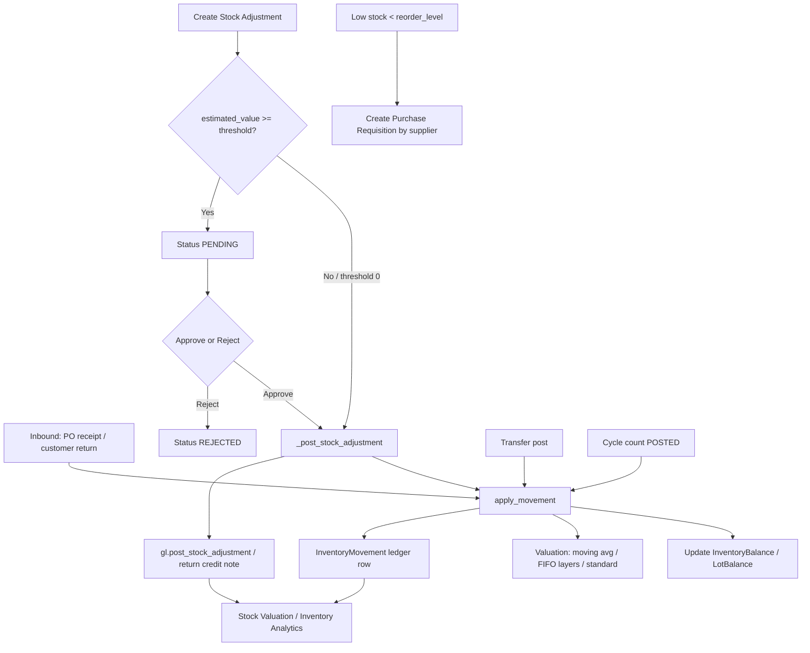

# 6. Inventory and Stock Control

### Purpose
Tracks on-hand and reserved stock per product and location across a Site → Location → Bin hierarchy, maintaining a full costed movement ledger and inventory valuation (moving average, FIFO, or standard cost). It supports manual adjustments with GL postings, location-to-location transfers, cycle counts, and low-stock reordering, keeping the stock ledger in step with the inventory control account.

### Roles involved
- **Admin** — full access to all inventory pages, plus the only role that manages Location Access scoping (`/locations/access/`).
- **Manager** — operational visibility across inventory, adjustments, transfers, cycle counts, sites/locations/bins.
- **Warehouse** — day-to-day stock: adjustments, transfers, cycle counts, low-stock reorder.
- **Purchasing** — views inventory, adjustments, movements, low stock; approves adjustments and raises reorders. (In code the group is `ROLE_PROCUREMENT`.)
- **Read-only** — view-only access to inventory list, movements and low stock.

Note: Accountant/Finance do not appear in the inventory views' `role_required` lists; they consume the resulting GL postings and the Stock Valuation report instead.

### Workflow
1. Stock enters via inbound movements (PO/GRN receipt, customer return) routed through `services.inventory.apply_movement`, which updates `InventoryBalance.on_hand` and valuation.
2. A user raises a **Stock Adjustment** at `/inventory/adjustments/new/` (correction, damage, write-off/loss, or return-to-supplier). `estimated_value` is computed as `abs(qty_delta) * product.cost_price`.
3. If the tenant's `stock_adjustment_approval_threshold > 0` and `estimated_value >= threshold`, the adjustment is saved `PENDING` and waits for approval; otherwise it posts immediately.
4. Posting (`_post_stock_adjustment`) writes one `InventoryMovement` via `apply_movement`, then books the GL impact via `gl.post_stock_adjustment` (or, for return-to-supplier with a supplier, raises a purchase credit note via `purchasing.create_return_credit_note`).
5. An approver (Admin/Purchasing) approves at `/inventory/adjustments/<id>/approve/` (posts) or rejects at `.../reject/`.
6. **Transfers**: a user builds an `InventoryTransfer` with lines at `/transfers/new/`, then posts it; `_post_transfer` applies a `TRANSFER_OUT` (negative) at the source and a `TRANSFER_IN` (positive) at the destination per line, lot-aware.
7. **Cycle counts**: created at `/cycle-counts/new/`, move DRAFT → SUBMITTED → APPROVED → POSTED. On post, each line's `variance_qty` is written as an `ADJUSTMENT` movement.
8. **Low stock**: `/inventory/low-stock/` lists products where `on_hand_total < reorder_level`; selected lines POST to `/inventory/low-stock/reorder/`, which creates `PurchaseRequisition`(s) grouped by `preferred_supplier`.

### Input data
- Product, location (and optional bin) for each movement/adjustment.
- Signed `qty_delta` (+found / −loss), reason, optional notes, optional supplier (for return-to-supplier).
- Optional lot/serial/expiry tracking (lot_code, serial_number, expiry_date).
- Unit cost on inbound movements (drives valuation); cost method comes from the Product.
- Transfer header (from/to location) and line quantities; cycle-count counted quantities.
- Reorder selections and quantities on the low-stock page.

### Output generated
- `InventoryMovement` ledger rows, each with `unit_cost` and signed `value`.
- Updated `InventoryBalance` (`on_hand`, `reserved`) and optional `InventoryLotBalance`.
- `InventoryCostLayer` rows for FIFO products on inbound; consumed oldest-first on outbound.
- Updated `Product.average_cost` (moving average / standard).
- GL `JournalEntry` (ref_type `STOCK_ADJ`): loss → DR Inventory Adjustments / CR Inventory; gain → reverse. Idempotent per adjustment id.
- `PurchaseRequisition` + lines from low-stock reorder; `CreditNote` for return-to-supplier.
- Statuses: StockAdjustment PENDING/POSTED/REJECTED; Transfer DRAFT/POSTED/CANCELLED; CycleCount DRAFT/SUBMITTED/APPROVED/POSTED.
- Audit log entries (STOCK_ADJ_REQUESTED, STOCK_ADJUSTED, STOCK_ADJ_APPROVED/REJECTED, requisition_create).

### Related modules
- **Procurement** — receipts (RECEIVE movements) raise stock; low-stock reorder creates Purchase Requisitions; return-to-supplier raises credit notes.
- **Sales / Fulfilment** — sales fulfilment (SALE movements) and reservations (`reserve_stock` / `release_reservations`) draw on stock.
- **General Ledger / Finance** — adjustments and receipts post journals via `services.gl`.
- **Reports** — Stock Valuation and Inventory Analytics read movement value and balances.
- **Products / BOMs** — cost method, reorder level, preferred supplier come from Product.

### Validations & rules
- **Approval threshold**: adjustments at/above `tenant.stock_adjustment_approval_threshold` go PENDING; below post immediately; zero/blank threshold means no approval gate.
- **Tenant scoping**: every model/query is filtered by `tenant`.
- **Location access scoping**: `accessible_location_ids` / `UserLocationAccess` narrows the inventory list and form location dropdowns; a user with no rows (or Admin) sees all locations.
- **Valuation**: inbound with `unit_cost` updates moving average; FIFO also creates a cost layer; STANDARD always carries `standard_cost` (purchase variance handled in GL). Outbound is valued at average / consumed FIFO layers / standard.
- **Negative stock**: allowed — FIFO shortfall is valued at fallback (current average) cost.
- **Idempotency**: `gl.post_stock_adjustment` returns the existing entry for the same `STOCK_ADJ` ref, preventing double-posting.
- **GL gating**: zero-value adjustments post no journal.
- **Status guards**: transfers skip if already POSTED; cycle counts only post when APPROVED; approve/reject only act on PENDING adjustments.
- **Uniqueness**: balance unique per (tenant, product, location); transfer number unique per tenant.
- No soft-delete on movements; the ledger is append-only (corrections are new movements).

### Database entities
- `InventoryBalance`, `InventoryLotBalance`, `InventoryReservation`
- `InventoryMovement`, `InventoryCostLayer`
- `StockAdjustment`
- `InventoryTransfer`, `InventoryTransferLine`
- `CycleCount`, `CycleCountLine`
- `Site`, `Location`, `Bin`, `UserLocationAccess`
- `Product` (cost_method, average_cost, standard_cost, reorder_level, preferred_supplier)
- Downstream: `JournalEntry` / `JournalLine`, `PurchaseRequisition` / `PurchaseRequisitionLine`, `CreditNote`

### API / page requirements
- `/inventory/` — `inventory_list`
- `/inventory/adjustments/` — `adjustment_list`; `/inventory/adjustments/new/` — `adjustment_create`
- `/inventory/adjustments/<adj_id>/approve/` — `adjustment_approve`; `.../reject/` — `adjustment_reject`
- `/inventory/movements/` — `stock_movements`
- `/inventory/low-stock/` — `low_stock`; `/inventory/low-stock/reorder/` — `low_stock_reorder`
- `/transfers/`, `/transfers/new/`, `/transfers/<id>/`, `/transfers/<id>/post/` — transfer views
- `/cycle-counts/`, `/cycle-counts/new/`, `/cycle-counts/<id>/`, `.../submit/`, `.../approve/`, `.../post/`
- `/sites/` (+ new/edit/delete), `/locations/` (+ new/edit/delete), `/bins/` (+ new/edit/delete)
- `/locations/access/` — `location_access` (Admin only)

These are server-rendered Django pages (template responses), not a JSON REST API.

### Flow diagram

---

[← Back to module index](README.md)
