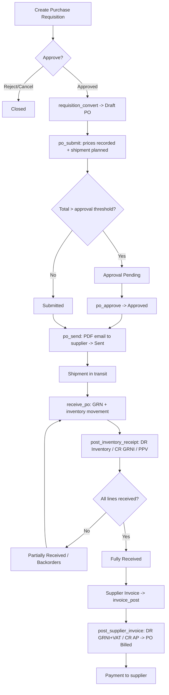

# 7. Purchasing

### Purpose
Manages the full procure-to-pay cycle for a UK SME: internal Purchase Requisitions, Purchase Orders to suppliers, inbound Shipments, Goods Receipts (GRN) into inventory, and three-way-matched Supplier Invoices (bills) that post to the General Ledger. It captures supplier price history for cost intelligence, supports approval thresholds, PO amendments/versioning, backorder tracking, and PO PDF/email to suppliers.

### Roles involved
- **Admin** - full access to all purchasing actions.
- **Purchasing** (group `Procurement`) - create/submit/send/amend/cancel POs, create requisitions, convert approved requisitions, create shipments.
- **Warehouse** - create requisitions, view POs/shipments, receive goods (GRN).
- **Manager** - read access across requisitions, POs, backorders, shipments (via the `Procurement`/`Warehouse` group mapping).
- **Accountant** / **Finance** - supplier invoices (bills) and posting (`/invoices/` is restricted to Admin/Accountant/Finance); Finance also approves/rejects requisitions.
- **Read-only** - view-only on POs, requisitions, shipments.

Note: requisition **approve/reject** views are gated to `[ROLE_ADMIN, ROLE_FINANCE]`, not Procurement.

### Workflow
1. A requester creates a **Purchase Requisition** (`requisition_create`) in Draft or directly Submitted (form `action`).
2. Admin/Finance **approves** (`requisition_approve`) or rejects/cancels it.
3. An approved requisition is **converted** (`requisition_convert`) into a Draft **PurchaseOrder** - supplier resolved from `preferred_supplier`, else a product's preferred supplier, else first supplier; lines copied with estimated/standard cost and STD tax code.
4. Purchasing **submits** the PO (`po_submit`): currency set from supplier/tenant, supplier prices recorded (`record_po_prices`), and a planned Shipment + ShipmentLines auto-created. If total > tenant `po_approval_threshold` the PO goes to **Approval Pending**, otherwise **Submitted**.
5. If required, Admin/Procurement **approves** (`po_approve`) → **Approved** (also ensures a shipment exists).
6. PO is **sent** to the supplier by email with PDF attached (`po_send`) → **Sent**.
7. Goods arrive; warehouse posts a **Goods Receipt / GRN** (`receive_po`) against a shipment - qty validated against open qty, inventory movements applied, optional landed cost apportioned, GL receipt posted (`post_inventory_receipt`).
8. PO status becomes **Partially Received** or **Fully Received** based on remaining open qty; outstanding lines appear in **Backorders**.
9. Finance/Accountant records and posts a **Supplier Invoice** (`invoice_post` → `post_supplier_invoice`): posts AP GL entry, marks the PO **Billed**, and captures actual billed prices (`record_bill_prices`).
10. Payment of the supplier invoice is handled by the Finance/Payments module (`supplier_payment_create`).

### Input data
- Requisition: department, preferred supplier, needed-by date, justification, line products/quantities/estimated unit cost.
- PO header: supplier, delivery address, currency, expected date, notes; lines: product, ordered qty, unit cost, VAT `tax_code`.
- Shipment: carrier, tracking number, ETA, destination Location; shipment line expected qty.
- GRN: received qty per line, optional lot code / serial / expiry, optional single landed-cost charge, attachment.
- Supplier Invoice: invoice number, invoice date, currency, lines (qty, unit cost, tax code, linked po_line/receipt_line), attachment.

### Output generated
- **Documents:** PO PDF (`po_pdf`, `documents/po_pdf.html`), PO email with PDF attachment (`po_email.html`).
- **Statuses:** PO - Draft / Submitted / Approval Pending / Approved / Sent / In Transit / Partially Received / Fully Received / Billed / Closed / Cancelled. (In Transit and Closed exist as choices but are not set by the receive/submit flows reviewed.)
- **GL postings:** GRN receipt - DR Inventory / CR GRNI / CR Accruals (landed) / ± Purchase Price Variance. Supplier invoice - DR GRNI + DR VAT Input / CR Accounts Payable.
- **Records:** GoodsReceipt + GoodsReceiptLines, InventoryMovement (RECEIVE), SupplierPriceHistory (PO and BILL sources), PurchaseOrderAmendment (versioning).

### Related modules
- **Inventory** - GRN applies costed stock movements and updates balances.
- **Finance / GL** - receipt and AP-invoice journal entries (`post_inventory_receipt`, `post_supplier_invoice`).
- **Payments** - supplier payments settle posted bills (DR AP / CR Bank).
- **VAT / Tax** - `TaxCode` drives input VAT on PO/invoice lines.
- **Suppliers & Products** master data; **Supplier Scorecard** report (`supplier_scorecard`) consumes bills + GRNs.

### Validations & rules
- **Approval threshold:** PO requires approval only when tenant `po_approval_threshold` is set and PO total exceeds it (set at submit time).
- **Receiving guards:** cannot receive a PO that is `approval_required`/Approval Pending; cannot receive more than a shipment line's open qty; "nothing received" rolls back the whole atomic transaction.
- **Status guards:** only Draft POs can be submitted; cancelled/closed POs cannot be sent or amended; only Approved requisitions convert, and a requisition converts only once (`converted_po`).
- **Amendments:** non-draft PO amendment creates a new version (`-vN`), supersedes the old one, sets `is_current=False` on the original, and requires a reason.
- **Price history idempotency:** `SupplierPriceHistory` unique per (tenant, supplier, product, source, reference); non-positive costs are ignored.
- **Tenant scoping:** every view filters by `_get_default_tenant(request)`; `po_number`/`req_number`/`grn_number`/`invoice_number` unique per tenant.
- Not implemented as an explicit gate: a formal three-way match block (PO/GRN/invoice quantities are linked via FKs and `SupplierInvoice.Status` has MATCHED/APPROVED, but posting via `invoice_post` does not enforce a match check).

### Database entities
- `PurchaseRequisition`, `PurchaseRequisitionLine`
- `PurchaseOrder`, `PurchaseOrderLine`, `PurchaseOrderAmendment`
- `Shipment`, `ShipmentLine`, `Container`
- `GoodsReceipt`, `GoodsReceiptLine`, `LandedCostCharge`
- `SupplierInvoice`, `SupplierInvoiceLine`
- `SupplierPriceHistory`, `Supplier`
- (GL) `JournalEntry`, `JournalLine`; (inventory) `InventoryMovement`, `InventoryBalance`

### API / page requirements
- Requisitions: `/requisitions/`, `/requisitions/new/`, `/requisitions/<id>/`, `.../submit/`, `.../approve/`, `.../reject/`, `.../cancel/`, `.../convert/`
- Purchase Orders: `/po/`, `/po/new/`, `/po/<id>/`, `.../submit/`, `.../approve/`, `.../send/`, `.../amend/`, `.../cancel/`, `.../print/`, `.../pdf/`, `.../receive/`
- `/po/backorders/` (outstanding open lines)
- `/po/supplier/<supplier_id>/prices/` → `supplier_prices_json` (last-cost prefill)
- Shipments: `/po/<po_id>/shipments/new/`, `/shipments/`, `/shipments/<id>/`, `/shipment/<id>/` (update)
- Supplier invoices (bills): `/invoices/`, `/invoices/new/`, `/invoices/<id>/`, `/invoices/<id>/post/`
- Report: `/reports/supplier-scorecard/`

### Flow diagram

---

[← Back to module index](README.md)
