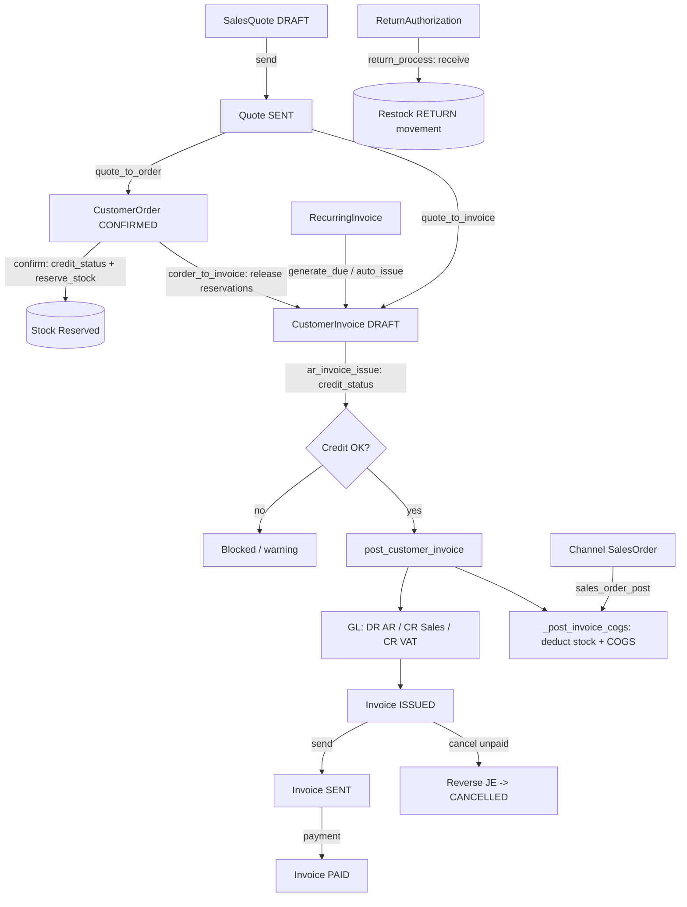

# 8. Sales

### Purpose
The Sales module manages the full order-to-cash lifecycle for selling goods and services to customers: quoting, order capture, invoicing, recurring billing, channel/e-commerce orders, credit notes, and returns. It drives stock reservations and deductions, posts revenue/VAT/COGS to the general ledger on invoice issue, and enforces customer credit limits and on-hold blocks. It connects sales activity directly to inventory and finance so a single tenant's AR ledger, VAT return, and stock valuation stay in sync.

### Roles involved
- **Sales** — create/edit quotes, orders, invoices, recurring templates, channel orders, and returns (`SALES_DOC_ROLES = [Sales, Finance, Admin]`).
- **Finance** / **Accountant** — issue, send, cancel, and refund customer invoices; manage credit notes.
- **Admin** — full access to all sales documents and configuration.
- **Manager** — navigation access (sidebar) to quotes, orders, invoices, returns, and channel orders.
- **Warehouse** — returns (RMA) processing/receiving via nav; channel order posting deducts stock.
- **Read-only** — list/detail views only (`SALES_DOC_READ` adds Read-only to read paths).

### Workflow
1. **Quote** — Sales creates a `SalesQuote` (DRAFT) with line items; optionally emails it (`quote_send`), moving it to SENT.
2. **Quote acceptance** — status moved via `quote_status` (ACCEPTED/DECLINED/EXPIRED/CANCELLED).
3. **Convert quote** — `quote_to_order` creates a CONFIRMED `CustomerOrder` (copying lines, linked via `CustomerOrder.quote`); or `quote_to_invoice` creates a draft `CustomerInvoice` (linked via `source_quote`). The quote is set to CONVERTED.
4. **Order confirm** — `corder_status` "confirm" runs `credit_status`, then reserves stock via `_reserve_customer_order` → `reserve_stock` (ref_type `CUSTOMER_ORDER`).
5. **Convert order to invoice** — `corder_to_invoice` builds a draft `CustomerInvoice` (linked via `source_order`), sets the order to INVOICED, and releases reservations (`_release_customer_order`).
6. **Issue invoice** — `ar_invoice_issue` checks `credit_status`, then `post_customer_invoice` posts the GL entry, sets status ISSUED, and runs `_post_invoice_cogs` to deduct stock and book COGS.
7. **Send invoice** — `ar_invoice_send` issues (if draft) then emails the PDF and marks SENT.
8. **Payment/credit** — payments allocate against the invoice; `outstanding` derives Partially paid / Paid / Overdue display states.
9. **Cancel/refund** — `ar_invoice_cancel` reverses the GL entry (if posted and unpaid); `ar_invoice_refund` and `CreditNote` handle post-payment credits.
10. **Recurring** — `RecurringInvoice` templates generate invoices on schedule via `generate_for_template` / `generate_due` (auto-issued if `auto_issue`).
11. **Channel orders** — `SalesOrder` (Shopify/e-commerce) posts via `sales_order_post` → `_post_sales_order` (releases reservations, deducts stock, allows negative with shortage warnings).
12. **Returns** — `ReturnAuthorization` (RMA) processed via `return_process` (approve → receive) restocks goods via `_receive_rma`.

### Input data
- Customer, currency, quote/order/invoice dates, valid-until / due-date.
- Line items: product (or description-only service line), qty, unit price, discount %, tax code.
- Notes and terms (defaulted from `tenant.invoice_footer`); default tax code and payment terms from tenant.
- Recurring: frequency, interval, start/next-run/end dates, max occurrences, auto-issue flag.
- Channel order: channel, order number, ship-from location, lot/serial/expiry per line.
- RMA: channel, original order number, receive location, lines with reason and lot/serial/expiry.

### Output generated
- Documents: quote PDF, sales-order PDF, invoice PDF, credit note PDF (`quote_pdf`, `corder_pdf`, `ar_invoice_pdf`, `credit_note_pdf`).
- GL postings on invoice issue (`post_customer_invoice`): DR Accounts Receivable (total), CR Sales Revenue (subtotal), CR VAT Output (tax). Plus COGS entry (`post_cogs`) and SALE inventory movements via `_post_invoice_cogs`.
- Status transitions across quote/order/invoice lifecycles; invoice cancellation reversal JE (`AR_INVOICE_CANCEL`).
- Stock reservations on order confirm; stock deductions on invoice issue and channel-order post; restock movements (RETURN) on RMA receive.
- Customer outstanding balance / aged-debtor data; VAT-return inputs (output VAT).

### Related modules
- **Inventory** — reservations (`reserve_stock`/`release_reservations`), SALE/RETURN movements (`apply_movement`), kit explosion (`explode_product`).
- **Finance / GL** — journal entries, COGS, VAT Output, AR control account; credit notes; payments/receipts allocation.
- **Customers** — credit limit and on-hold status (`credit_status`), statements.
- **VAT (MTD)** — issued invoices feed output-VAT boxes via tax codes.
- **Reports** — sales reports (history, by product/customer/channel), profitability, aged receivables.
- **Channels** — `SalesOrder` from Shopify/e-commerce connectors.

### Validations & rules
- **Credit control**: `credit_status(total)` blocks issuing an invoice when over limit or customer ON_HOLD. On order confirm, ON_HOLD is a hard block but over-limit only warns (no receivable until invoiced).
- **Idempotent posting**: `post_customer_invoice` and `_post_invoice_cogs` guard against double-posting via JE ref (`AR_INVOICE` / `COGS` + invoice number).
- **Cancel guards**: an invoice with payments cannot be cancelled (must use credit note/refund); GL reversal only when previously issued.
- **Conversion immutability**: CONVERTED quotes and INVOICED orders cannot be deleted (linked to downstream docs).
- **Soft delete**: `CustomerInvoice` uses `SoftDeleteManager` (`is_deleted`/`deleted_at`/`deleted_by`); not a hard delete.
- **Negative stock allowed**: channel-order post and invoice COGS permit negative inventory, surfacing shortages as warnings rather than blocking.
- **Tenant scoping**: every query filters by `tenant`; document numbers unique per tenant.
- **Service lines**: description-only lines (no product) and tenants without a stock location skip stock/COGS, supporting service businesses.

### Database entities
- `SalesQuote`, `SalesQuoteLine`
- `CustomerOrder`, `CustomerOrderLine`
- `CustomerInvoice`, `CustomerInvoiceLine`
- `RecurringInvoice`, `RecurringInvoiceLine`
- `CreditNote`, `CreditNoteLine`
- `SalesOrder`, `SalesOrderLine` (channel/e-commerce), `SalesChannel` (choices)
- `ReturnAuthorization`, `ReturnLine`
- Supporting: `Customer`, `Product`, `TaxCode`, `Location`, `JournalEntry`, `JournalLine`, `InventoryMovement`, `StockReservation`

### API / page requirements
- Quotes: `/quotes/`, `/quotes/new/`, `/quotes/<id>/`, `/quotes/<id>/edit/`, `/quotes/<id>/pdf/`, `/quotes/<id>/send/`, `/quotes/<id>/status/<to>/`, `/quotes/<id>/to-order/`, `/quotes/<id>/to-invoice/`, `/quotes/<id>/delete/`
- Customer orders: `/customer-orders/`, `/customer-orders/new/`, `/customer-orders/<id>/`, `/customer-orders/<id>/edit/`, `/customer-orders/<id>/pdf/`, `/customer-orders/<id>/status/<to>/`, `/customer-orders/<id>/to-invoice/`, `/customer-orders/<id>/delete/`
- AR invoices: `/ar/invoices/`, `/ar/invoices/new/`, `/ar/invoices/<id>/`, `/ar/invoices/<id>/edit/`, `/ar/invoices/<id>/issue/`, `/ar/invoices/<id>/pdf/`, `/ar/invoices/<id>/send/`, `/ar/invoices/<id>/cancel/`, `/ar/invoices/<id>/refund/`, `/ar/invoices/<id>/delete/`
- Recurring: `/recurring-invoices/`, `/recurring-invoices/new/`, `/recurring-invoices/run-due/`, `/recurring-invoices/<id>/`, `/recurring-invoices/<id>/edit/`, `/recurring-invoices/<id>/toggle/`, `/recurring-invoices/<id>/generate/`
- Channel orders: `/sales-orders/`, `/sales-orders/new/`, `/sales-orders/<id>/`, `/sales-orders/<id>/post/`
- Returns: `/returns/`, `/returns/new/`, `/returns/<id>/`, `/returns/<id>/process/`
- Credit notes: `/credit-notes/` (+ new/detail/post/pdf)
- Sales reports: `/sales/reports/` (history, by-product, by-customer, by-channel, profitability)

### Flow diagram

---

[← Back to module index](README.md)
