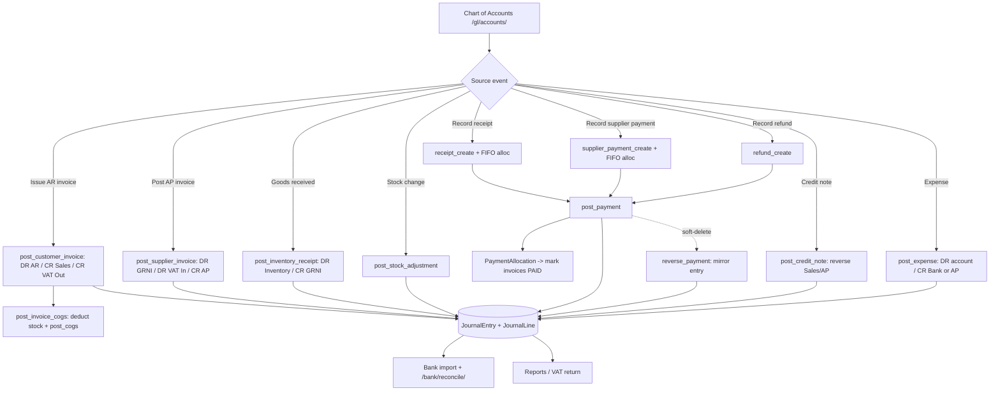

# 9. Finance and Accounting

### Purpose
A double-entry general ledger that turns operational events (invoices, payments, expenses, credit notes, goods receipts, stock changes) into balanced journal entries automatically. It also handles cash recording (customer receipts, supplier payments, customer refunds) with FIFO allocation against open invoices, plus bank-statement reconciliation. Designed for a UK SME: VAT input/output accounts feed the MTD VAT return, and sensitive cash records are soft-deleted (never hard-deleted) for audit.

### Roles involved
- **Finance** (Django group `Finance`, membership roles ACCOUNTANT and FINANCE) - primary writer for payments, GL accounts, credit notes, expenses, reconciliation.
- **Admin** - full access; sees everything.
- **Read-only** - can view the Journal (`journal_detail` allows ROLE_READONLY) and financial reports; no write access.
- Other roles (Manager, Sales, Warehouse, Purchasing) can only *record* expenses (the `/expenses/` page is open to them), but posting expenses to the GL is Finance/Admin.

### Workflow
1. **Chart of accounts** is set up per tenant (`/gl/accounts/`). The GL service relies on fixed default codes (e.g. 1000 Inventory, 1050 Bank, 1100 AR, 2000 AP, 2100 GRNI, 2200 VAT Output, 1300 VAT Input, 4000 Sales, 5000 COGS).
2. **Source documents post automatically.** Issuing a customer invoice calls `post_customer_invoice` (DR AR / CR Sales / CR VAT Output, then deducts stock and posts COGS). Posting a supplier invoice calls `post_supplier_invoice` (DR GRNI / DR VAT Input / CR AP). Goods receipt → `post_inventory_receipt`; stock adjustments → `post_stock_adjustment`.
3. **Record a customer receipt** at `/payments/receipts/new/`: the system pulls that customer's open (ISSUED) invoices oldest-first and allocates the receipt **FIFO** (`_allocate_fifo`), then `post_payment` books DR Bank / CR AR and marks fully-settled invoices PAID.
4. **Record a supplier payment** at `/payments/payments/new/`: FIFO allocation against POSTED supplier invoices, then DR AP / CR Bank.
5. **Record a customer refund** at `/payments/refunds/new/`: DR AR / CR Bank (no allocation).
6. **Credit notes** (`/credit-notes/new/`) are drafted then posted (`post_credit_note`); a sales credit reverses Sales/VAT Output against AR, a purchase credit reverses against AP.
7. **Expenses** are recorded, optionally submitted/approved, then posted (`post_expense`) to the chosen expense account.
8. **Import the bank statement** (`/bank/transactions/import/`, CSV: date, description, amount), then **reconcile** at `/bank/reconcile/` - auto-match or manually match each line to a Payment or paid Expense and mark reconciled.
9. **Reverse / delete:** soft-deleting a payment (`/payments/<id>/delete/`) calls `reverse_payment` to post a mirror entry, frees the settled invoices, and flags the row deleted (kept for audit).
10. Resulting balances flow into the financial reports (trial balance, P&L, balance sheet) and the VAT return.

### Input data
- GL account: code, name, type (ASSET/LIABILITY/EQUITY/INCOME/COGS/EXPENSE), active flag.
- Payment: direction, customer/supplier, date, amount, method (BANK/CARD/CASH/CHEQUE/OTHER), reference, notes.
- Credit note: kind (SALES/PURCHASE), number, date, party, optional linked invoice, reason, lines (product/description, qty, unit amount, tax code, account).
- Expense: date, payee, optional supplier, category (an expense/COGS GLAccount), net amount, tax code, paid-now flag, method, receipt file.
- Bank transaction: date, description, signed amount (+in / −out), reference.

### Output generated
- `JournalEntry` + balanced `JournalLine` rows, tagged by `ref_type` (AR_INVOICE, AP_INVOICE, PAYMENT, PAYMENT_REVERSAL, EXPENSE, CREDIT_NOTE, GRN, COGS, STOCK_ADJ) and `ref_id`.
- Status transitions: CustomerInvoice → PAID when fully settled; SupplierInvoice → POSTED; Payment/Expense/CreditNote → POSTED.
- `PaymentAllocation` rows linking cash to invoices.
- Reconciled bank transactions (`is_reconciled`).
- Credit-note PDF (`/credit-notes/<id>/pdf/`). Finance CSV export (`/finance/export/<kind>.csv`).

### Related modules
- **Sales / AR** (CustomerInvoice → receipts, sales credit notes).
- **Procurement / AP** (SupplierInvoice → supplier payments, GRNI, purchase credit notes).
- **Inventory** (COGS, inventory receipt, stock-adjustment postings).
- **VAT (MTD)** - VAT input/output accounts feed the 9-box `VatReturn`.
- **Reports** (trial balance, P&L, balance sheet, aged debtors/creditors, cash flow) read the GL.

### Validations & rules
- **Tenant scoping:** every entity is filtered by `tenant`; `_acc()` resolves accounts per tenant by code.
- **Idempotency:** posting functions short-circuit if a JE for that `(ref_type, ref_id)` already exists, so re-issuing/re-posting never double-counts.
- **Double-entry integrity:** each posting writes balancing debit/credit lines; `JournalEntry.total_debit`/`total_credit` expose the check (note: balance is enforced by the service logic, not a DB constraint).
- **FIFO allocation:** receipts/payments settle oldest open invoices first.
- **Soft-delete (sensitive):** `Payment` uses `SoftDeleteManager` (`is_deleted`, `deleted_by`, `deleted_at`); the default manager hides deleted rows, `all_objects` retains them. Deletion posts a reversing entry rather than removing ledger history.
- **No GL hard-edit:** journal entries are not editable through the UI; corrections go via reversals/new postings.
- **GLAccount uniqueness:** `(tenant, code)` unique; accounts are PROTECTed from deletion by journal lines and expenses.
- **Bank reconciliation posts nothing** to the ledger - it is matching/preparation only.
- **Supplier invoices have no PAID state** - once settled they remain POSTED.
- Approval thresholds: not implemented for payments/credit notes (expenses have a DRAFT→SUBMITTED→approve flow; payments and credit notes post directly with Finance/Admin rights).

### Database entities
`GLAccount`, `JournalEntry`, `JournalLine`, `Payment`, `PaymentAllocation`, `Expense`, `CreditNote`, `CreditNoteLine`, `BankTransaction`. Reads/updates `CustomerInvoice`, `SupplierInvoice`, `TaxCode`, `InventoryMovement`, `Location`, `Tenant`.

### API / page requirements
- Payments: `/payments/`, `/payments/receipts/new/`, `/payments/payments/new/`, `/payments/refunds/new/`, `/payments/<id>/`, `/payments/<id>/delete/`.
- General ledger: `/gl/accounts/`, `/gl/accounts/new/`, `/gl/accounts/<id>/edit/`, `/gl/journal/`, `/gl/journal/<id>/`.
- Credit notes: `/credit-notes/`, `/credit-notes/new/`, `/credit-notes/<id>/`, `/credit-notes/<id>/post/`, `/credit-notes/<id>/pdf/`.
- Expenses: `/expenses/`, `/expenses/new/`, `/expenses/<id>/`, `/expenses/<id>/post/`, plus submit/approve/reject.
- Bank: `/bank/transactions/`, `/bank/transactions/new/`, `/bank/transactions/import/`, `/bank/reconcile/`.
- AP posting trigger: `/invoices/<id>/post/`. Finance export: `/finance/export/<kind>.csv`.

### Flow diagram

---

[← Back to module index](README.md)
