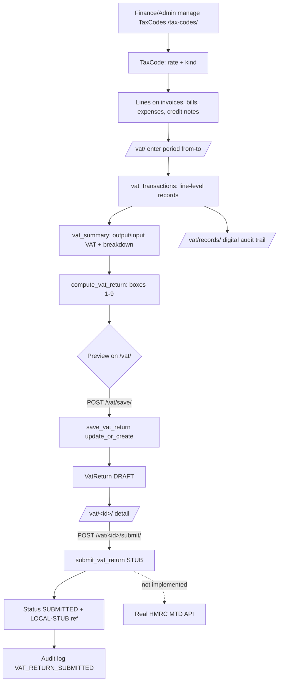

# 10. VAT and UK Tax Compliance

### Purpose
Computes Making Tax Digital (MTD) 9-box VAT returns for a UK tenant by aggregating VAT at transaction-line level across every VAT-bearing document in a chosen period. It also manages the tenant's library of VAT tax codes (rate + treatment) that drive how each line is taxed and reported. Returns are saved as DRAFT and can be marked SUBMITTED; live HMRC filing is intentionally a clearly-labelled local stub.

### Roles involved
- **Finance** (`ROLE_FINANCE` — covers both the Finance and Accountant membership roles, which both map to the Django `Finance` group): full read/write on tax codes and VAT returns.
- **Admin** (`ROLE_ADMIN`): full read/write.
- **Read-only** (`ROLE_READONLY`): read access to tax code list, VAT preview/returns and VAT records; cannot create/edit/save/submit.

### Workflow
1. Finance/Admin maintains VAT tax codes at `/tax-codes/` — create/edit a `TaxCode` with a `code`, `name`, `rate` (decimal fraction, e.g. `0.2000`) and `kind` (standard/reduced/zero/exempt/outside-scope).
2. Tax codes are selected on individual document lines (sales invoices, supplier bills, expenses, credit notes), so each line carries its own VAT treatment.
3. To prepare a return, the user opens `/vat/`, enters a period (`from`/`to`), and the page renders a live preview by calling `compute_vat_return`.
4. `vat_transactions` walks every VAT-bearing line in the period; `vat_summary` aggregates output/input VAT and a per-rate breakdown; `compute_vat_return` maps the totals onto the nine boxes.
5. The user POSTs to `/vat/save/`, which calls `save_vat_return` to persist (or refresh) a DRAFT `VatReturn` via `update_or_create` keyed on `(tenant, period_from, period_to)`.
6. The saved return is shown at `/vat/<id>/` with all nine boxes.
7. The user POSTs to `/vat/<id>/submit/`; `submit_vat_return` flips status DRAFT→SUBMITTED, stamps `submitted_at`, and writes a `LOCAL-STUB-<id>` reference. A warning message explicitly states live HMRC MTD filing is not connected.
8. The digital VAT records (audit trail behind a return) are viewable at `/vat/records/`, defaulting to the current financial year.

### Input data
- `TaxCode` definitions: code, name, rate, kind, is_active.
- Reporting period: `date_from` / `date_to`.
- Source documents in the period (read-only inputs): `CustomerInvoice` lines (status ISSUED/SENT/PAID), `SupplierInvoice` lines (status POSTED), `Expense` records (status POSTED), `CreditNote` lines (status POSTED, sales or purchase).

### Output generated
- Live 9-box preview (boxes 1–9) plus plain-English summary and per-rate breakdown.
- Persisted `VatReturn` records (DRAFT, then SUBMITTED).
- `submitted_at` timestamp and `hmrc_reference` (`LOCAL-STUB-<id>` — not a real HMRC receipt).
- Digital VAT records list (one row per VAT-bearing line; credit notes signed negative).
- Audit log entries: `VAT_RATE_CHANGED`, `VAT_RETURN_SAVED`, `VAT_RETURN_SUBMITTED`, `RECORD_DELETED`.
- No GL postings are generated by this module (VAT is reported, not posted, here).

### Related modules
- **Sales / AR** — `CustomerInvoice` lines feed output VAT (boxes 1, 6).
- **Procurement / AP** — `SupplierInvoice` lines feed input VAT (boxes 4, 7).
- **Expenses** — POSTED `Expense` records feed input VAT.
- **Credit Notes** — sales/purchase credit notes reduce output/input VAT respectively.
- **Reports** — uses `reports_service.current_financial_year` to default the VAT records period.
- **Audit Log** — every mutating action is logged.

### Validations & rules
- **Tenant scoping**: all `TaxCode` and `VatReturn` queries filter by tenant; tax code `code` is unique per tenant.
- **One return per period**: `VatReturn` is unique on `(tenant, period_from, period_to)`; saving refreshes the existing DRAFT rather than duplicating.
- **Period validity**: `vat_save` rejects missing dates or `date_to < date_from`.
- **Treatment rules**: outside-scope (`OUTSIDE`) supplies are excluded from net boxes 6/7 (`in_vat_boxes` is False); zero-rated and exempt supplies are included at a zero rate. A line with no tax code is treated as "No VAT" but still included in net boxes.
- **Document status gating**: only ISSUED/SENT/PAID sales invoices, POSTED supplier bills, POSTED expenses and POSTED credit notes are picked up.
- **Box 2/8/9**: hard-coded to 0.00 (post-Brexit GB assumption — EU acquisitions/supplies not implemented).
- **Submission immutability**: `submit_vat_return` is idempotent — a return already SUBMITTED is returned unchanged.
- **MTD stub**: actual HMRC submission is NOT implemented; the single replacement seam is `submit_vat_return`, and the user is warned the reference is a local stub.
- **Soft-delete**: not implemented for tax codes — `taxcode_delete` performs a hard `obj.delete()`.

### Database entities
- `TaxCode` (with `Kind` choices STANDARD/REDUCED/ZERO/EXEMPT/OUTSIDE and `in_vat_boxes` property)
- `VatReturn` (with `Status` DRAFT/SUBMITTED and box1–box9 fields)
- Read-only sources: `CustomerInvoice`, `SupplierInvoice`, `Expense`, `CreditNote` (and their lines + `tax_code` FKs)

### API / page requirements
- `GET /tax-codes/` → `taxcode_list`
- `GET/POST /tax-codes/new/` → `taxcode_create`
- `GET/POST /tax-codes/<int:tax_id>/edit/` → `taxcode_edit`
- `GET/POST /tax-codes/<int:tax_id>/delete/` → `taxcode_delete`
- `GET /vat/?from=&to=` → `vat_index` (live 9-box preview + saved returns)
- `POST /vat/save/` → `vat_save`
- `GET /vat/<int:vr_id>/` → `vat_detail`
- `POST /vat/<int:vr_id>/submit/` → `vat_submit` (local stub)
- `GET /vat/records/?from=&to=` → `vat_records`
- Service functions (`core/services/vat.py`): `vat_transactions`, `vat_summary`, `compute_vat_return`, `save_vat_return`, `submit_vat_return`.
- No JSON/REST API — these are server-rendered Django views/templates.

### Flow diagram

---

[← Back to module index](README.md)
