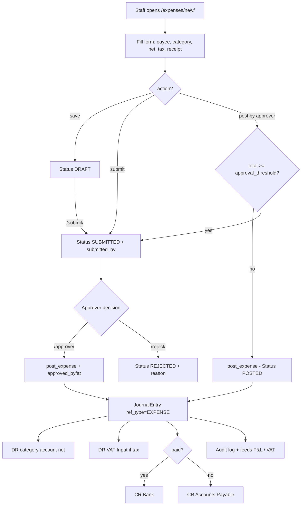

# 11. Expenses

### Purpose
Lets staff record everyday business costs (rent, fuel, software, professional fees, etc.) that arrive without a formal supplier bill, optionally attaching a receipt photo or PDF. Each expense carries a net amount plus a VAT tax code, runs through a Draft → Submitted → Posted approval workflow, and on posting generates the GL double-entry (DR expense account + DR VAT input, CR Bank or Accounts Payable).

### Roles involved
- **Admin** — full access (submit, approve, post, reject).
- **Finance** — approver: submit, approve, reject, post (`EXPENSE_APPROVERS = [ROLE_FINANCE, ROLE_ADMIN]`).
- **Manager, Sales, Warehouse, Purchasing** — staff: create, save draft, submit for approval (`EXPENSE_STAFF = [ROLE_ADMIN, ROLE_FINANCE, ROLE_PROCUREMENT, ROLE_WAREHOUSE, ROLE_SALES]`; note Manager maps to the Procurement/Warehouse/Sales groups).
- **Read-only** — may view the list and detail only (`expense_list` / `expense_detail` include `ROLE_READONLY`).
- **Accountant** appears in the sidebar entry for `/expenses/` but is not in `EXPENSE_STAFF`/`EXPENSE_APPROVERS`, so its write access is via the Finance group mapping.

### Workflow
1. A staff user opens `/expenses/new/` and fills the form: date, payee, optional supplier, category (an expense GL account), net amount, tax code, payment method, paid/reimbursable flags, reference, and an optional receipt file.
2. On submit, the view sets `tenant` and `currency_code` from the tenant, saves the record, then branches on the form `action`:
   - **Save draft** → status `DRAFT`.
   - **Submit** → status `SUBMITTED`, `submitted_by` set, audit log `expense_submit`.
   - **Post** (approver, below threshold) → `post_expense()` runs immediately, status `POSTED`.
   - **Post** (approver, at/above threshold) → forced to `SUBMITTED` with a warning that approval is required.
3. A draft can later be submitted via `/expenses/<id>/submit/` (staff, only when `DRAFT`).
4. An approver (Finance/Admin) reviews via `/expenses/<id>/` and either approves (`/approve/`) or rejects (`/reject/` with an optional reason).
5. On **approve**: `post_expense()` posts the GL entry and sets status `POSTED`; `approved_by` / `approved_at` are recorded; audit `expense_approve`.
6. On **reject**: status `REJECTED`, `rejected_reason` stored, `approved_by`/`approved_at` set; audit `expense_reject`.
7. `/expenses/<id>/post/` (Finance/Admin) is a direct post path for any non-posted expense, bypassing approval gating.

### Input data
- Expense date, payee (merchant), optional supplier link.
- Category — an active `GLAccount` of type EXPENSE (form restricts the queryset to `type=EXPENSE, is_active=True`).
- Description, net amount (before VAT), tax code (optional; defaults to tenant `default_tax_code`).
- Payment method (Bank transfer / Card / Cash / Other), reference.
- Flags: `paid` (paid now vs owed), `reimbursable` (paid personally).
- Receipt file upload — validated to `.pdf/.png/.jpg/.jpeg/.gif/.webp/.heic`, stored tenant-scoped under `expense_receipts/<tenant_id>/`.

### Output generated
- An `Expense` record with status Draft / Submitted / Rejected / Posted.
- On posting, a balanced `JournalEntry` (`ref_type="EXPENSE"`, `ref_id=<expense.id>`) with `JournalLine`s: DR category account (net), DR VAT Input (tax, account key `vat_input`) when tax is non-zero, CR Bank (`bank`) if `paid` else CR Accounts Payable (`ap`) for the gross total.
- Audit-log entries: `expense_submit`, `expense_approve`, `expense_reject`.
- Posted expenses flow into VAT input reclaim and P&L expense reporting via the journal.

### Related modules
- **General Ledger / Chart of Accounts** — categories are EXPENSE `GLAccount`s; posting writes `JournalEntry`/`JournalLine`.
- **VAT / Tax Codes** — `tax_code` drives reclaimable VAT Input.
- **Suppliers / Accounts Payable** — optional supplier link; unpaid expenses credit AP.
- **Bank** — paid expenses credit the Bank account (feeds bank reconciliation).
- **Reports** — Profit & Loss (expense accounts) and VAT return.
- **Inter-company** — `is_intercompany` flag marks group purchases for consolidation elimination (set programmatically, not in the standard form).
- **Tenant Settings** — `expense_approval_threshold` configured under Company Profile.

### Validations & rules
- **Approval threshold**: if `tenant.expense_approval_threshold > 0` and `expense.total >= threshold`, the expense cannot be posted on creation and is forced to Submitted for approval.
- **Approve/reject gate**: only `SUBMITTED` expenses can be approved or rejected.
- **Submit gate**: `/submit/` only acts when status is `DRAFT`.
- **Post idempotency**: `post_expense()` returns the existing journal entry if already `POSTED` (no double-posting); `/post/` no-ops when already posted.
- **Category restriction**: only active EXPENSE-type GL accounts selectable.
- **Receipt type validation**: PDF or image extensions only.
- **Tenant scoping**: every query filters `tenant=_get_default_tenant(request)`; receipts stored per-tenant directory.
- **Referential protection**: `category`, `supplier`, `tax_code` use `on_delete=PROTECT`.
- **No soft-delete or immutability lock** on posted expenses is implemented — there is no edit/delete view or void path for a posted expense; not implemented.

### Database entities
- `Expense` (statuses DRAFT/SUBMITTED/REJECTED/POSTED; methods BANK/CARD/CASH/OTHER; computed `tax_amount`, `total`).
- `GLAccount` (EXPENSE-type accounts used as categories; e.g. 6100 Rent & Rates, 6200 Utilities, 6400 Travel & Subsistence, 6700 Software & Subscriptions, etc.).
- `TaxCode`, `Supplier`, `Tenant` (holds `expense_approval_threshold`, `default_tax_code`, `currency_code`).
- `JournalEntry` / `JournalLine` (the posted double-entry).
- `auth.User` via `submitted_by`, `approved_by`, `posted_by`.
- Note: `Expense` has no line-item child model — it is a single net amount plus one tax code.

### API / page requirements
- `GET /expenses/` → `expense_list` (list + total; read-only roles allowed).
- `GET/POST /expenses/new/` → `expense_create`.
- `GET /expenses/<int:expense_id>/` → `expense_detail` (shows linked journal entry).
- `POST /expenses/<int:expense_id>/submit/` → `expense_submit`.
- `POST /expenses/<int:expense_id>/approve/` → `expense_approve`.
- `POST /expenses/<int:expense_id>/reject/` → `expense_reject` (reads `reason`).
- `POST /expenses/<int:expense_id>/post/` → `expense_post` (Finance/Admin).
- No JSON/REST API — these are server-rendered Django views/templates under `core/templates/expenses/`.

### Flow diagram

---

[← Back to module index](README.md)
