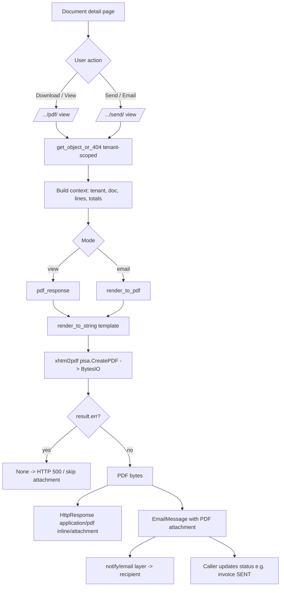

# 13. Documents / PDFs

### Purpose
Provides a single, pure-Python PDF rendering layer that turns sales and purchasing documents into print-ready, branded PDFs for download, inline viewing, and email attachment. It is a shared cross-cutting service rather than a standalone module, consumed by AR, Sales, Procurement, Finance, and Customers to produce supplier-facing and customer-facing paperwork.

### Roles involved
Document PDFs inherit the access rules of the calling view, so roles vary per document:
- Purchase Order PDF (`po_pdf`): Admin, Purchasing (Procurement group), Warehouse, Finance/Accountant, Read-only.
- Customer Invoice PDF / send (`ar_invoice_pdf`, `ar_invoice_send`): Sales, Finance/Accountant, Admin.
- Quote, Sales Order, Credit Note, Customer Statement PDFs follow their owning views' role gates (Sales/Admin/Finance for sales documents; Finance/Accountant/Admin for credit notes).

### Workflow
1. A user opens a source document detail page (e.g. PO, invoice, quote, statement).
2. User clicks "Download/View PDF" or "Send", hitting the document's `…/pdf/` or `…/send/` route.
3. The view loads the tenant-scoped record via `get_object_or_404(Model, id=…, tenant=tenant)`.
4. The view calls `core.services.pdf.pdf_response(filename, template, context, download=…)` for browser delivery, or `render_to_pdf(template, context)` for raw PDF bytes when emailing.
5. `render_to_pdf` runs `render_to_string` on the document template, then `xhtml2pdf.pisa.CreatePDF` writes HTML to a `BytesIO` buffer.
6. On success the PDF bytes are returned; on render error `render_to_pdf` returns `None` and `pdf_response` returns an HTTP 500 ("Could not generate PDF.").
7. For viewing, `pdf_response` sets `Content-Type: application/pdf` with `Content-Disposition` of `inline` (most viewers, `download=False`) or `attachment`.
8. For email (e.g. `ar_invoice_send`), the PDF bytes are wrapped as an attachment tuple `(filename, pdf, "application/pdf")` and passed to the notify/email layer alongside an HTML body.

### Input data
- Tenant branding from the `Tenant` record: `trading_name`/`name`, address lines, VAT number, email, `invoice_footer`.
- The source document instance and its line items (e.g. `po.lines`, invoice lines).
- Per-document context keys: `doc_title`, `number`, `notes`, and `terms` (invoices).
- Computed money values (subtotal, VAT, total) where the source view calculates them.

### Output generated
- Customer Invoice PDF - `invoice-<invoice_number>.pdf` (template `documents/invoice_pdf.html`).
- Quote PDF - `quote-<quote_number>.pdf` (`documents/quote_pdf.html`).
- Sales Order PDF - `sales-order-<order_number>.pdf` (`documents/order_pdf.html`).
- Purchase Order PDF - `purchase-order-<po_number>.pdf` (`documents/po_pdf.html`).
- Credit Note PDF - `credit-note-<credit_note_number>.pdf` (`documents/credit_note_pdf.html`).
- Customer Statement PDF - `statement-<customer.name>.pdf` (`documents/statement_pdf.html`).
- Email attachments (same bytes) for invoice send, PO send, quote send, and statement email.
- No GL postings or status changes are produced by the PDF layer itself; status side-effects (e.g. invoice → SENT) belong to the calling send views.

### Related modules
- Accounts Receivable / Customer Invoices (invoice PDF + send).
- Sales (Quotes, Sales/Customer Orders PDFs + send).
- Procurement (Purchase Order PDF + send to supplier).
- Finance (Credit Note PDF).
- Customers (Customer Statement PDF + email).
- Notifications / email layer (`core.notify`, Django `EmailMessage`) which carries the PDF attachment.

### Validations & rules
- Tenant scoping: every PDF view fetches its record with `tenant=tenant`, so PDFs cannot cross organisation boundaries.
- Render failure handling: a failed `pisa.CreatePDF` yields `None`; download returns HTTP 500, and email send proceeds without the attachment (attachment set to `None`).
- Templates are standalone and must use only xhtml2pdf's limited CSS subset; they do NOT extend `base.html` (`_pdf_base.html` is the shared base with inline `@page` A4 styling).
- VAT line on the PDF only renders when `tenant.vat_registered` and `tenant.vat_number` are set.
- Email-send guards live in the caller, not the PDF layer (e.g. `po_send` blocks cancelled/closed POs and requires a supplier email; `ar_invoice_send` enforces credit status and issues a draft before sending).
- No persistent storage of generated PDFs - they are rendered on demand each request (not cached or filed against the record).

### Database entities
The PDF service itself defines no models; it reads existing entities:
- `Tenant` (branding/footer).
- `CustomerInvoice` (+ lines).
- `Quote` / quote lines.
- `CustomerOrder` / order lines (sales order).
- `PurchaseOrder` / `PurchaseOrderLine`.
- `CreditNote`.
- `Customer` (for statement header and ledger entries).

### API / page requirements
- `GET /ar/invoices/<id>/pdf/` → `ar_invoice_pdf` (inline).
- `POST /ar/invoices/<id>/send/` → `ar_invoice_send` (email + attachment, marks SENT).
- `GET /quotes/<id>/pdf/` → `quote_pdf`; `POST /quotes/<id>/send/` → `quote_send`.
- `GET /customer-orders/<id>/pdf/` → `corder_pdf`.
- `GET /po/<id>/pdf/` → `po_pdf` (inline); `POST /po/<id>/send/` → `po_send`. Also `GET /po/<id>/print/` → `po_print` (HTML print view, not PDF).
- `GET /credit-notes/<id>/pdf/` → `credit_note_pdf`.
- `GET /customers/<id>/statement/pdf/` → `customer_statement_pdf`; `POST /customers/<id>/statement/email/` → `customer_statement_email`.
- Service entry points: `core.services.pdf.render_to_pdf(template_src, context)` and `pdf_response(filename, template_src, context, download=True)`.

### Flow diagram

---

[← Back to module index](README.md)
