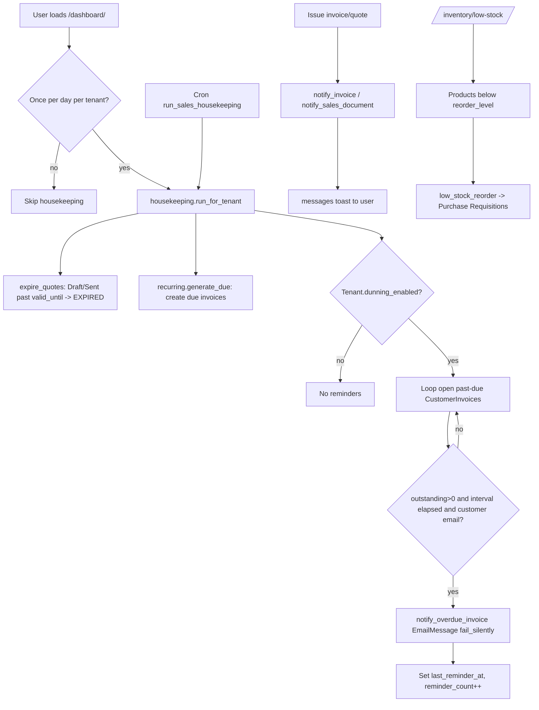

# 14. Notifications and Alerts

### Purpose
SwifPro BI has no dedicated notification model or inbox; instead it combines best-effort transactional emails (invoices, quotes, dunning reminders, access-request and credential emails), an in-app low-stock alerts page, and Django's `messages` framework for toast feedback. All email sends are fire-and-forget (`fail_silently=True`) so a mail-server problem never breaks the underlying business flow. Overdue-payment dunning and quote-expiry alerts run via a once-a-day housekeeping pass, either opportunistically on page load or from a scheduled management command.

### Roles involved
- **Admin** — receives new access-request emails (`notify_admins_new_request`); configures dunning on the tenant; sees all alert pages.
- **Sales / Manager** — email quotes (`notify_sales_document`) and customer invoices (`notify_invoice`); trigger recurring-invoice runs; view low-stock alerts.
- **Accountant / Finance** — email/issue invoices, rely on automatic overdue dunning reminders.
- **Warehouse / Purchasing** — consume the Low Stock alert page and reorder from it.
- **Read-only** — sees in-app `messages` toasts only; no send actions.
- Applicants (non-role) receive approval/rejection/credential emails.

### Workflow
1. A user action issues a document (invoice via `ar_invoice_*`, quote via the quote send view). The view calls the relevant `notify.*` function with the request and an optional PDF attachment tuple.
2. `notify_invoice` / `notify_sales_document` build an `EmailMessage`, attach the PDF if supplied, and `send(fail_silently=True)`; they return `True`/`False` depending on whether the customer has an email.
3. The view reports the outcome to the user through `messages.success/info/error` (in-app toast).
4. Separately, on any post-login landing (`views.py:339`), `housekeeping.opportunistic(request)` runs once per tenant per day (throttled by `Tenant.last_housekeeping_date`).
5. `run_for_tenant` expires stale quotes (`expire_quotes`), generates due recurring invoices (`recurring.generate_due`), and sends overdue reminders (`send_overdue_reminders`).
6. `send_overdue_reminders` iterates open, past-due `CustomerInvoice`s with positive `outstanding`, skipping any reminded within `dunning_interval_days`, and emails via `notify_overdue_invoice`.
7. On a successful reminder, the invoice's `last_reminder_at` and `reminder_count` are updated so the dunning cadence is enforced.
8. A nightly `run_sales_housekeeping` management command does the same across all tenants for installs that prefer external cron/Task Scheduler over opportunistic runs.
9. The Low Stock page (`/inventory/low-stock/`) computes, on demand, products below their reorder level and offers a reorder action that creates Purchase Requisitions.

### Input data
- Customer email (`Customer.email`), invoice/quote totals, numbers, dates, `currency_code`, `tenant.name`.
- Tenant dunning config: `dunning_enabled` (default True), `dunning_interval_days` (default 7).
- Per-invoice dunning state: `last_reminder_at`, `reminder_count`, `due_date`, `outstanding`, `status` (must be in `CustomerInvoice.OPEN_STATES`).
- Access-request fields (name, employee_id, email, team, message) for admin/applicant emails.
- Generated temporary passwords / usernames for credential emails.
- Product `reorder_level`, `on_hand_total`, `preferred_supplier` for low-stock alerts.

### Output generated
- **Emails** (subjects prefixed `[SwifPro BI]` for account emails): invoice email, overdue payment reminder, quote/sales-document email, new-access-request notice to admins, applicant approved (with temp credentials), applicant rejected, admin invite credentials.
- **In-app toasts** via Django `messages` (success/info/error).
- **Status side effects**: quotes flipped to `EXPIRED`; recurring invoices generated; invoice `last_reminder_at`/`reminder_count` bumped; `tenant.last_housekeeping_date` set.
- **Low Stock alert list** (rendered `inventory/low_stock.html`) and resulting Purchase Requisitions from the reorder action.
- Not implemented: there is no persisted notification log/inbox model, no read/unread tracking, and no SMS/push channel — alerts are email + transient `messages` + on-demand pages only.

### Related modules
- **AR / Invoicing** — invoice emails and overdue dunning.
- **Sales / Quotes** — quote emails and quote-expiry automation.
- **Recurring Invoices** — generated as part of the same housekeeping pass.
- **Inventory / Procurement** — Low Stock alerts feed Purchase Requisitions.
- **User Access / Onboarding** — access-request and credential emails.
- **Tenant settings** — dunning enable/interval configuration.
- **Audit Log** — `RECURRING_GENERATED` and related actions are logged.

### Validations & rules
- All emails are best-effort: `fail_silently=True`; senders return `False` (no exception) when the recipient has no email.
- Dunning skipped entirely when `Tenant.dunning_enabled` is False; interval falls back to 7 days if `dunning_interval_days` is unset.
- A reminder is suppressed if `last_reminder_at` is within `dunning_interval_days`, if `outstanding <= 0.00`, or if the invoice is not in `OPEN_STATES`.
- Opportunistic housekeeping is throttled to once per day per tenant (`last_housekeeping_date`) and never raises into the request path (wrapped in try/except).
- All querysets are tenant-scoped (`tenant=tenant`); admin-notification recipients are scoped to the tenant's Admin memberships plus active superusers.
- Low-stock alerting only considers active products with `reorder_level > 0` and lists those whose `on_hand_total < reorder_level`.

### Database entities
- `Tenant` (`dunning_enabled`, `dunning_interval_days`, `last_housekeeping_date`)
- `CustomerInvoice` (`last_reminder_at`, `reminder_count`, `OPEN_STATES`, `outstanding`)
- `Customer` (`email`)
- `SalesQuote` (status transitions to `EXPIRED`)
- `Product` (`reorder_level`, `on_hand_total`, `preferred_supplier`) for low-stock
- `OrgMembership` / `User` (admin recipient resolution)
- `AccessRequest` (access-request emails)
- No dedicated `Notification` model exists.

### API / page requirements
- `/inventory/low-stock/` → `views.low_stock` (alert page)
- `/inventory/low-stock/reorder/` → `views.low_stock_reorder` (POST, creates requisitions)
- `/recurring-invoices/run-due/` → `views.recurring_run_due` (POST, manual housekeeping trigger)
- `/dashboard/` post-login redirect → triggers `housekeeping.opportunistic`
- Management commands: `run_sales_housekeeping`, `run_recurring_invoices` (cron/Task Scheduler)
- Email senders (not URLs) in `core/notify.py`: `notify_invoice`, `notify_overdue_invoice`, `notify_sales_document`, `notify_admins_new_request`, `notify_applicant_approved`, `notify_applicant_rejected`, `notify_credentials`
- Note: `notify_sales_document` is wired only for Quotes (`views.py:4132`); sales-order emailing is not currently invoked despite the generic helper.

### Flow diagram

---

[← Back to module index](README.md)
