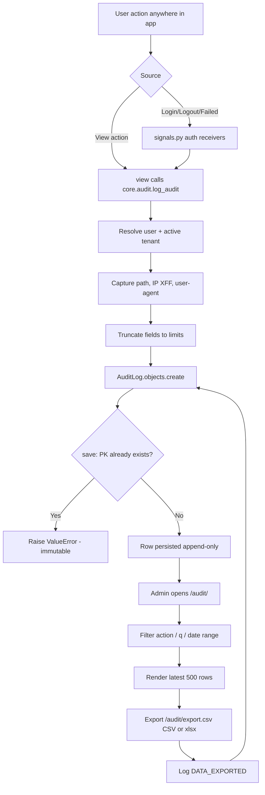

# 15. Audit Logs

### Purpose
Provides an append-only security and change-tracking trail that records who did what, when, and from where across the tenant. It captures logins, access-denied events, sensitive data changes, deletions, exports, and configuration changes so an admin can later prove and investigate activity. The trail is tamper-resistant: existing records cannot be modified, only created.

### Roles involved
- **Admin** — the only role that can view, filter, and export the audit log (the viewer is gated by `@role_required([ROLE_ADMIN], [ROLE_ADMIN])`). Every other role can *generate* audit entries implicitly through their normal actions (e.g. Warehouse stock adjustments, Sales invoice deletions, Finance VAT changes), but cannot read the log.

### Workflow
1. A user performs an action anywhere in the app (logs in, deletes a draft invoice, adjusts stock, changes VAT settings, exports data, etc.).
2. The relevant view (or a Django auth signal) calls `core.audit.log_audit(...)` with the action code plus optional who/what context (`entity_type`, `entity_id`, `old_value`, `new_value`, `detail`).
3. `log_audit` resolves the authenticated user, captures the request `path`, client IP (honouring `X-Forwarded-For`), and truncated user-agent, then creates an `AuditLog` row scoped to the active `tenant`. It is best-effort and never raises into the request path.
4. Login, logout, and failed-login events are captured automatically via `user_logged_in` / `user_logged_out` / `user_login_failed` signal receivers in `core/signals.py`.
5. An Admin opens `/audit/`, optionally filtering by action, free-text (`q`), and date range (`from`/`to`); the latest 500 matching rows render.
6. The Admin can download the trail (up to 5000 rows) via `/audit/export.csv` (CSV, or `?format=xlsx` for Excel) — this export is itself logged as `DATA_EXPORTED`.

### Input data
- Action code (e.g. `LOGIN`, `STOCK_ADJUSTED`, `INVOICE_DELETED`).
- Acting user / username, and active tenant.
- Optional structured context: `entity_type`, `entity_id`, `old_value`, `new_value`, free-text `detail`.
- Request metadata: `path`, IP (`X-Forwarded-For` / `REMOTE_ADDR`), user-agent (truncated to 255 chars).
- Viewer filters: `action`, `q`, `from`, `to`, and export `format`.

### Output generated
- An immutable `AuditLog` record with a server timestamp (`created_at`).
- A read-only filtered audit viewer (`audit_log.html`).
- CSV / XLSX export of the trail (columns: timestamp, action, user, entity_type, entity_id, old_value, new_value, detail, path, ip, user_agent).
- A `change_summary` property rendering `old_value → new_value` for change events.
- No GL postings are produced by this module.

### Related modules
- **Authentication / Users & Roles** — `LOGIN`, `LOGIN_FAILED`, `LOGOUT`, `PASSWORD_CHANGED`, `ROLE_CHANGED`, `PERMISSION_CHANGED`, `USER_INVITED`, `USER_REMOVED`, `ACCESS_REQUEST*`, `LOCATION_ACCESS_CHANGED`.
- **Inventory** — `STOCK_ADJ_REQUESTED`, `STOCK_ADJUSTED`, `STOCK_ADJ_APPROVED/REJECTED`, `PRODUCT_COST_CHANGED`.
- **Sales / AR** — `INVOICE_DELETED`, `INVOICE_SENT`, `INVOICE_CANCELLED`, `QUOTE_*`, `ORDER_*`, `RECURRING_GENERATED`, `REFUND_RECORDED`, `STATEMENT_SENT`.
- **Finance / VAT** — `PAYMENT_DELETED`, `VAT_SETTINGS_CHANGED`, `VAT_RATE_CHANGED`, `VAT_RETURN_SAVED/SUBMITTED`, `INTERCOMPANY_SALE`.
- **Settings / Admin** — `ORG_CREATED`, `SETTINGS_CHANGED`, `GROUP_CHANGED`, `ACCESS_DENIED`, `DATA_EXPORTED`, generic `RECORD_DELETED`.

### Validations & rules
- **Append-only / immutable**: `AuditLog.save()` raises `ValueError` if a row with an existing PK is re-saved — records can never be updated or edited.
- **Tenant-scoped**: both the viewer and export filter strictly on the active tenant; on tenant deletion the FK is `SET_NULL` so the trail survives.
- **Admin-only access**: viewer and export require the Admin role; access-denied attempts elsewhere are themselves logged as `ACCESS_DENIED`.
- **Best-effort, non-blocking**: `log_audit` swallows all exceptions so audit failures never break the user's primary action.
- **Field truncation**: `entity_type` ≤ 80, `entity_id` ≤ 64, `detail` ≤ 255, `user_agent` ≤ 255 chars.
- **Viewer/export caps**: viewer shows max 500 rows, export max 5000 rows.
- **Soft-delete for sensitive records**: deletions of customer invoices and payments set `is_deleted` / `deleted_at` / `deleted_by` (the underlying row is retained) and emit `INVOICE_DELETED` / `PAYMENT_DELETED` audit entries rather than hard-deleting. Note: there is no auto-prune/retention job — entries persist indefinitely until manually managed.

### Database entities
- `AuditLog` (fields: `tenant`, `user`, `username`, `action`, `entity_type`, `entity_id`, `old_value`, `new_value`, `detail`, `path`, `ip`, `user_agent`, `created_at`).
- References `Tenant` and `auth.User` (both nullable, `SET_NULL`).

### API / page requirements
- `GET /audit/` → `views.audit_log_list` (name `audit_log_list`) — filterable HTML viewer; query params `action`, `q`, `from`, `to`.
- `GET /audit/export.csv` → `views.audit_log_export` (name `audit_log_export`) — CSV download; `?format=xlsx` returns Excel.
- Sidebar entry: **Administration → Audit Log** (`/audit/`, icon `shield-lock`, Admin only).
- Writer (not an endpoint): `core.audit.log_audit(...)`, invoked throughout `core/views.py` and `core/signals.py`.
- No JSON/REST API is exposed for this module.

### Flow diagram

---

[← Back to module index](README.md)
