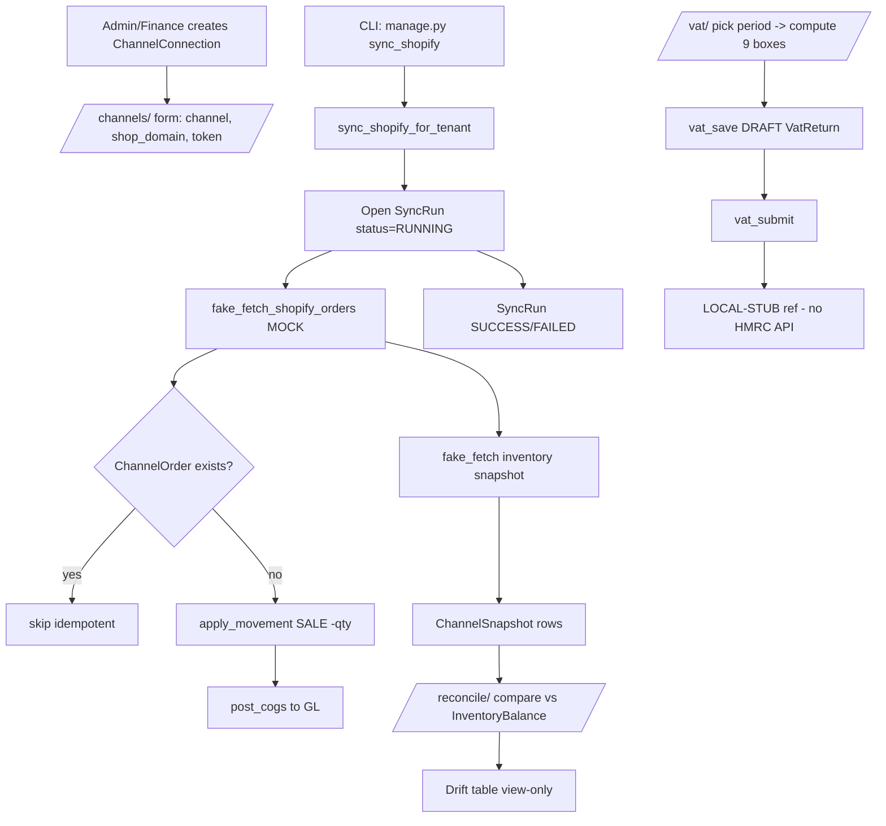

# 17. Integrations

### Purpose
Connects SwifPro BI to external sales channels (Shopify, Amazon) and outbound systems so a UK SME can pull channel orders/stock and reconcile them against internal inventory, and prepare HMRC MTD VAT returns. In the current build the channel sync and HMRC filing are deliberately mocked/stubbed seams: order sync runs from a management command with fake data, and VAT "submission" is recorded locally only. Email is the one genuinely live outbound integration, via Django's mail framework.

### Roles involved
- **Admin** — full access to channel connections, reconcile, VAT, channel sales orders.
- **Finance / Accountant** (Finance group) — create/edit/delete channel connections, save & submit VAT returns.
- **Sales** — create and post channel Sales Orders, view sales-order list.
- **Read-only** — view channel sales orders, VAT detail/records.
- Note: the `reconcile` view itself has no `@role_required` decorator on it (only `@login_required` upstream behaviour applies via the global pattern); any authenticated user reaching `/reconcile/` can view drift.

### Workflow
1. Admin/Finance creates a `ChannelConnection` at `/channels/new/` (channel = Shopify/Amazon, name, shop_domain, access_token).
2. A Shopify sync is triggered out-of-band by the management command `python manage.py sync_shopify` (there is **no web URL/button** for it).
3. `sync_shopify_for_tenant()` opens a `SyncRun`, calls `fake_fetch_shopify_orders()` (hard-coded mock data), and for each new order creates a `ChannelOrder` (idempotent via unique `external_order_id`).
4. For each order line it resolves the `Product` by SKU and calls `apply_movement(... movement_type="SALE", qty_delta=-qty ...)` into a "Shopify Warehouse" `Location`, then posts COGS via `post_cogs()`.
5. `fake_fetch_shopify_inventory_snapshot()` writes `ChannelSnapshot` rows (mock SKU/quantity), and the `SyncRun` is marked SUCCESS/FAILED.
6. A user opens `/reconcile/` to compare the latest `ChannelSnapshot` per SKU against summed `InventoryBalance.on_hand`, showing per-SKU drift.
7. Separately, channel/ecommerce `SalesOrder`s can be entered/posted at `/sales-orders/` (drift between manual and synced is not auto-resolved).
8. For VAT, Finance picks a period at `/vat/`, previews the 9 boxes (`compute_vat_return`), saves a DRAFT `VatReturn` (`/vat/save/`).
9. Finance submits at `/vat/<id>/submit/`; `submit_vat_return()` only sets status=SUBMITTED locally and stamps `hmrc_reference = "LOCAL-STUB-<id>"` — no HMRC API call.

### Input data
- Channel connection: channel type, connection name, `shop_domain`, `access_token` (stored plaintext — MVP note in code).
- Mock Shopify orders (`SHP-10001`, line items by SKU) and inventory snapshot — hard-coded in `sync_shopify.py`, not real API responses.
- Internal `InventoryBalance` / `Product.sku` for reconcile.
- VAT period dates (from/to) for return computation.

### Output generated
- `SyncRun` record (status RUNNING/SUCCESS/FAILED, detail line).
- `ChannelOrder` rows + inventory `StockMovement`s (type SALE) + COGS GL posting via `post_cogs`.
- `ChannelSnapshot` rows.
- Reconcile drift table (`channel_qty − swifpro_qty`) — view-only, no auto-adjustment.
- `VatReturn` (9 boxes), with `hmrc_reference` = `LOCAL-STUB-<id>` on submit. Audit events `VAT_RETURN_SAVED` / `VAT_RETURN_SUBMITTED`, `RECORD_DELETED` on channel delete.
- Outbound emails via `django.core.mail` (`send_mail` / `EmailMessage`) for quotes, invoices, statements, access requests.

### Related modules
- **Inventory** — `apply_movement`, `InventoryBalance` (reconcile + sync deductions).
- **General Ledger / Finance** — `post_cogs` on synced orders.
- **VAT/Tax** — VAT return draws on `CustomerInvoice`, `SupplierInvoice`, `Expense`, `CreditNote`, `TaxCode`.
- **Sales** — channel `SalesOrder` posting.
- **Notifications/Email** — `core/notify.py` outbound mail.

### Validations & rules
- All entities tenant-scoped (`tenant=` filters on every query).
- `ChannelOrder` is idempotent: `unique_together = (tenant, channel, external_order_id)` — re-syncing skips existing orders.
- `VatReturn` unique per `(tenant, period_from, period_to)`; `vat_save` rejects invalid/reversed periods; re-saving uses `update_or_create` (refreshes DRAFT figures).
- VAT submit is idempotent (returns early if already SUBMITTED); UI shows a warning that live HMRC filing is not connected.
- VAT computation: only `CustomerInvoice` in ISSUED/SENT/PAID, `SupplierInvoice`/`Expense`/`CreditNote` POSTED; out-of-scope codes excluded from boxes 6/7; credit notes negated.
- **Not implemented / honest gaps:** real Shopify & Amazon API clients are not implemented (Amazon has no sync at all; Shopify is fake fetch). Real HMRC MTD submission is a local stub. There is **no REST/JSON API** for external consumers. The sync has no web trigger (command-line only). Channel `access_token` is stored unencrypted.

### Database entities
- `SalesChannel` (TextChoices: SHOPIFY, AMAZON)
- `ChannelConnection`
- `SyncRun`
- `ChannelOrder`
- `ChannelSnapshot`
- `SalesOrder` (channel/ecommerce orders)
- `VatReturn`
- (reads) `Product`, `Location`, `InventoryBalance`, `CustomerInvoice`, `SupplierInvoice`, `Expense`, `CreditNote`, `TaxCode`

### API / page requirements
- `/channels/` `channel_list`, `/channels/new/` `channel_create`, `/channels/<id>/edit/` `channel_edit`, `/channels/<id>/delete/` `channel_delete`
- `/reconcile/` `reconcile`
- `/sales-orders/` `sales_order_list`, `/sales-orders/new/` `sales_order_create`, `/sales-orders/<id>/` `sales_order_detail`, `/sales-orders/<id>/post/` `sales_order_post`
- `/vat/` `vat_index`, `/vat/save/` `vat_save`, `/vat/<id>/` `vat_detail`, `/vat/<id>/submit/` `vat_submit`, `/vat/records/` `vat_records`
- Command: `manage.py sync_shopify` (no HTTP endpoint)
- No public REST API endpoints exist.

### Flow diagram

---

[← Back to module index](README.md)
