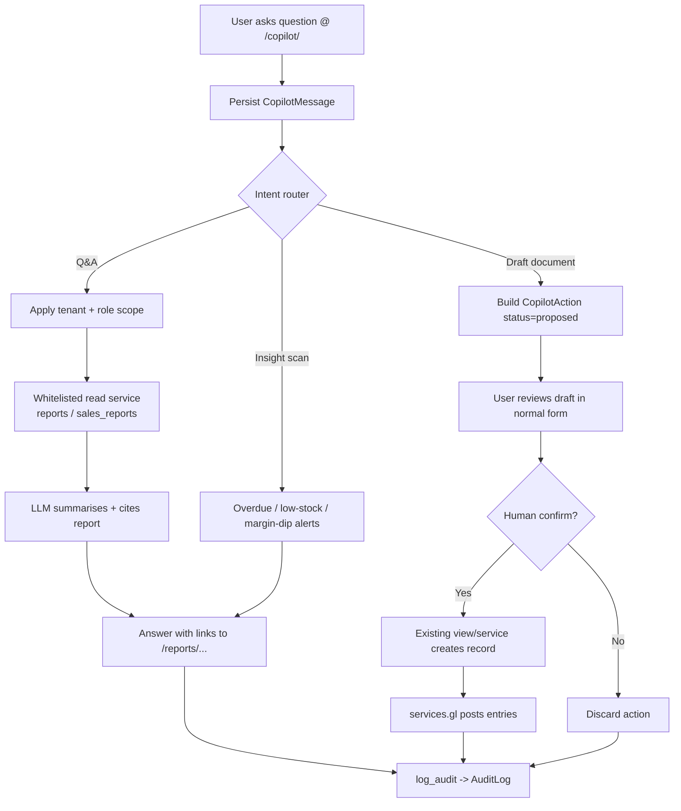

# 18. AI Assistant / Copilot

> **STATUS: PROPOSED — NOT YET IMPLEMENTED.** There is no AI assistant, copilot, LLM, or natural-language layer anywhere in `core/` today. A full-text search for `copilot`, `assistant`, `openai`, `anthropic`, `llm`, `gpt` returns zero source hits (only incidental `uom` substring matches in migrations). No `/copilot/` URL, no `CopilotConversation`/`CopilotMessage`/`CopilotAction` models, and no copilot service exist. Everything below is a design proposal grounded in the app's *real* services, models, roles and URLs so it can be built on top of them.

### Purpose
A read-mostly natural-language layer that lets a UK SME owner or finance user ask plain-English questions over existing SwifPro BI data ("what's my P&L this quarter?", "who's the most overdue customer?", "which products are below reorder?") and get answers sourced directly from the existing report services. It can also draft documents (sales invoices, POs, chase emails) and surface proactive insight alerts (overdue debtors, low stock, margin dips), but never posts to the ledger or sends anything without explicit human confirmation.

### Roles involved
- **Admin** — full copilot access; only role that can see cross-module/admin insights (audit, users); manages copilot enablement.
- **Accountant / Finance** — financial Q&A (P&L, balance sheet, aged debtors/creditors, VAT), draft chase emails and credit notes.
- **Manager** — operations Q&A (sales, inventory analytics, supplier scorecard), draft POs.
- **Sales** — sales/customer questions, draft quotes and customer invoices.
- **Purchasing** — stock/reorder questions, draft purchase orders/requisitions.
- **Warehouse** — low-stock and stock-movement questions (read-only answers).
- **Read-only** — Q&A over the reports they can already view; no drafting.

Proposed rule: the copilot inherits the *exact* visibility of the caller's role from `core/roles.py` `NAV` / group RBAC — it can never answer about a page the role cannot open.

### Workflow
1. User opens `/copilot/` (proposed) or a side panel and types a question.
2. Copilot persists the turn to a `CopilotMessage` under a `CopilotConversation` (tenant- and user-scoped).
3. An intent/router classifies the request into: **Q&A**, **draft document**, or **insight/alert**.
4. For Q&A, the copilot maps intent to a whitelisted, tenant-scoped read function (e.g. `services.reports.profit_and_loss(tenant, …)`, `aged_receivables(tenant)`, `stock_valuation(tenant)`, `services.sales_reports.profitability(tenant, …)`) and runs it with the caller's `tenant` and role-derived location/permission filters.
5. The LLM summarises the structured result in plain English and cites the underlying report/URL (e.g. links to `/reports/profit-and-loss/`).
6. For a draft request, the copilot pre-fills a form (e.g. an `InvoiceForm`/PO draft) and returns it as a **proposed action** — a `CopilotAction` row in `proposed` status. Nothing is written to business tables yet.
7. The user reviews the draft in the normal create page; on **Confirm**, the existing view/service performs the real create (and any GL posting via `services.gl`), exactly as a manual entry would.
8. Every copilot interaction and every confirmed action is written via `core.audit.log_audit(...)` to the existing `AuditLog`.
9. Background insight scan (scheduled, like existing `run_sales_housekeeping` / `run_recurring_invoices` commands) computes alerts and stores them as `insight`-type `CopilotMessage`s for the next session.

### Input data
- User's natural-language prompt and conversation history.
- Current `tenant` and `OrgMembership` role (for scoping/visibility).
- Read-only results from existing services: `reports.profit_and_loss`, `balance_sheet`, `aged_receivables`, `aged_payables`, `stock_valuation`, `inventory_analytics`, `cash_flow_summary`, `consolidated`; `sales_reports.sales_by_product/customer/channel`, `profitability`.
- For drafts: customer/supplier/product master data (`Customer`, `Supplier`, `Product`) to populate line items.

### Output generated
- Conversational answer text with citations/links to the real report pages.
- **Drafts (never auto-posted):** proposed `CustomerInvoice`, `PurchaseOrder`, `PurchaseRequisition`, `CreditNote`, or chase/RFQ email text — held as `CopilotAction(status=proposed)`.
- **Insight alerts:** overdue-debtor, low-stock, margin-dip, VAT-deadline notices.
- **No GL postings of its own.** GL entries only happen when the user confirms and the existing service (`services.gl`) runs.
- Audit records in `AuditLog` for every question and every confirmed action.

### Related modules
- **Reports / Finance** — primary data source (P&L, balance sheet, aged debtors/creditors, VAT, cash flow).
- **Sales** — sales reports + draft quotes/customer invoices.
- **Procurement** — supplier scorecard + draft POs/requisitions.
- **Inventory** — stock valuation, low-stock, inventory analytics.
- **Audit & Access** — `core.audit` / `AuditLog` for the immutable trail; `core.roles` / RBAC for scoping.

### Validations & rules
- **Read-mostly / write-via-confirmation:** copilot can call only a whitelisted set of read functions directly; any state change must go through the existing view + human **Confirm** step — it cannot post a journal, send an email, or create a document autonomously.
- **Tenant scoping:** every service call passes the request's `tenant`; the copilot can never read another tenant's data (mirrors existing `core.current` / middleware scoping).
- **Role visibility:** answers and draft permissions are gated by the caller's role exactly as `NAV` gates pages; Read-only cannot draft.
- **Credit-limit / threshold respect:** draft invoices/POs surface (but do not bypass) existing checks such as customer credit limits and the tenant's `stock_adjustment_approval_threshold` — the human still hits the real validations on confirm.
- **Immutability & audit:** every prompt, answer and confirmed action logged via `log_audit`; conversation/messages should be append-only (soft-delete only, consistent with `deleted_at` pattern used on invoices).
- **No hallucinated numbers:** financial figures must come from a service call, not the model's free text; if no whitelisted function matches, the copilot declines rather than guessing.
- *(Proposed)* PII/prompt-injection guardrails on any externally-sourced text (e.g. supplier emails) before it reaches the model.

### Database entities
*All proposed — none exist yet. Reuses existing:* `Tenant`, `OrgMembership`, `UserProfile`, `AuditLog`, plus the read-only report sources (`CustomerInvoice`, `Product`, `GLEntry`, etc.).

Proposed new models:
- **`CopilotConversation`** — `tenant` (FK), `user` (FK), `title`, `created_at`, `deleted_at` (soft-delete).
- **`CopilotMessage`** — `conversation` (FK), `role` (`user`/`assistant`/`insight`), `content`, `cited_report`, `created_at`.
- **`CopilotAction`** — `message` (FK), `action_type` (`draft_invoice`/`draft_po`/`draft_email`/…), `payload` (JSON), `status` (`proposed`/`confirmed`/`discarded`), `confirmed_by`, `confirmed_at`, `result_entity_type`, `result_entity_id`.

### API / page requirements
*All proposed — none of these routes exist in `core/urls.py` today.*
- `GET /copilot/` — conversation UI (proposed nav entry, Admin-gated initially, then per-role).
- `POST /copilot/ask/` — submit a question; returns answer + citations.
- `POST /copilot/action/<id>/confirm/` — confirm a proposed draft; hands off to the existing create view/service.
- `POST /copilot/action/<id>/discard/` — discard a draft.
- `GET /copilot/insights/` — list current insight alerts.
- Existing real endpoints it *links to / hands off to:* `/reports/profit-and-loss/`, `/reports/aged-receivables/`, `/reports/stock-valuation/`, `/sales/reports/profitability/`, `/ar/invoices/`, `/po/`, `/credit-notes/`, `/vat/`.

### Flow diagram

Relevant files inspected: `d:\swifpro_bi\core\roles.py`, `d:\swifpro_bi\core\audit.py`, `d:\swifpro_bi\core\services\reports.py`, `d:\swifpro_bi\core\services\sales_reports.py`, `d:\swifpro_bi\core\models.py`, `d:\swifpro_bi\core\urls.py` (no copilot routes present).

---

[← Back to module index](README.md)
