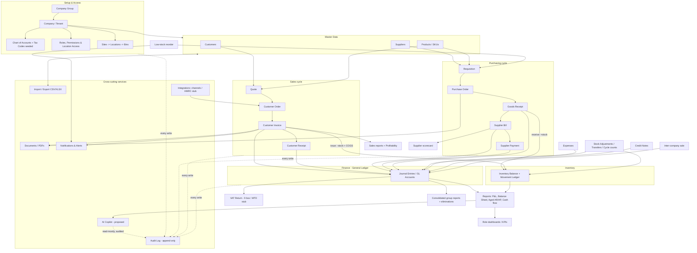

# 19. End-to-end ERP flow

How the whole system connects - from company setup through master data, the buy-side and sell-side transaction
cycles, into the General Ledger, VAT, reporting, and the cross-cutting services (documents, notifications, audit,
import/export, integrations, copilot).

---

### Appendix - module connectivity matrix

| Module | Feeds into | Reads from |
|---|---|---|
| Company Setup | every module (tenant scope, defaults) | - |
| Roles & Permissions | every module (access control) | Company Setup |
| Customer Mgmt | Sales, Finance (AR), Reports | Company Setup |
| Supplier Mgmt | Purchasing, Finance (AP), Reports | Company Setup |
| Product/SKU | Inventory, Purchasing, Sales | Suppliers, Tax codes |
| Inventory | Sales (COGS), Finance (GL), Reports | Purchasing (GRN), Products, Locations |
| Purchasing | Inventory, Finance (AP), Suppliers, VAT | Requisitions, Products, Suppliers |
| Sales | Inventory, Finance (AR), VAT, Reports | Customers, Products |
| Finance & Accounting | VAT, Reports, Consolidation | Sales, Purchasing, Inventory, Expenses |
| VAT | Reports, HMRC (stub) | Sales, Purchasing, Expenses |
| Expenses | Finance (GL/AP), VAT, Suppliers | Company Setup (threshold) |
| Reports & Dashboards | Copilot | GL, Inventory, Sales, Purchasing |
| Documents/PDFs | Notifications (attachments) | Sales, Purchasing, Finance |
| Notifications | users (email/in-app) | Sales, Inventory, Finance |
| Audit Logs | Reports (compliance) | every module |
| Import/Export | Master data, Finance | every module |
| Integrations | Sales (channels), VAT (HMRC) | Products, Inventory |
| AI Copilot (proposed) | users | Reports, all modules (read) |

---

[← Back to module index](README.md)
